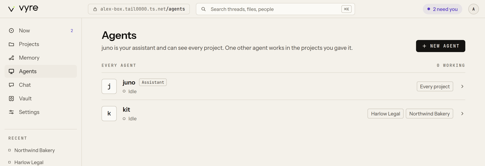
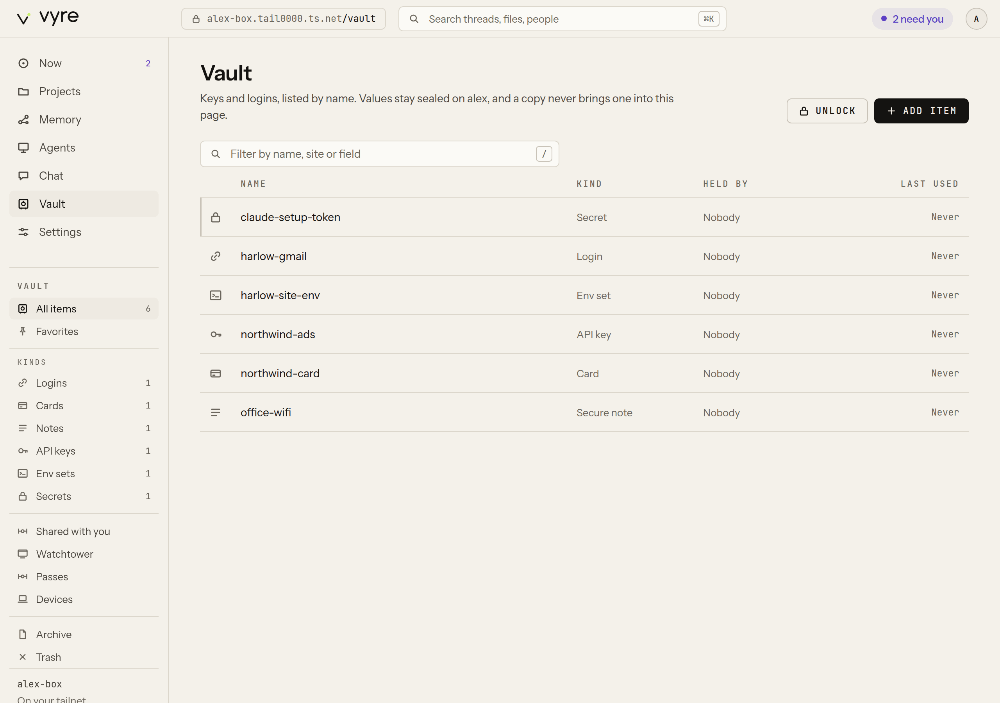
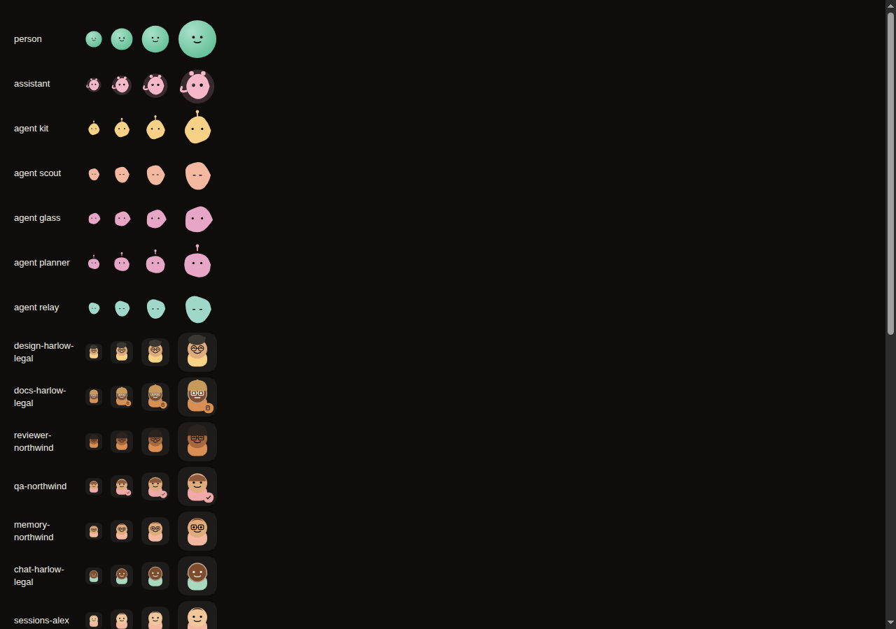

# Vyre

[](https://github.com/vyre-ai/vyre/actions/workflows/node.yml)
[](https://github.com/vyre-ai/vyre/actions/workflows/capsule-mac.yml)
[](https://github.com/vyre-ai/vyre/actions/workflows/ios.yml)
[](https://github.com/vyre-ai/vyre/actions/workflows/android.yml)

**Your agents live on your server. Reach them from your Mac or your phone.**

Vyre is an open-source, self-hosted home for Claude Code agents. They run on a server you own,
keep working when your laptop is closed, and answer when you press Option-Space on your Mac or
open Vyre on your phone.

Your API keys stay in an encrypted vault on that server. Anything that sends a message, posts or
pays waits for your Touch ID or Face ID.

Under the hood it's a Claude Code plugin plus one small daemon. Vyre doesn't fork or wrap Claude
Code, so when Claude Code improves, Vyre improves with it.

```
curl -fsSL https://vyre.run/install.sh | sh
vyre up
```

On a Mac: `npm install -g https://vyre.run/box/vyre.tgz && vyre up`.

`vyre up` finds your Tailscale network (or sets one up), asks for a name, and gives you an
address: `<you>.vyre.run`.

## Who it's for

Anyone running Claude Code who has closed a laptop mid-session and lost the agent that was still
working, or who wants one server that remembers every session instead of a folder of local
transcripts.

## What you get

- **The Deck.** The web app at your address. Chat with Claude, browse every past session inline,
  talk to it by voice, and use `/goal`, `/later`, `/find` to steer without breaking your flow.

  <picture>
    <source media="(prefers-color-scheme: dark)" srcset="docs/images/readme/deck-chat.dark.png">
    
  </picture>

- **Teammates.** Give an agent its own name and its own projects. `vyre team` lists them, `vyre
  team ask` sends one work.

  <picture>
    <source media="(prefers-color-scheme: dark)" srcset="docs/images/readme/teammates.dark.png">
    
  </picture>

- **The Mac Capsule.** Option-Space anywhere on your Mac to `@` an agent, a project, or a file,
  and send work to your server without leaving what you're doing.
- **Wink.** Add your phone by scanning your own avatar at [phone.vyre.run](https://phone.vyre.run).
  Settings and onboarding show a ring around your avatar; point your phone's camera at it, check
  the name, and tap Pair.
- **Your tailnet, joined automatically.** A desktop you pair over the relay finds your network on
  its own. No auth key to paste in.
- **GitHub.** Sign in with a short code, start a project straight from one of your repos, or add
  a repo to a project you already have. Each session gets its own branch.
- **A vault.** Credentials agents can use but nobody has to see. Share an item with someone else's
  Vyre and it's relayed, so one revoke ends their access.

  <picture>
    <source media="(prefers-color-scheme: dark)" srcset="docs/images/readme/vault.dark.png">
    
  </picture>

- **Memory across sessions.** Ask Vyre something and it searches everything you've said before,
  and shows you which past session an answer came from.

Every person and agent gets their own avatar, on the Deck, on your phone, and in the Capsule.

<picture>
  
</picture>

## Questions

**What is Vyre?** An open-source daemon plus a Claude Code plugin. Together they give your
agents a permanent home: a server, instead of a laptop that closes.

**What do I need to run it?** A machine to act as your server (a spare Mac, a VPS, a home
server) and Node 22.5 or newer. `vyre up` sets up Tailscale for you if you don't already run it.

**What does it cost?** Vyre itself is free and open source. You pay Anthropic for Claude the
same way you would running Claude Code directly.

**What leaves my server?** Your prompts go to Anthropic's API through Claude Code, exactly as
they would if you ran Claude Code directly on your laptop. Your keys, memory and sessions stay
on your server. The relay that pairs a new device only ever passes encrypted pairing data; it
never sees your keys or your conversations.

**How do I add my phone?** Open [phone.vyre.run](https://phone.vyre.run) on your phone, scan the
ring around your avatar on the Deck or in onboarding, check the name it shows you, and tap Pair.

## Status

Early. The daemon, module loader, event log and CLI work (milestone M0). See
[`docs/SPEC.md`](docs/SPEC.md) for the design and the milestones, and
[`docs/work/`](docs/work/) for what each workstream is doing now.

## Develop

Needs Node 22.5 or newer. No build step, no dependencies.

```
npm test
VYRE_HOME=$(mktemp -d) bin/vyre up
bin/vyre call system.echo '{"text":"hi"}'
bin/vyre down
```

Write a module: [`docs/MODULES.md`](docs/MODULES.md).

## Licence

Apache 2.0. See [`LICENSE`](LICENSE).
