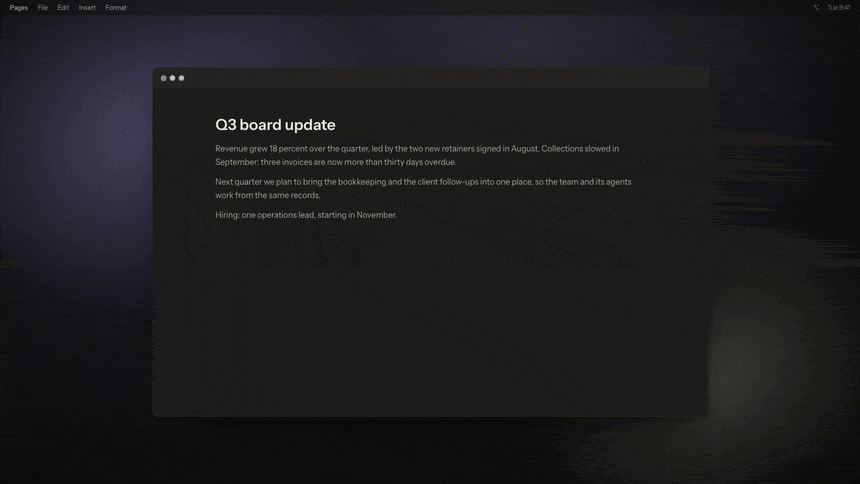
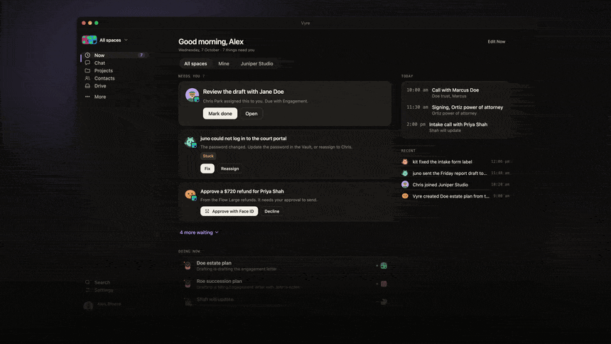
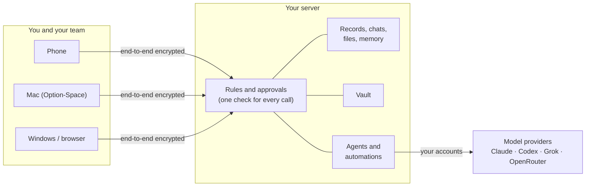

<p align="center">
  
</p>

<h1 align="center">Vyre</h1>

<p align="center"><b>Your team and your AI agents, working together on a server you own.</b><br>
Open source. Self-hosted. Any model.</p>

<p align="center">
  <a href="https://vyre.run">Website</a> ·
  <a href="docs/get-started/install.md">Install</a> ·
  <a href="docs/index.md">Docs</a> ·
  <a href="docs/known-gaps.md">Known gaps</a>
</p>

<p align="center">
  <a href="https://github.com/vyre-ai/vyre/actions/workflows/node.yml"></a>
  <a href="LICENSE"></a>
</p>

<p align="center">
  
  <br><sub>A film of where Vyre 0.3.0 is heading. Today Lumen asks your assistant and finds your work; the hand-off between agents, live steps and one approval for several sends land in 0.3.0.</sub>
</p>

AI agents can already draft the email, chase the invoice and update the file. What they can't do is work inside your team: see the same client your people see, pick up a task where a colleague left it, use the company's keys without walking off with them, and stop before anything goes out in your name.

Vyre is the place where they can. Your people, your agents and the work they share live on one server you own. You ask from your phone, your Mac or a browser, the right agent does the work with the right context, and everything that leaves your server waits for a person's yes.

## What you get

- **A team of agents, not a chat box.** Give each agent a role and its own instructions, or let your assistant hand work to the one best placed for it. Agents work on your server while you get on with your day, and report back when they are done.
- **Any model, your own accounts.** Claude, Codex, Grok, or hundreds of models through OpenRouter. Sign in with the subscription you already pay for, or use an API key. Switch models in the middle of a conversation, or ask two at once.
- **One shared picture of the work.** Clients, contacts, projects, tasks, emails and meetings are linked records that people and agents read from the same place. An agent working on a client sees that client's history, not a copy someone pasted.
- **Conversations with people and agents together.** @ a teammate or an agent, # a record, and keep the whole thread, with exact recall of anything said before.
- **Automations that do the same thing every time.** Watch for an email, a form or a date, then run declared steps: sort it with a model, update a record, assign a task, draft the reply.
- **A yes for anything that leaves.** Emails, posts, payments and deletes wait for Face ID or Touch ID on your phone, and the approval covers that one act, once.
- **Keys your agents can use but never see.** A built-in vault holds your passwords and API keys, encrypted on your server, and hands them over only where they are allowed to go.

<p align="center">
  
</p>

## How it works



Every call, whether it comes from a person's phone, an agent or an automation, goes through one check on your server. It decides what the caller may read and change, holds anything outward for a person, and writes changes and approvals to the log. Agents run in their own sandboxes on the same server, with the records and files their task needs.

## Bring any model

| Provider | Runs | Sign in with |
|---|---|---|
| Claude | Claude Code | your Claude subscription, or an Anthropic API key |
| Codex | Codex, over the open Agent Client Protocol | your ChatGPT sign-in, or an OpenAI API key |
| Grok | Grok Build, over the Agent Client Protocol | your Grok sign-in, or an xAI API key |
| OpenRouter | hundreds of models | an OpenRouter API key |

Your conversations, memory and files belong to Vyre, not to a provider, so changing the model doesn't mean starting over. Each reply shows which provider wrote it. Your prompts go only to the provider you choose.

## How the vault works

1. **You add a key or a password** from the app or the terminal. It is encrypted at rest on your server, and you say where it may be sent, for example only to `api.stripe.com`.
2. **You grant it** to an agent, an automation or a connected service, by name.
3. **The agent uses it without seeing it.** It asks to call the service, and Vyre attaches the credential to that one request on the way out. The value never enters the agent's context, a log or an event.
4. **Showing or copying a value** needs you, in person: Face ID, Touch ID or a passkey.

The vault is also a password manager for your team: logins with one-time codes, cards, notes, API keys and SSH keys. You share an item with a teammate and revoke it when they leave. Sensitive fields in your records, such as a social security number, work the same way: an agent sees a placeholder, never the value.

## Security

- **Your data stays on your server.** Records, chats, files, memory and keys never leave it, except what a step sends to the provider you chose.
- **Encrypted chats.** A chat with a person in it is never stored in the clear. Its key lives on the participants' devices and is lent to the server only while a session runs.
- **Signed code.** Vyre's own modules are checked by signature. An add-on runs in a sandbox and can only reach what it declares. Releases are signed, and Vyre verifies them before it updates.
- **No open door.** Your devices reach the server through an end-to-end encrypted relay, or a direct path your router agreed to. The one port the server publishes is a TLS door for its own name, and nothing listens there until the server has a name and a certificate.

## Quick start

You need a server (a Linux machine with Docker, or a Mac that stays on) and an account with at least one model provider.

1. Install the Vyre app on your phone and claim your name.
2. Run the line it shows on your server:

   ```sh
   curl -fsSL vyre.run/i | sh
   ```

3. Pair the server from the app: scan the code, paste it, or type the short code.

On our test server the workspace was ready about two minutes after the install finished. Step by step: [Install](docs/get-started/install.md).

## Words you'll see in the app

| Word | What it is |
|---|---|
| Space | Your team's workspace: its members, records, chats and files. You also get a Personal one. |
| Assistant | Your own agent. It answers you and hands work to the others. |
| Agent | An AI teammate with a role, its own instructions and the access you gave it. |
| Flow | An automation: something to watch for, and the steps to run. |
| Kit | A ready-made set of record types and stages, for example for a law firm. |
| Lumen | Vyre on your Mac, opened with Option-Space. |

## Contributing

Vyre needs Node 22.5 or newer, and the server has no build step.

```sh
npm test
VYRE_HOME=$(mktemp -d) bin/vyre up
bin/vyre call system.echo '{"text":"hi"}'
```

Write your own module: [Modules](docs/MODULES.md). Report a bug in [Issues](https://github.com/vyre-ai/vyre/issues). Security reports go through [private advisories](https://github.com/vyre-ai/vyre/security/advisories/new).

## License

Apache 2.0. See [LICENSE](LICENSE). Vyre is free; you pay your model providers as you do today.
