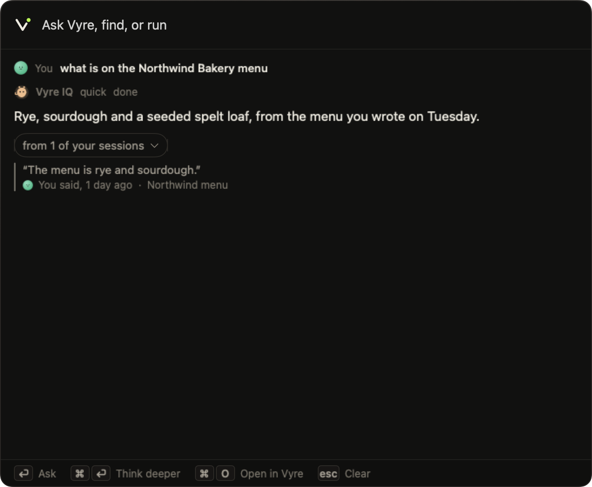
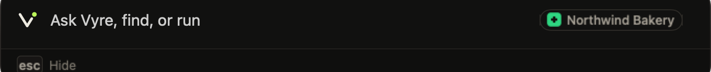
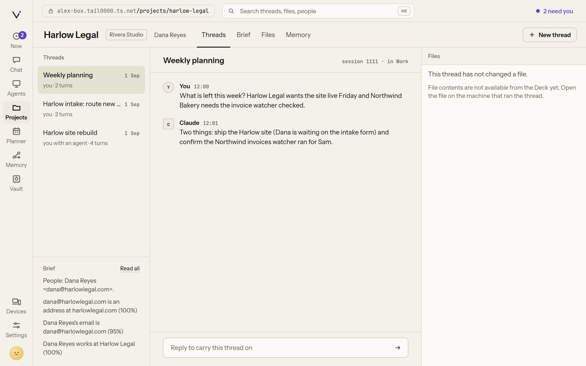

# Vyre

[](https://github.com/vyre-ai/vyre/actions/workflows/node.yml)
[](https://github.com/vyre-ai/vyre/actions/workflows/capsule-mac.yml)
[](https://github.com/vyre-ai/vyre/actions/workflows/ios.yml)
[](https://github.com/vyre-ai/vyre/actions/workflows/android.yml)

**Your agents live on your server. Reach them from your Mac or your phone.**

Vyre is an open-source, self-hosted home for Claude Code agents. They run on a server you own, keep working when your laptop is closed, and answer when you press Option-Space on your Mac or open Vyre on your phone.

Your API keys stay in an encrypted vault on that server. Anything that sends a message, posts or pays waits for your Touch ID or Face ID.

<picture>
  
</picture>

## Install

On the Linux server that will run your agents:

```
curl -fsSL https://vyre.run/install.sh | sh
vyre up
```

On your Mac, with Tailscale installed and signed in:

```
npm install -g https://vyre.run/box/vyre.tgz
vyre up
vyre capsule install
```

`vyre up` connects your Mac to your server. `vyre capsule install` builds the Capsule on your Mac; nothing is downloaded for it. Vyre never changes your Mac's Tailscale settings. Step by step: [Install](docs/get-started/install.md).

## On your Mac: the Capsule

Press Option-Space in any app. Ask a question, send work to one of your agents, or run a `vyre` command. Answers show which past session they came from, and the Capsule knows which project you are working in.

<picture>
  
</picture>

## On your phone: pair by scanning your avatar

Open [phone.vyre.run](https://phone.vyre.run) and point the camera at the ring around your avatar on your Mac or in the browser. Your phone shows your server's name and fingerprint, and pairs only after you tap Pair. After that you can follow sessions, answer your agents' questions and approve actions from your phone.

<picture>
  
</picture>

## On your server: your agents

- **Sessions that outlive your laptop.** Claude Code runs on the server, so closing the lid doesn't stop the work.
- **Memory across sessions.** Vyre searches what you and your agents said before and shows the session each answer came from.
- **Teammates.** Give each project its own named agents. They keep their own notes and pick up where they left off.
- **GitHub.** Sign in with a short code, start a project from one of your repos, or add a repo to a project. Each session works in its own copy of the repo, so parallel sessions don't collide.
- **The vault.** Agents use a credential without seeing its value. You can share an item with another person's Vyre and revoke it with one command.
- **Desktops on your tailnet.** After a one-time Tailscale setup on your server, a Linux or Windows desktop you pair joins your tailnet on its own. Macs follow in 0.1.2.

<picture>
  
</picture>

## What stays private

- Your keys, memory and sessions stay on your server.
- Your prompts go to Anthropic's API through Claude Code, the same as when you run Claude Code on its own.
- Your server opens no port to the internet. Your Mac reaches it over Tailscale.
- A phone you pair by scanning reaches your server through our relay at relay.vyre.run. That traffic is end-to-end encrypted, so the relay can see that your phone and server talk, and when, but never what is said or your keys.

## Questions

**What is Vyre?** A daemon and a Claude Code plugin that give your Claude Code agents a permanent home on a server you own, plus the Capsule for your Mac and an app for your phone. It doesn't fork Claude Code, so Claude Code updates reach you directly.

**What do I need?** A Linux server (a VPS, a home server or a spare machine), a Mac, Tailscale, and a Claude account. Your phone is optional.

**What does it cost?** Vyre is free and open source under Apache 2.0. You pay Anthropic for Claude as you do today.

**Is it secure?** Your server opens no public port, your keys are encrypted at rest, phone traffic through the relay is end-to-end encrypted, and every send, post, payment or new device needs your Touch ID or Face ID. Details: [Security](docs/security/index.md).

**How do I add my phone?** Open phone.vyre.run on the phone, scan the ring around your avatar, check the name and fingerprint, and tap Pair.

## Develop

Needs Node 22.5 or newer. No build step, no dependencies.

```
npm test
VYRE_HOME=$(mktemp -d) bin/vyre up
bin/vyre call system.echo '{"text":"hi"}'
bin/vyre down
```

Write a module: [docs/MODULES.md](docs/MODULES.md). What each team is building now: [docs/work/](docs/work/).

## License

Apache 2.0. See [LICENSE](LICENSE).
