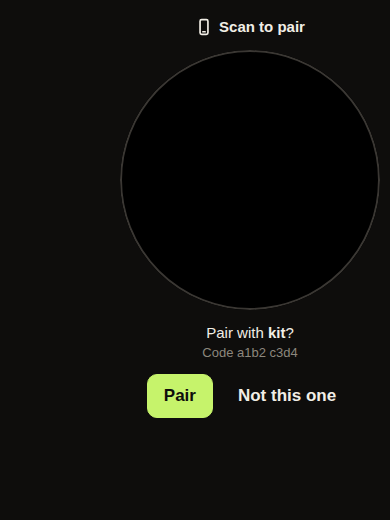

# Vyre

[](https://github.com/vyre-ai/vyre/actions/workflows/node.yml)
[](https://github.com/vyre-ai/vyre/actions/workflows/capsule-mac.yml)
[](https://github.com/vyre-ai/vyre/actions/workflows/ios.yml)
[](https://github.com/vyre-ai/vyre/actions/workflows/android.yml)

**Your agents live on your server. Reach them from your Mac or your phone.**

Vyre is an open-source, self-hosted home for your AI agents. They run on a server you own and keep working when your laptop is closed. On your Mac you reach them with Vyre Lumen: press Option-Space in any app, ask, and send work to an agent. On your phone, open Vyre from your Home Screen.

Use your own subscriptions: Claude, Codex, Grok or OpenRouter. Pick the model for each session, or add @codex or @grok to ask another one for a single message. Your keys stay in an encrypted vault on your server, and anything that sends a message, posts or pays waits for your Touch ID or Face ID.

<picture>
  <source media="(prefers-color-scheme: dark)" srcset="docs/using/shots/deck-now.dark.png">
  
</picture>

## Set up

Open [vyre.run/setup](https://vyre.run/setup). It gives you one line to paste on your server, then walks you through naming your server (you.vyre.run, or your own domain), signing in to your AI, connecting Tailscale and adding your phone.

- **The server** is a Linux machine with Docker, or a Mac that stays on.
- **Tailscale** is required. The free plan is enough.
- **Your Mac** (Node 22.5 or newer, Tailscale signed in) pairs with your server and gets Vyre Lumen:

```
npm install -g https://vyre.run/box/vyre.tgz
vyre up
vyre capsule install
```

`vyre capsule install` builds Vyre Lumen on your Mac from the package; nothing is downloaded for it.

The line the setup page shows is `curl -fsSL https://vyre.run/i | VYRE_CODE=<code> sh`, where the code is the one on the page. (`curl -fsSL https://vyre.run/install.sh | sh` is the same install without a code, for the terminal only.) Step by step: [Install](docs/get-started/install.md).

## On your Mac: Vyre Lumen

Press Option-Space in any app. Ask a question, send work to one of your agents, or run a `vyre` command. Answers show which past session they came from, and Lumen knows which project you are working in.


## On your phone

Vyre on your phone is the web app, added to your Home Screen from your server's address. Your phone needs Tailscale signed in. The setup page shows a ring to scan with your phone to pair it, shows your server's name and fingerprint, and pairs only after you tap Pair.

<picture>
  
</picture>

## On Windows

There is a Windows app for your Windows PC: a tray icon and an Alt-Space panel, and it updates itself. Its installer, VyreSetup.exe, comes with each release on GitHub.

## Your agents, your accounts

- **Sessions that belong to Vyre, not to one model.** A session keeps its memory and files when you change the model. Choose the provider, account, model and effort from the picker in the composer, or add `@codex` or `@grok` to a single message and the session stays where it is. A line in the thread says "Switched to Grok" when it changes, and each reply carries its provider's own mark.
- **Images and video.** What a model generates is saved in the project as an artifact, with its provider, prompt and session, and shows up in a Generated folder in Drive. "Use in" hands an image to another model.
- **Artifacts.** Documents, charts, diagrams and decks run with no scripts. An interactive page says "Runs its own code and can reach the internet" before it runs. In Safari, on a Mac or an iPhone, a page that navigates itself is a known gap that is fixed in 0.2.1: until then open interactive pages only from agents you trust. See [Known gaps](docs/known-gaps.md).
- **Memory across sessions.** Vyre searches what you and your agents said before and shows the session each answer came from.
- **Teammates.** Give each project its own named agents with their own duties and notes; they pick up where they left off.
- **GitHub.** Connect with a short code. Commits carry your identity, and each session works in its own copy of the repo, so parallel sessions don't collide.
- **Watchers.** Small jobs that watch for something and tell you, scoped to the project that made them.
- **Agent computers.** An agent that gets its own computer is held to that computer, and only you can resume a paused one.
- **Vyre for Chrome.** An extension that lets your agents use Chrome in a tab group of their own. It learns how sites work so later runs are faster, which you can see and forget under Memory, and it says plainly what it does not block. See [Learning](docs/using/learning.md).
- **The vault.** Agents use a credential without seeing its value. You can share an item with another person's Vyre and revoke it. Pairing a device, revealing a secret, and anything that sends, posts or pays waits for Touch ID or Face ID. A spend cap limits what agents can spend.

<picture>
  <source media="(prefers-color-scheme: dark)" srcset="docs/using/shots/deck-chat.dark.png">
  
</picture>

## Updates

Releases are signed (an Ed25519 signature on the release files, and cosign on the server image) and Vyre checks both before it installs one. The stable channel ignores prereleases.

## What stays private

- Your keys, memory and sessions stay on your server.
- Your prompts go to the provider you choose (Anthropic, OpenAI, xAI or OpenRouter), the same as when you use that provider on its own.
- Your server publishes no port to the internet. You reach it over Tailscale.
- Vyre's relay at relay.vyre.run carries setup progress and phone pairing. That traffic is end-to-end encrypted, so the relay can see that a server and a device talk, and when, but never what they say.

## Not in 0.2.0

Coming in 0.2.1: Touch ID prompts for terminal commands that need them, the Safari fix above, faster Chrome routing and parallel tabs, "give it to two" (one question, two models, side by side) and per-provider blocks for each model's plans and diffs. Coming in 0.2.5: Spaces (team spaces and sharing between people), memory rollover, and putting idle sessions to sleep.

## Questions

**What is Vyre?** A daemon and a set of apps that give your AI agents a permanent home on a server you own: Vyre Lumen for your Mac, an app for your phone and one for Windows. It runs your Claude, Codex and Grok agents with your own accounts.

**What do I need?** A server (a Linux machine with Docker, or a Mac that stays on), Tailscale, and an account with at least one of Claude, Codex, Grok or OpenRouter. Your phone, your Mac and a Windows PC are each optional.

**What does it cost?** Vyre is free and open source under Apache 2.0. You pay your AI providers as you do today.

**Is it secure?** Your server publishes no port, your keys are encrypted at rest, relay traffic is end-to-end encrypted, and every send, post, payment or new device needs your Touch ID or Face ID. Releases are signed.

**How do I add my phone?** Open the setup page or your server's address on the phone, scan the ring, check the name and fingerprint, and tap Pair.

## Develop

Needs Node 22.5 or newer. No build step, no dependencies.

```
npm test
VYRE_HOME=$(mktemp -d) bin/vyre up
bin/vyre call system.echo '{"text":"hi"}'
bin/vyre down
```

Write a module: [docs/MODULES.md](docs/MODULES.md). What each team is building now: [docs/work/](docs/work/).

## License

Apache 2.0. See [LICENSE](LICENSE).
