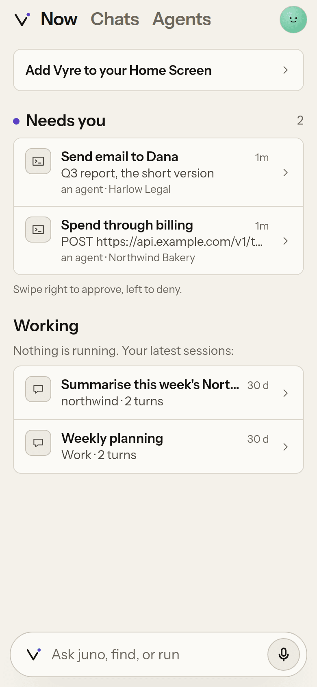

# Install

Vyre runs on a Linux server you own (the box) and reaches your Mac and phone over Tailscale. You
start on your Mac: it sets up the server over SSH, then you finish in your browser. This page is
one path, start to finish, in about fifteen minutes. Other ways to install are at the end, in
[Other ways to install](#other-ways-to-install).

> [!WHY] Why a server, and not just my Mac?
> Your assistant and agents keep working when your Mac is asleep or closed, and your phone can
> reach them from anywhere. A small VPS is enough. If you only want Vyre on this Mac, see
> [Other ways to install](#other-ways-to-install).

## Before you start

- [ ] A Mac with Node 22.5 or newer. Check with `node --version`.
- [ ] Claude Code on the Mac (`claude --version`). Your own sessions on the Mac run on it. The
      server gets its own copy.
- [ ] Tailscale on the Mac, signed in. Get it from <https://tailscale.com/download/mac>. No
      account? Signing in with Google, GitHub, Apple or Microsoft makes one; the free plan is
      enough.
- [ ] A Linux server you can `ssh` into, with an account that can use `sudo`. Docker is
      installed for you if it is missing, after you say yes.
- [ ] A Claude subscription (Pro or Max), or an Anthropic API key.
- [ ] An iPhone or Android phone. You open Vyre on it, and approve your Mac from it.

> [!WHY] Why Tailscale?
> Your box never opens a port to the internet. Tailscale puts your server, Mac and phone on one
> private network (your tailnet), and Vyre only answers devices on it. Vyre also uses your
> Tailscale login to know it is you, so there is no Vyre password to steal.

## 1. Install Vyre on your Mac

This puts the `vyre` command on your Mac. Vyre is not on npm yet, so you install the published
package directly.

```sh
npm install -g https://vyre.run/box/vyre.tgz
vyre --version
```

```output
0.0.1
```

The install is about 6 MB. Search by meaning uses a local model of about 130 MB, which Vyre
fetches into `~/.vyre` the first time it indexes your sessions; until then search matches
keywords. To fetch it now:

```sh
vyre recall --setup
```

```output
  installing the search model (about 128 MB the first time, then nothing) ...
  search by meaning is on · Xenova/all-MiniLM-L6-v2 · vectors fill in over the next few minutes
```

## 2. Run `vyre up`

`vyre up` starts Vyre on this Mac and looks for a box on your tailnet. On a first install there is
none, so it asks where Vyre should run.

```sh
vyre up
```

```output
  vyred running · 0.0.1 · local · started · pid 48213

  Where should Vyre run?
    1  on a server I can SSH to (recommended)
    2  on this Mac
    3  I already set up a box
  1, 2 or 3?
```

> [!SNAG] Tailscale is not installed, or Tailscale is signed out
> `vyre up` prints that line above the question. Install Tailscale from
> <https://tailscale.com/download/mac>, open it, sign in, then run `vyre up` again. Vyre never
> changes your Mac's Tailscale settings itself.

## 3. Choose your server

At the question, type `1` and press Return, then type the account and address you use with
`ssh`. Vyre connects, looks at the server, and says what it will change before it changes
anything. Typing `1` is the same as running this, which you can also use directly:

```sh
vyre box add alex@192.0.2.10
```

```output
  1, 2 or 3? 1
  server (user@host): alex@192.0.2.10
  reaching alex@192.0.2.10
  alex@192.0.2.10: Ubuntu 24.04 LTS, no Docker yet

  Vyre will, on alex@192.0.2.10:
    install Docker with get.docker.com
    create /srv/vyre and put Vyre's stack in it
    add /usr/local/bin/vyre
    start Vyre, which waits for you to finish setting it up in your browser

  Go ahead? [y/N]
```

The plan is what Vyre found on your server, so yours may differ. With Docker already there, the
first line is `use the Docker already there`. When sudo needs your password, the plan says
`sudo will ask for your password on this terminal`, and it asks there.

> [!SNAG] could not reach alex@192.0.2.10
> Vyre uses your Mac's own `ssh`. Check that `ssh alex@192.0.2.10` works in a terminal first. If
> the server has no SSH key for you, Vyre asks for the password once and reuses the connection.

> [!SNAG] this server has no /dev/net/tun, which Tailscale needs
> Nothing was changed. On your own server run `sudo modprobe tun`. On a VPS or an LXC container,
> turn on TUN in the provider's control panel. Then run `vyre up` again.

> [!SNAG] The plan says "add alex to the docker group"
> Your account cannot use Docker without sudo, and sudo needs a password, which later steps over
> SSH cannot type. Joining the `docker` group fixes that. It makes the account root-equivalent on
> that server. Say no and nothing changes.

## 4. Let Vyre set up the server

Type `y` and press Return. Vyre copies its installer to the server and runs it there: it installs Docker if needed,
creates `/srv/vyre`, and starts two containers, one for Tailscale and one for Vyre. The first run
builds or pulls the image and takes a few minutes. When the server is ready, the terminal says:

```output
  Finish in your browser. I'll wait here.

    http://127.0.0.1:7300/onboard?t=...
```

Your browser opens that link. Leave the terminal open: it holds the SSH tunnel the page runs
through, and prints each browser step as you finish it.

The installer's own output scrolls past before that line, and it also prints a link and an
`ssh -N -L ...` line. You do not need either: the Mac opens the tunnel for you.

> [!SNAG] You pressed Ctrl-C, or the terminal closed
> Nothing is lost. Run `vyre box add alex@192.0.2.10`. It looks at what the server has and
> carries on from there.

## 5. Finish in the browser: You

The setup page has six screens. Each one can be skipped and finished later.

On the first, type your name (lowercase, like `alex`) and a name for your assistant (like
`juno`). Press **Continue**.


```output
  You            done
```

That line appears in your terminal once the screen is done, and so on for each step.

## 6. Claude Code

Vyre's sessions and agents run on your Claude account. Choose **Your Claude subscription** and
press **Sign in with Claude**. Claude's sign-in opens in a new tab. When it shows you a code,
copy it, paste it into the **Code** box on the Vyre page, and press **Continue**.


The screen then says "Signed in with your Claude subscription. The token is in the Vault."

```output
  Claude Code    done
```

> [!SNAG] "That code did not work", or "Claude did not accept that code"
> Copy the whole code from Claude's page, with nothing before or after it, and paste it again. If
> it still fails, press **Try another way**, then **Sign in with Claude** again for a fresh code.

> [!SNAG] "the sign-in has ended; start it again"
> The sign-in waited too long. Press **Try another way**, then **Sign in with Claude**.

> [!TIP] Use an API key instead
> Choose **An Anthropic API key**, paste a key that starts with `sk-ant-api`, and press
> **Save key**. Usage is billed to your Anthropic account. Either way the credential goes into
> Vyre's Vault, never into a file.

## 7. Tailscale

This puts the server on your tailnet. Press **Connect**. Tailscale's sign-in opens in a new tab:
sign in with the **same account as your Mac**. The page waits, then shows the server joined.


```output
  Tailscale      done
```

> [!SNAG] The page keeps saying "Waiting for Tailscale"
> Finish signing in on Tailscale's tab. If the tab did not open, use the **Open it here** link on
> the page.

## 8. Your address

Vyre gets an HTTPS certificate for the server's name on your tailnet, such as
`https://vyre.tail1234.ts.net`. Press **Get your address** and wait for the three rows to finish.


As soon as the address works, the terminal moves on by itself. It closes the tunnel, opens a new
tab to make your passkey (step 9), asks your box to pair with this Mac (step 13), and prints the
ending:

```output
  Your address   done

  Make your passkey, which approves everything on your box from now on (works once, for 10 minutes):

    https://vyre.tail1234.ts.net/onboard/passkey#e=...

  Approve this Mac in your Deck: it names this Mac (alex-mac) and asks for your passkey. Code: 482-913
  vyre link shows when it is done.

  Vyre is ready.

    your box        https://vyre.tail1234.ts.net
    your assistant  juno
    next            vyre      (your projects and threads)
```

The terminal is done. The rest happens in the browser. On the setup tab, press
**Switch to vyre.tail1234.ts.net**: from here the setup continues at your new address, and the
`127.0.0.1` link stops working. That is expected.

> [!SNAG] "HTTPS certificates are turned off in your tailnet"
> Tailscale has HTTPS off for new tailnets. Press **Turn on HTTPS**: Tailscale's DNS settings
> open. Under HTTPS Certificates, turn it on. Come back to the Vyre tab and press
> **Check again**. Turning it on publishes the server's name in public Certificate Transparency
> logs.

> [!SNAG] The new address does not open in your browser
> The browser runs on your Mac, so your Mac must be on the tailnet: open the Tailscale menu and
> check it is connected, as the same account you used in step 7.

## 9. Your passkey

The passkey tab asks you to **Add a passkey**. Name the device, press **Add a passkey**, and
confirm with Touch ID. The passkey approves anything important on your box from now on,
including a new Mac. When it says "Passkey added.", press **Continue setting up**.

> [!WHY] Why a passkey?
> A passkey cannot be typed into a fake page or read by a program on your server. Vyre asks for it
> before anything that matters: approving a Mac, taking over a session, releasing a secret. A
> Claude session running on the box can reach the box's terminal, but it cannot press Touch ID.

> [!SNAG] The passkey tab did not open, or its link has expired
> Open the link the terminal printed. It works once, for 10 minutes. For a fresh one, run
> `vyre box add alex@192.0.2.10` again: with the address already working, it prints a fresh
> passkey link and the pairing code.

> [!SNAG] "This browser cannot create a passkey"
> Open the link in Safari or Chrome, on a device on your tailnet.

## 10. Your history

Vyre reads Claude Code sessions and makes them searchable, and you can group them into projects:
name a project, tick its sessions, press **Make project**. A new server has no sessions of its
own, so the screen says "This box has no sessions of its own. Your Mac's sessions show up here
once you pair it, right after setup." Press **Continue**. Once the Mac is paired, its sessions
are listed here and in the Deck, each marked with the Mac's name; they stay on the Mac (see
[The box and the Mac](../concepts/box-and-mac.md#the-box-reads-the-macs-sessions)).


## 11. Your devices

This screen has two cards.

- **Pair this Mac** shows the two commands you already ran (`npm i -g https://vyre.run/box/vyre.tgz`
  and `vyre up`) and, below them, the request your Mac made in step 8: "A Mac wants to pair:
  alex-mac", with a field for the code. Leave it: this Mac cannot approve itself, so you approve
  it from your phone in step 13.
- **Open Vyre on your phone** has two QR codes, one for the Tailscale app and one for your
  address, then **Add to Home Screen**. You use them in step 12.

Press **Open Vyre**. Your assistant says hello on the last screen. Press **Open Vyre** again:
the Deck opens at your address.


> [!SNAG] "The Mac that is asking cannot approve itself. Open Vyre on your phone and approve it there."
> You typed the code on the Mac. The box takes an approval only from another of your devices.
> Carry on to step 12 and approve it from your phone in step 13.

## 12. Open Vyre on your phone

Your address only opens on your own devices on your tailnet, so the phone needs Tailscale too.

1. Scan the **Install Tailscale** code from the **Your devices** screen, or get Tailscale from
   your app store. Sign in with the same account as your Mac, and turn its VPN switch on.
2. Scan the second code, or open `https://vyre.tail1234.ts.net/now` in the phone's browser. On an
   iPhone, use Safari.
3. On an iPhone, tap Share, then **Add to Home Screen**, then **Add**. On Android, use Chrome's
   **Install app**. Open Vyre from the Home Screen: it runs full screen, like an app.



Now shows a **Set up this phone** card for notifications and a passkey. More in
[On your phone](../using/mobile.md).

> [!SNAG] The phone says it cannot find the server, or the page never loads
> Open the Tailscale app. Check three things: it is signed in as the same account as your Mac,
> the connection switch (the VPN) is on, and your phone is listed on the Mac's Tailscale menu.
> Then reload the page. On iPhone, allow the VPN configuration when iOS asks.

## 13. Approve your Mac

The terminal printed a pairing code in step 8. On your phone, Now shows a card, "A Mac wants to
pair: alex-mac". Type the code, press **Approve**, and confirm with Face ID. A passkey you made on
the Mac is on your iPhone when iCloud Keychain is on. The card then says "alex-mac is paired."

Check from the Mac:

```sh
vyre link
```

```output
  waiting for approval: 482-913 · approve it in your Deck, which asks for your passkey
  not paired with a box · vyre link pair <address>
```

Once you approve it, `vyre link` says `linked to` and names your box.

> [!GAP]
> The Deck open on the Mac being paired cannot approve it, and with only the Mac there is no
> other way yet. See [known gaps](../known-gaps.md#approving-a-mac-in-the-deck). Everything else,
> including the Deck and your phone, works without it.

> [!SNAG] "That code does not match. Check the code on the Mac and try again."
> Type the code exactly as `vyre up` or `vyre link` shows it on the Mac, such as `482-913`.

> [!SNAG] "the pairing code expired; start again"
> A code lasts 10 minutes. Run `vyre up` for a fresh one. Running `vyre link approve` on the box
> does not approve it for you: it sends you to the Deck, on purpose.

> [!SNAG] "the box serves alex@example.com, and this Mac is signed in to Tailscale as ..."
> The Mac and the server are on different Tailscale accounts. Sign the Mac in to Tailscale as the
> account the box names, then run `vyre up`.

## 14. Open the Capsule

The Capsule is the command bar on your Mac: press Control twice, anywhere. Install and open it:

```sh
vyre capsule install
vyre capsule
```

```output
  downloading https://vyre.run/box/Vyre-mac.zip
  checked against the hash in this npm package
  installed /Users/alex/Applications/Vyre.app
  open it: vyre capsule (or double-click it in Finder)
  Capsule open · press Control twice anywhere · log /Users/alex/.vyre/logs/capsule.out
```


> [!SNAG] macOS says it cannot check the app for malicious software
> The app is not signed yet. In Finder, right-click `Vyre.app` in `~/Applications` and choose
> **Open**, then **Open** again. If the dialog offers only **Done**, open System Settings, then
> Privacy & Security, and choose **Open Anyway**.

> [!SNAG] Control twice does nothing
> Grant Input Monitoring to Vyre in System Settings, Privacy & Security, then run `vyre capsule`
> again.

That is the whole install. `vyre up` on the Mac prints the "Vyre is ready." block again any time
you want to check. Next: [Your first day](first-day.md).

## Looking after the box

Updates, logs, moving to a new server and removing Vyre are in [Box care](../using/box-care.md).
How the box and the Mac fit together, and what runs where, is in
[The box and the Mac](../concepts/box-and-mac.md).

### Backup

From the Mac, `vyre box backup` copies the whole box into one file. On the box itself,
`vyre backup` writes `vyre-backup-YYYY-MM-DD.tar.gz` holding `config.json`, a consistent copy of
the store, `vault/`, `watchers/`, `modules/`, `certs/` and `names/`. It leaves out the search
model and the logs. Both files hold your sealed vault: keep them where only you can read them.
The steps are in [Box care](../using/box-care.md).

## Other ways to install

::: tabs
::: tab I already have a box
Your box is set up (from another Mac, or with the one-line installer below) and this is a new
Mac. Install Vyre as in [step 1](#1-install-vyre-on-your-mac), then:

```sh
vyre up
```

With the Mac on the same tailnet, `vyre up` finds the box by itself:

```output
  found your box on the tailnet: https://vyre.tail1234.ts.net
  Approve this Mac in your Deck: it names this Mac (alex-mac) and asks for your passkey. Code: 482-913
  vyre link shows when it is done.
```

On your own terminal it also offers, once, to show Vyre's line under every Claude Code session
(`vyre statusline install` does it later). Then approve the Mac from your phone, as in
[step 13](#13-approve-your-mac). If it does not find it, or finds more than one,
name it: pick `3` at the question, or run
`vyre up --connect https://vyre.tail1234.ts.net`.

::: tab Only on this Mac
No server: this Mac is the box. Your phone reaches it only while the Mac is awake. Pick `2` at
the question in [step 2](#2-run-vyre-up), or run:

```sh
vyre up --box
```

```output
  Open this link to set up Vyre (it works once, for an hour):

    http://127.0.0.1:7300/onboard?t=...
```

The link opens in your browser. Follow steps 5 to 11 from there. With this Mac as the box there
is no other Mac to pair: on **Your devices**, use only the phone card. Running without Docker, and
under systemd on Linux, is in [Without Docker](without-docker.md).

::: tab Start on the server
You are already in a shell on the server. Run the one-line installer there:

```sh
curl -fsSL https://vyre.run/install.sh | sh
```

```output
  Open this link to set up Vyre (it works once, for an hour):

    http://127.0.0.1:7300/onboard?t=...

  This box is headless. On your own computer, run this first, then open the link there:
    ssh -N -L 7300:127.0.0.1:7300 alex@192.0.2.10
```

On your Mac, run the `ssh -N -L` line and leave it running (it prints nothing), then open the
link in the Mac's browser. Follow steps 5 to 11. In this path nothing moves on in a Mac
terminal: pressing **Switch to vyre.tail1234.ts.net** on the address screen takes you straight to
**Add a passkey**. Then install Vyre on the Mac as in
[step 1](#1-install-vyre-on-your-mac) and run `vyre up`, as in the first tab.

> [!SNAG] The setup page will not load
> Check the `ssh -N -L` line is still running, and open the link exactly as printed, with
> `127.0.0.1:7300`. Do not change the port: the page answers "Not here." on any other.

:::

## If setup stops partway

> [!SNAG] The setup link has expired
> The link works once, for an hour. From the Mac, run `vyre box add alex@192.0.2.10` again. On
> the server, run `vyre up`. Either prints a fresh link, and the page keeps every step you
> already finished.

> [!SNAG] "Almost there: your box has no address yet."
> You skipped the address screen (step 8), so there is nothing for your Mac or phone to reach yet,
> and the last screen says it cannot open the Deck. Run `vyre box add alex@192.0.2.10` again and
> finish **Your address** in the browser.

> [!SNAG] your box https://vyre.tail1234.ts.net did not answer from here
> The reason follows on the same line. "this Mac is not on the tailnet": sign in to Tailscale on
> the Mac. "the box is offline or unreachable": on the server, run `vyre status`.

More failures, and the message each one prints, are in [Troubleshooting](troubleshooting.md).
