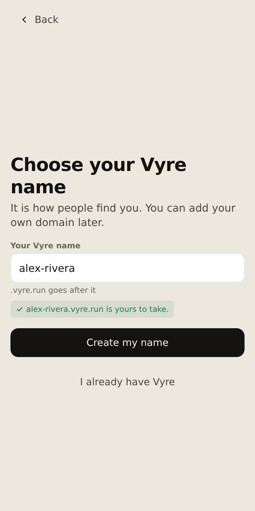
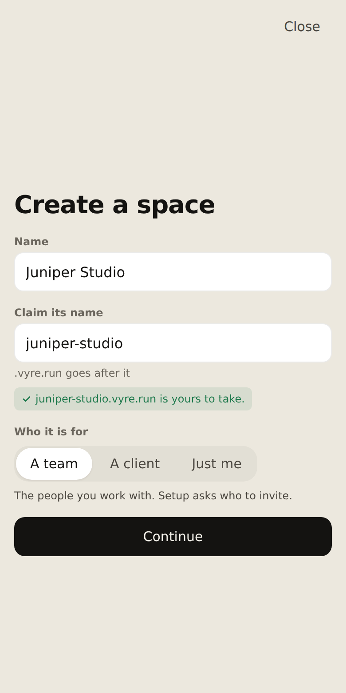
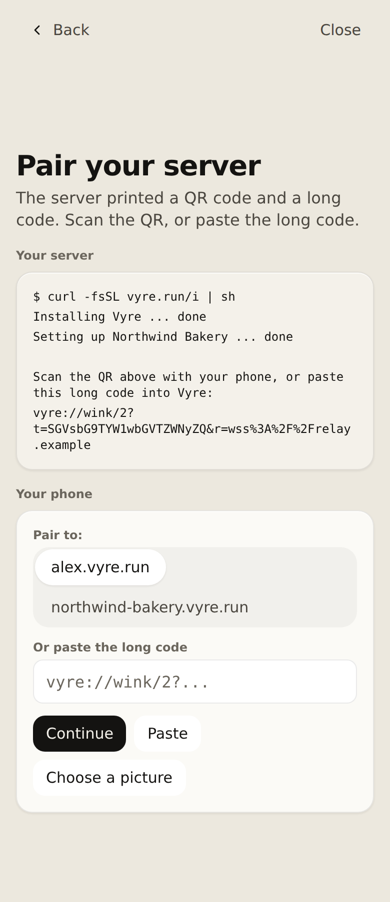
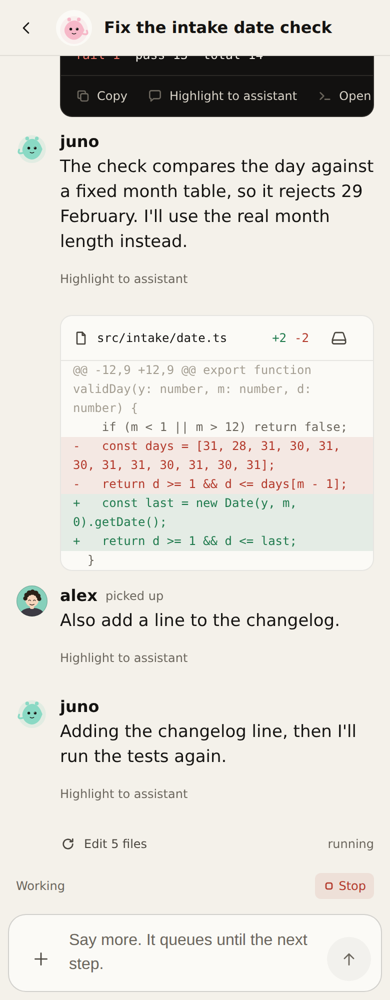
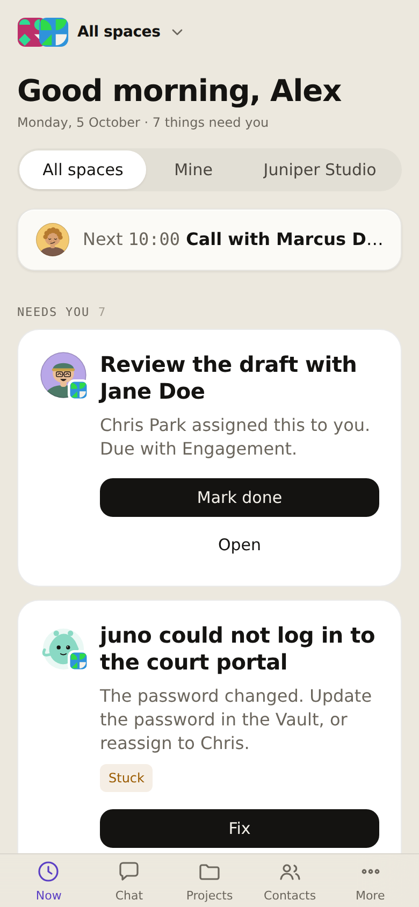

# Install

Vyre runs your agents on a server you own. You open Vyre from the Vyre app on your phone, from the
Lumen on your Mac and from any browser, and the agents keep working when your Mac is asleep.
Setup starts in the Vyre app: you choose your name, create a space, run one line on the server, and
pair the server with a code and three words. The whole path takes about fifteen minutes. Other ways
to install are at the end, in [Other ways to install](#other-ways-to-install).

> [!WHY] Why a server, and not just my Mac?
> Your assistant and agents keep working when your Mac is asleep or closed, and your phone can
> reach them from anywhere. A small VPS is enough. A Mac that stays on can be the server too
> (step 3).

## Before you start

- [ ] A Linux server you can open a terminal on, with an account that can use `sudo`. Docker is
      installed for you if it is missing, after you say yes. Or a Mac that stays on and plugged in.
- [ ] Size: one space per server. A 4 GB server runs one space; Vyre sizes it for you. 8 GB is comfortable and leaves room to grow. If a server has too little free memory for Twenty, the installer says so and Vyre offers the small built-in store instead.
- [ ] A Claude account (the app offers to connect it during setup), and a ChatGPT (Codex) or Grok
      account if you want them. You can add them later in Settings.
- [ ] A phone or a Mac with the Vyre app. In some browsers you start from your phone, and a browser
      otherwise connects to a Vyre that is already set up.

> [!WHY] Do I need a VPN or another network app?
> No. Vyre has its own private network built in, so your server, your computers and your phone
> find each other with nothing to install and nothing to sign in to. Where a direct path is not
> possible, Vyre's relay carries the connection, end-to-end encrypted.

## 1. Open the Vyre app and choose your name

Open the Vyre app on your phone, or the Lumen on your Mac. The Vyre phone apps for iPhone and
Android are built from the repository today (see [On your phone](../using/mobile.md)). The first
screen offers **Get started** and **I already have Vyre**. **Get started** asks one question: *Do you have your own server, or are you joining a team?*

- **I am joining a team** makes your name first ("Make your name, connect this device with a code,
  and you are in"), then takes you to **Your spaces**, where you can create a space on your own
  server or join one. The steps below follow this path, because it is the one that starts with a
  name.
- **I have my own server** goes straight to **Set up My Cloud**. That page shows the install line
  and the long-code entry together, and it is where **Add your own server** leads for a home that
  joined a team. Pairing needs this device to have your name, so make your name first.

Then the app asks you to choose your Vyre name. It is how people find you. Vyre makes a key for
the name on this device, and the key stays here. A name needs at least three letters, and the app
tells you as you type whether `<name>.vyre.run` is taken or yours to take. Press **Create my
name**.



The app then shows a **recovery code** and says it is the only way back in if you lose every
device. It is shown once, and anyone who holds it can get back into your name, so keep it
somewhere only you can reach. Press **I saved it**.

If you already have a name, press **I already have Vyre** and scan a code from a device that has
it. The key on a new device cannot be rebuilt from the name alone.

## 2. Create a space

Your spaces screen offers **Create a space** and **Join a space**. Create a space asks for three
things: its name, the name to claim for it (its address is that name followed by `.vyre.run`; people
and spaces share one set of names, so a space cannot take its owner's name), and **Who it is for**:
**A team**, **A client** or **Just me**. A team and a client then get a step to invite people; **Just
me** skips it.



On a Mac the app first asks **Where should Vyre run?**: **On this Mac** (only while the Mac stays
on) or **On a server** (it shows the one line to run there). A computer app asks **Where will it
live?** with **On a server you have** (one command) or **On this computer** (only while it stays
on, and unreachable while the computer sleeps or is off). A phone is never asked: it makes the
space on the Vyre it is connected to, and a phone with no Vyre running yet offers **Send me the
setup link**, which shares <https://vyre.run> for you to open on a computer.

## 3. Run the line on your server

Choosing a server shows **Run this on your server**. Open a terminal on the server as yourself,
not root, and paste the line the app shows. On a Linux server it looks like this:

```sh
curl -fsSL vyre.run/i | sh
```

A prerelease build of the app shows a different line, one that fetches that release's own installer from GitHub; a stable build shows the line above. Press **I ran it** in the app when it has finished.

The installer asks for `sudo` itself, only for what needs it: Docker, the `/srv/vyre` folder and
`/usr/local/bin/vyre`. It asks before it installs anything. If Docker is missing it asks
`Docker is not installed. Install it now with: curl -fsSL https://get.docker.com | sh ?`.

It works through five steps, and the terminal shows each one as it happens:

1. **Checking Docker**: Docker with Compose 2.24 or newer.
2. **Downloading and verifying**: every file is checked against a published list of checksums,
   and the Vyre image's signature is checked against Vyre's release workflow before the image is
   pulled by its digest. A failed check stops the install, and nothing skips it.
3. **Laying out /srv/vyre**: the stack goes in that folder, owned by your account.
4. **Installing the vyre command**: `/usr/local/bin/vyre`.
5. **Starting Vyre**: Vyre starts in a container on your server.

Near the end the terminal asks you to pair this server from your Vyre app:

```output
  Pair this server from your Vyre app: scan this with your phone,
  or paste the long code into the app on a computer.
  <the QR, drawn in the terminal>
  Long code: <one long line, good for one use>
  It is good for five minutes.
```

> [!SNAG] "this Docker came from snap", "this Docker runs rootless", or "Podman answering as docker"
> Vyre needs the regular Docker Engine. Install it with
> `curl -fsSL https://get.docker.com | sh`, then run the line again.

> [!SNAG] "Vyre is already running in /srv/vyre, so this installer leaves it alone."
> An earlier install is running here. `vyre update` updates it. To start over, run
> `vyre uninstall --keep-data`, then paste the line again. Your data stays.

> [!SNAG] **Pair your server** shows nothing to scan
> Check the line finished in the terminal, then run the line again, or run `vyre call
> wink.server.code '{"qr":true}'` on the server.

::: tabs
::: tab A Mac that stays on
Paste the line in Terminal on that Mac, as yourself, not root. The installer asks for your Mac
password once, to set Vyre up as a service that starts when the Mac does, with nobody signed in.
The installer downloads a Node and checks it against a pinned checksum, installs Colima (the
small Linux machine your agents' computers run in) and the GitHub command line tool, and checks
the Vyre release's signature before it installs anything. Near the end it prints `Vyre is running. Pair it from your Vyre app: run <bin>/vyre call wink.server.code '{"qr":true}' here, then scan the QR or paste the long code.` Then continue at step 4.

After a power cut: with FileVault on, the Mac waits for someone to unlock it at the screen, and
Vyre is off until then. With FileVault off, anyone who takes the Mac can read Vyre's files,
notes and conversations; the vault stays locked behind its password. Either way the Mac switches
itself back on only if "Start up automatically after a power failure" is on in System Settings,
under Energy, and it starts off on a Mac mini. Vyre keeps the Mac awake while it runs, so leave
it plugged in. The installer reads these two settings and tells you which applies.
::: tab A Linux server
The steps above are the Linux path.
:::


## 4. Pair your server

The app's **Pair your server** screen says the server printed a QR code and a long code. On a phone,
scan the QR; on a computer, paste the long code into the field.



The app then shows three words and waits. The server's terminal shows three words for each way in
and asks you to pick the set the app shows. Say yes at the server only if it shows the same words,
or press **Not the same** in the app:

```output
  <Name> is asking to pair this server. Pick the three words your app shows:
    1) <three words>
    2) <three words>
    3) <three words>
  Which one? (1, 2 or 3, Enter to refuse)
```

A wrong pick prints `Those were not the words the app shows, so nothing was paired.` and offers to
try again. If five minutes pass before a device asks, it prints `The code ran out before a device
asked. Nothing was paired.` and asks `Make a new code? [y/N]`. When it works, the install finishes with `Your server is ready.`, a line about your keys
(the sealing key is a file owned by the sealing process's own user, so root on this server, or a
stolen disk, can read it), and `Connected to <name>. Finish setting up on your <device>.` (the name is your space's name as the server reports it, address included; with no device name it says "device"). Run with
`--yes`, or with no terminal, it prints the QR and the long code and then `Finish setting up on
your device once it has paired.` To show the code again later, run `vyre call wink.server.code
'{"qr":true}'` on the server. A server has no first-run page: there is no browser link and no tunnel.

> [!SNAG] "Another server already used this code. Run the install line again to get a new code."
> The code works for one server. Run the install line on the server again for a new code.

> [!SNAG] The app says the code ran out, or was already used
> Run the install line on your server again, or `vyre call wink.server.code '{"qr":true}'` if it
> is already installed, and use the new code.

> [!SNAG] The app cannot reach the server
> Check that the server is on and online. Nothing was paired. Run `vyre status` on the server.

## 5. Finish setting up the space

Setup carries on by itself on the device it started on. The AI, tools and Kit screens can be skipped (**Later**, or **Start empty** for a Kit), and the
look and members screens have only **Continue**:

- **Give the space a look.** Pick a colour (Violet, Amber, Sky, Sage or Rose) for how its mark
  shows on every screen. You can change it later.
- **Who is in it?** You are the owner. Invites are made in Spaces and members, where you choose
  each person's role. A **Just me** space skips this.
- **Connect your AI accounts.** Your assistant works on your own AI account. Connect Claude now,
  or later from Settings.
- **Connect your tools.** Pick the ones you will use. Nothing connects yet: each asks for its own
  sign-in when you set it up.
- **Start with a Kit.** A Kit adds record types, Flows and views in one step. Pick one, or **Start
  empty**.

If setup is still unfinished on another of your devices, this one shows **Setup in progress on your
<device>** with **Continue here**. A device that has not finished setup shows a **Finish setting up
Vyre** banner.

To join someone else's space instead, choose **Join a space** on the spaces screen, scan the invite
or paste its link, and press **Open invite**. The app shows the space's name and who invited you.
An invite from a link outside Vyre carries a warning to check the space name first.

A chat is where you work with your assistant and your agents, and Now shows your day: the next
call, the spaces you are in, and the things that need you.





## 6. Open Vyre on your phone

There is nothing to install and nothing to sign in to first.

1. Open the Vyre app on your phone and scan the code your server or a computer you are signed in
   on shows, or paste its long code. Both screens show the same three words; say yes only if
   they match. Or open `https://alex.vyre.run/now` in the phone's browser, which reaches your
   server through the relay. On an iPhone, use Safari.
2. In the browser, on an iPhone, tap Share, then **Add to Home Screen**, then **Add**. On
   Android, use Chrome's **Install app**. Open Vyre from the Home Screen: it runs full screen,
   like an app.

More in [On your phone](../using/mobile.md).

> [!SNAG] The phone says it cannot find the server, or the page never loads
> Check the phone has a connection, then reload the page. If it still fails, run `vyre status` on
> the server.

## 7. Put the Lumen on your Mac

The Lumen is Vyre's command bar on the Mac: press Control twice, anywhere. It lives on the Mac
you work on, not on the server. It comes with the `vyre` command, so install that first. This
needs Node 22.5 or newer (`node --version`):

```sh
npm install -g https://vyre.run/box/vyre.tgz
vyre --version
```

```output
0.2.0
```

Then pair the Mac with your server and open the Lumen. `vyre up --connect` only saves your server's
address. Pairing is `vyre link pair` with the code the server shows (the install prints it, and
`vyre call wink.server.code` on the server shows it again):

```sh
vyre up --connect https://alex.vyre.run
vyre link pair <code>
```

The server's terminal asks you to pick the three words the pairing device shows, as in step 4.
Run `vyre up` again afterwards and it ends with the block
that says it is ready (`your assistant` names the assistant once you have made one, and says `none
yet` before that):

```output
  Vyre is ready.

    your box        https://alex.vyre.run
    your assistant  juno
    next            vyre      (your projects and threads)
```

`vyre up` also builds and opens the Lumen. To build it yourself, or when it did not open:

```sh
vyre capsule install
vyre capsule
```

```output
  vyre capsule install builds Lumen on this Mac; nothing is downloaded.
  Building Lumen for this Mac (once, under a minute).
  Lumen built · /Users/alex/.vyre/capsule/Vyre.app · vyre capsule opens it
  Lumen open · ⌥Space, or Control twice once it is allowed · /Users/alex/.vyre/capsule/Vyre.app
```

The app is built on your Mac with Apple's Command Line Tools, so nothing is downloaded and
Gatekeeper has nothing to quarantine. If they are missing, `vyre capsule install` says to run
`xcode-select --install`. The first time, it offers to make a local signing identity so macOS
keeps the Lumen's permissions across updates.

> [!SNAG] "Lumen is built with Apple's Command Line Tools, which are not installed"
> Run `xcode-select --install`, then `vyre capsule install` again.

> [!SNAG] Control twice does nothing
> Grant Input Monitoring to Vyre in System Settings, Privacy & Security, then run `vyre capsule`
> again. Option-Space opens it meanwhile.

That is the whole install. Next: [Your first day](first-day.md).

## A Windows PC

A Windows PC is a device you use Vyre from, not a home: in 0.2.9 the home is a Mac, Linux or a
server, and a Windows home comes in 0.3.0. The Windows app is a tray app. It is not
code-signed at 0.2.0, so Windows says it does not recognize the app: choose **More info**, then
**Run anyway**. Its installer, `VyreSetup.exe`, is on the latest release at
<https://github.com/vyre-ai/vyre/releases>, and it is checked against the release's published
checksums. You can also use your server from any browser on the PC, at your address. The app and the CLI are in [Windows](../using/windows.md).

## Looking after the box

Updates, logs, moving to a new server and removing Vyre are in [Box care](../using/box-care.md).
How the server and the Mac fit together, and what runs where, is in
[The box and the Mac](../concepts/box-and-mac.md).

### Backup

From the Mac, `vyre box backup` copies the whole server into one file; the box stops while it
copies and starts again after. On the server itself, `vyre backup` writes
`vyre-backup-YYYY-MM-DD.vyre`, one file sealed with a passphrase you type (12 characters or more).
It holds your settings, the store, the sealed vault, watchers, modules, certificates, names and
the artifacts your agents made, plus your project files and session transcripts unless you leave
them out with `--skip-projects` or `--skip-transcripts`. It leaves out the search model, the logs
and your Claude, Codex and Grok sign-ins (you sign in again after a restore). It opens only with
that passphrase: keep the two apart. The steps are in [Box care](../using/box-care.md).

## Other ways to install

**From my Mac over SSH.** Use this when you would rather start on the Mac than from the Vyre app.
`vyre box add alex@192.0.2.10` copies the installer to the server over SSH and runs it, and the
pairing question appears in that same terminal. It does not open a browser, tunnel a port or make a
passkey link. At the end it prints `Your server is installed and not paired yet.` with how to pair, or
`Your server is paired to <space>.` if it already is. Then pair the Mac as in
[step 7](#7-put-the-lumen-on-your-mac).

**I already have a server.** Your server is set up and this is a new Mac. Install
Vyre as in [step 7](#7-put-the-lumen-on-your-mac), then:

```sh
vyre up
```

```sh
vyre up --connect https://alex.vyre.run
```

`vyre up --connect` only saves the address; pair with `vyre link pair <code>`, as in step 7. On your own terminal it also offers, once, to show Vyre's line under every Claude Code
session (`vyre statusline install` does it later). Pick `3` at the question `vyre up` asks, if you
would rather type the address there.

The server itself can also run without Docker, from the package: see [Without Docker](without-docker.md).

## If setup stops partway

> [!SNAG] This code has expired. Start again.
> The pairing code lasts five minutes. Run the install line again for a fresh one. If the first
> line already got as far as starting Vyre, the installer answers `Vyre is already running in
> /srv/vyre, so this installer leaves it alone.` and a new line does nothing. Run `vyre uninstall --keep-data`
> on the server, then paste the fresh line. Your data stays.

> [!SNAG] your box https://alex.vyre.run did not answer from here
> The reason follows on the same line. "the box is offline or unreachable": on the server, run
> `vyre status`.

More failures, and the message each one prints, are in [Troubleshooting](troubleshooting.md).
