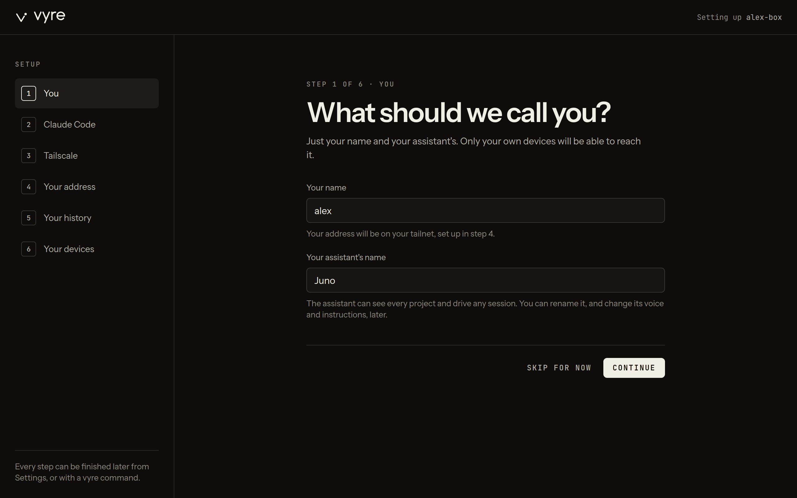
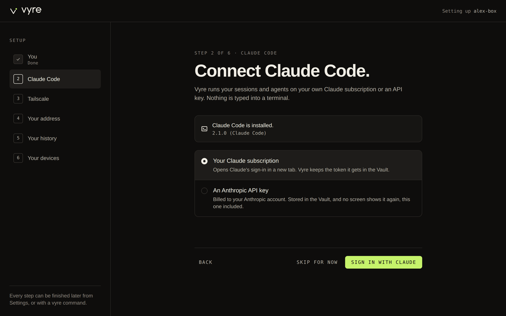
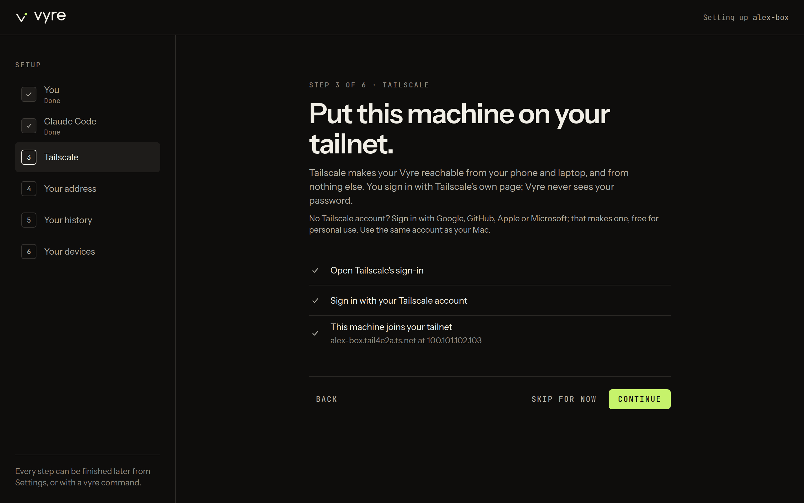
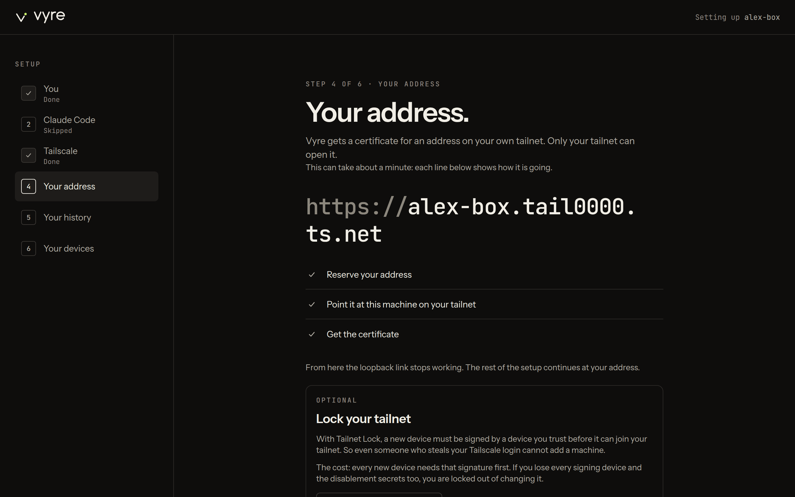
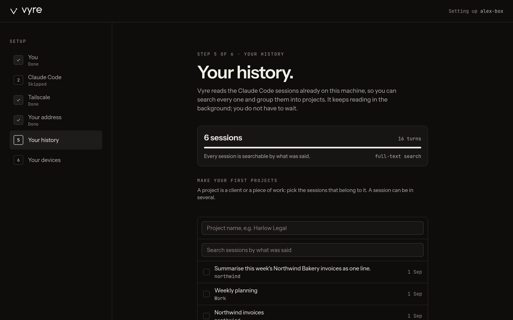
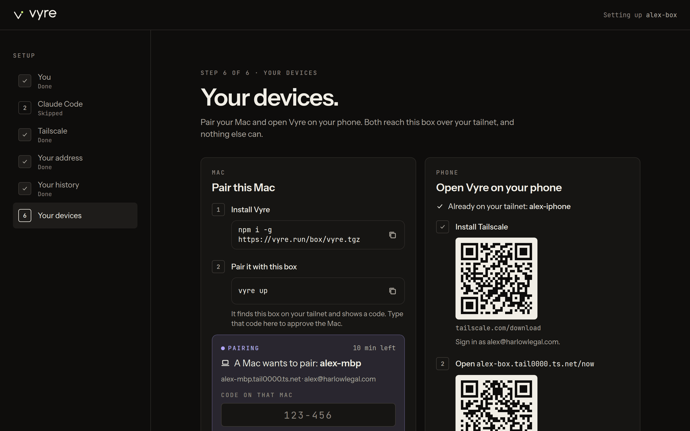
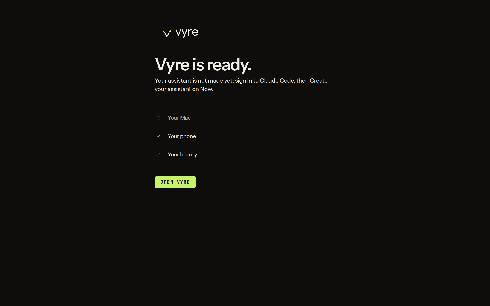

# Onboarding

Onboarding is the browser half of setting up a box: six screens that name you and your
assistant, sign the box in to Claude and Tailscale, give it an HTTPS address, read your Claude
Code history and put Vyre on your other devices. It opens by itself when `vyre up` or
`vyre box add` gets the server ready. The terminal side (installing the `vyre` command, choosing
the server, approving your Mac, the Capsule) is in [Install](install.md); this page is the
reference for the screens.

::: demo onboarding
1. 
2. 
3. 
4. 
5. 
6. 
:::

> [!WHY] Why start on the Mac and not on the server?
> The Mac already has your SSH key, your browser and your Tailscale sign-in. Starting there means
> you never copy a link or open a tunnel by hand: the Mac holds the tunnel to the server's setup
> page and opens it for you. The full reasoning is in [ADR 0008](../adr/0008-install-journey.md).

## How the screens work

- The page opens at `http://127.0.0.1:7300/onboard?t=...`. The link works once, for an hour, and
  the page listens only on the box's own loopback: from a Mac it runs through the SSH tunnel
  that `vyre box add` holds open. See [Install, step 4](install.md#4-let-vyre-set-up-the-server).
- The list on the left shows the six steps, with **Done** under each finished one. Click a step
  to go back to it.
- Every screen but the first has **Back**. Every screen but the last has **Skip for now**.
- A skipped step can be finished later: in the Deck, Settings, Setup lists every step with a
  **Finish** button that opens the same screen. See [Finish a skipped step](#finish-a-skipped-step).
- When the Mac started the setup, its terminal prints each step as you finish it, such as
  `You  done` or `Claude Code  skipped`.

## 1. You

**What should we call you?** asks for two names.

- **Your name**: lowercase letters, numbers and hyphens, 3 to 32 long, starting with a letter,
  such as `alex`. Under the box the page says "Your address will be on your tailnet, set up in
  step 4."
- **Your assistant's name**: any name, such as `juno`. The assistant can see every project and
  drive any session. You can rename it later.

**Continue** saves both and moves on. It stays grey until your name is valid.

> [!SNAG] "Lowercase letters, numbers and hyphens, 3 to 32 long, starting with a letter."
> Step 1 does not take a display name like `Alex Rivera`. Type a short name such as `alex`.

## 2. Claude Code

**Connect Claude Code.** Vyre's sessions and agents run on your own Claude account. The page
first looks for Claude Code on the box and shows its version. On a Docker box it is always there:
it is part of the image.

Choose how Vyre signs in:

- **Your Claude subscription**, then **Sign in with Claude**. Claude's sign-in opens in a new
  tab. When it gives you a code, paste it into **Code** and press **Continue**. **Open it again**
  reopens the tab. **Try another way** goes back to the choice.
- **An Anthropic API key**: paste a key that starts with `sk-ant-api` and press **Save key**.
  Usage is billed to your Anthropic account.

Either way the credential goes into the [Vault](../using/vault.md), as `claude-setup-token` or
`anthropic-api-key`, and no screen shows it again. When it is done you should see "Signed in with
your Claude subscription. The token is in the Vault." (or "Signed in with an API key"), and
**Continue**.

> [!SNAG] "That code did not work. Try again."
> Copy the whole code from Claude's page, with nothing before or after it, and paste it again. If
> it still fails, press **Try another way**, then **Sign in with Claude** again for a fresh code.

> [!SNAG] "Claude Code is not installed on this machine."
> You see this only on a box without Docker. Run the command the page shows
> (`npm install -g @anthropic-ai/claude-code`) on the server, then press **Check again**.

## 3. Tailscale

**Put this machine on your tailnet.** Press **Connect**. Tailscale's sign-in opens in a new tab:
sign in with the same account as your Mac. No account? Signing in with Google, GitHub, Apple or
Microsoft makes one. Vyre never sees your password. New to Tailscale? See
[Tailscale, from zero](tailscale.md).

The three rows tick as you go: **Open Tailscale's sign-in**, **Sign in with your Tailscale
account**, and **This machine joins your tailnet**, which then names the machine and its tailnet
IP. While it waits the button reads **Waiting for Tailscale**. Once the machine has joined, press
**Continue**.

> [!SNAG] The page keeps saying "Waiting for Tailscale"
> Finish signing in on Tailscale's tab. If the tab did not open, use the **Open it here** link
> under the rows.

> [!SNAG] "Your tailnet will not let this machine join."
> The page shows the reason and, when there is one, the fix. Fix it in Tailscale's admin console,
> then press **Check again**. For "Tailscale runs in userspace networking mode", see
> [Troubleshooting](troubleshooting.md).

## 4. Your address

**Your address.** Vyre gets an HTTPS certificate for the box's name on your tailnet, such as
`https://vyre.tail1234.ts.net`. Only devices on your tailnet can open it. Press
**Get your address** and wait for the three rows: **Reserve your address**, **Point it at this
machine on your tailnet** and **Get the certificate**. If one fails, the button becomes
**Try again**.

When all three are done, the button reads **Switch to** and your address. Press it. From here the
`127.0.0.1` link stops working and the setup continues at your address, first with your passkey:

1. The passkey page asks you to **Add a passkey**. Name the device, press **Add a passkey**, and
   confirm with Touch ID (or your phone).
2. It says "Passkey added." Press **Continue setting up** to go on to step 5.

The passkey approves anything important on your box from now on, including a new Mac. See
[Presence](../concepts/presence.md).

When the Mac started the setup, its terminal moves on by itself as soon as the address works. It
closes the tunnel, asks your box to pair with this Mac, and prints "Vyre is ready." That part is
in [Install, step 8](install.md#8-your-address).

> [!SNAG] "HTTPS certificates are off for your tailnet"
> Tailscale has HTTPS off for new tailnets. Press **Turn on HTTPS**: Tailscale's DNS settings
> open. Under HTTPS Certificates, turn it on. Come back and press **Check again**. Turning it on
> publishes the machine's name in public Certificate Transparency logs. Step by step:
> [Turn on HTTPS certificates](tailscale.md#5-turn-on-https-certificates).

> [!SNAG] "Pick your name in step 1 first."
> The address needs your name. Press **Go to step 1**, finish it, and come back.

> [!SNAG] The new address does not open in your browser
> The browser runs on your Mac, so your Mac must be on the tailnet: open the Tailscale menu and
> check it is connected, as the same account you used in step 3. If it is, see
> [the address does not load](tailscale.md#the-address-does-not-load-and-no-certificate-error-either).

> [!SNAG] "This browser cannot create a passkey."
> Open the link in Safari or Chrome, on a device on your tailnet. **Continue setting up** skips
> the passkey for now; `vyre box add alex@192.0.2.10` from the Mac prints a fresh passkey link
> later.

> [!WHY] What about my own domain?
> The address step has a collapsed **Your own domain** section. A domain of your own, or a
> `<you>.vyre.run` name, needs a Cloudflare API token set in the box's configuration
> (`CLOUDFLARE_vyre_token` in `/srv/vyre/vyre.env` for `vyre.run`) until the hosted name
> directory exists. That directory is not built yet. The tailnet name needs nothing. The steps
> are in [Troubleshooting](troubleshooting.md).

## 5. Your history

**Your history.** Vyre reads the Claude Code sessions already on this machine so you can search
them by what was said. The panel counts sessions and turns and fills its bar as it reads. It keeps
reading in the background, so you do not have to wait.

Under **Make your first projects** you can group sessions into a project, such as a client:

1. Type a project name, for example `Harlow Legal`.
2. Search the sessions by what was said, and tick the ones that belong.
3. Press **Make project**. The project appears above the picker. A session can be in several.

Press **Continue** when you are done, or at once.

On a new server the box has no sessions of its own, and the page says "This box has no sessions
of its own. Your Mac's sessions show up here once you pair it, right after setup." with a
**Pair your Mac** link to step 6. Once the Mac is paired, the picker lists its sessions too. They
stay on the Mac: the box reads them through the link. See
[The box and the Mac](../concepts/box-and-mac.md#the-box-reads-the-macs-sessions).

On a Mac that is its own box, with no sessions yet, it says "No Claude Code sessions found on this
machine yet."

## 6. Your devices

**Your devices.** "Pair your Mac and open Vyre on your phone." Two cards, side by side on a wide
screen and stacked on a narrow one.

**Pair this Mac**:

1. **Install Vyre**: `npm i -g https://vyre.run/box/vyre.tgz` on the Mac.
2. **Pair it with this box**: `vyre up` on the Mac. It finds the box on your tailnet, asks
   whether to pair with it, and shows a code once you say yes (`vyre link pair <address>` does the
   same without the question).
3. A card appears here, "A Mac wants to pair:" and the Mac's name, with a field for **Code on that
   Mac**, **Approve** and **Deny**. Type the code, press **Approve**, and confirm with your
   passkey. The card counts down the request's ten minutes.

When it is done the card says "Mac paired:" and the name, and "Press Control twice to open the
Capsule." The Capsule itself is in [Install, step 14](install.md#14-open-the-capsule).

> [!SNAG] "The Mac that is asking cannot approve itself. Open Vyre on your phone and approve it there."
> You are on the Mac you are pairing. The box takes the approval only from another of your
> devices. Open Vyre on your phone (the card beside this one), and approve the request on Now.

> [!GAP]
> The Deck approves a pairing, but not from the Mac being paired. Approve it from your phone
> (or another device on your tailnet) with your passkey. See
> [known gaps](../known-gaps.md#approving-a-mac-in-the-deck).

**Open Vyre on your phone**:

1. **Install Tailscale**: a QR code for `tailscale.com/download`, and the account to sign in with.
   When Tailscale lists your phone, the step is ticked and says "Already on your tailnet:" and the
   phone's name. A phone that is offline in Tailscale is named, with "Open the Tailscale app and
   turn it on, then scan." Phone steps: [Install Tailscale on each device](tailscale.md#2-install-tailscale-on-each-device).
2. **Open** your address: a QR code for your address with `/now`. Before the address works it
   says "After Tailscale and your address".
3. **Add to Home Screen**: "Share, then Add to Home Screen. It opens like an app."

More in [On your phone](../using/mobile.md).

**Open Vyre** finishes the setup. This screen has no Skip.

## The last screen

The page says **Vyre is ready.**, your assistant says hello, and three rows tick for your Mac,
your phone and your history. **Open Vyre** takes you to the Deck at your address.

If you skipped the Claude Code step, no assistant was made. Now and Agents in the Deck then show
**Create your assistant**: give it a name, tick **Give it its own computer, from the pool** if you
want it to browse and use apps you can watch in Glass, and press **Create**.

> [!SNAG] "Your address is not set up yet, so this page cannot open the Deck."
> You skipped **Your address**. The Deck is served only at your address, so go back to step 4 and
> finish it. If the terminal already stopped waiting, run `vyre box add alex@192.0.2.10` again.

## Finish a skipped step

Open the Deck, then Settings. **Setup** lists the six steps with **To do**, **Skipped** or
**Done**, the command that finishes each from a terminal (`vyre up`, or `vyre index` for your
history), and a **Finish** button beside each one left, which opens the same screen as here.
`vyre up` picks up at the first step not finished.

**Your devices** in Settings lists your devices on the tailnet, online or offline, and marks a
paired Mac "Paired with this box". **Add a device** opens step 6.

If you skipped **Your address**, the Deck cannot open yet: run `vyre box add alex@192.0.2.10`
from the Mac, or `vyre up` on the server, for a fresh setup link. The page keeps every step you
already finished.

## Next

- [Install](install.md): the terminal steps around these screens, from nothing to a working setup.
- [Your first day](first-day.md): what to do once the Deck is open.
- [Troubleshooting](troubleshooting.md): every setup message and its fix.
