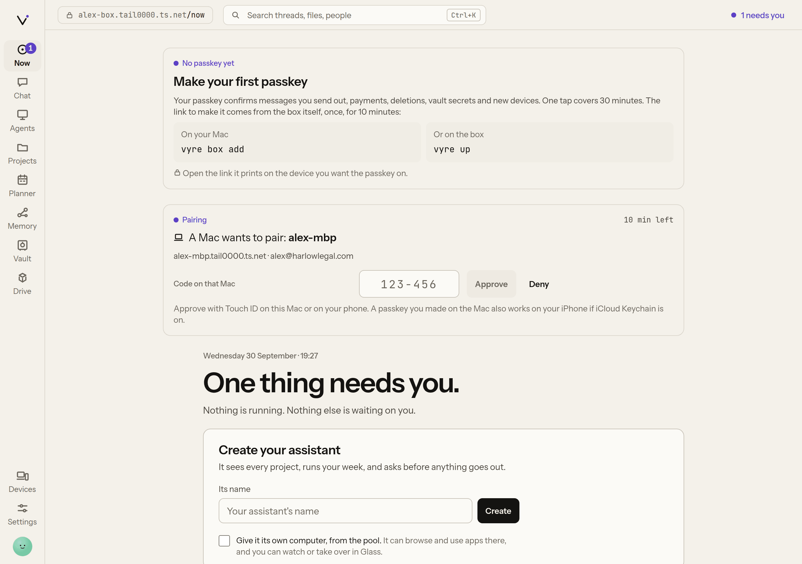
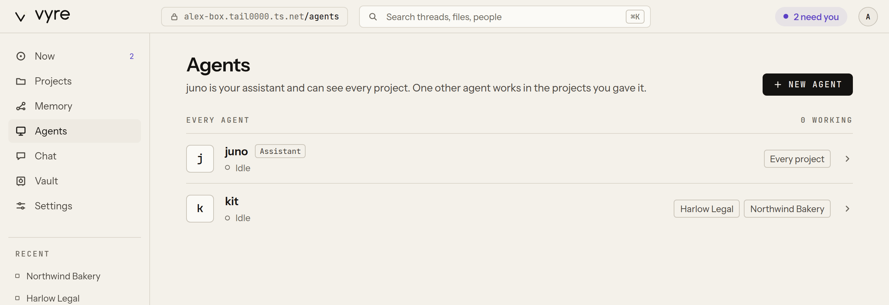

# Agents

Every Vyre session is a real Claude Code session. An **agent** is a named record that says how
Vyre should run such sessions for you: which credentials, which projects, what instructions. Its
work happens in ordinary headless threads that vyred owns, so each one keeps running after you
close a window, streams to every surface, and routes its permission questions to wherever you
are. Every install has one special agent, **the assistant**, made at onboarding. You can make
others, such as a research agent or a bookkeeping agent.

| | The assistant | Other agents |
| --- | --- | --- |
| How many | exactly one | as many as you make |
| Projects it can see | every project (`"*"`) | only the ones in its list |
| Can start, drive and stop other sessions | yes, through the `threads.*` and `agents.*` tools | no |
| Where it works | its own folder under Vyre's home | its project's home when it has one project, else its own folder |

An agent never draws context from a project outside its list: its brief, its prompt hints and its
`recall.search` stay inside those projects' folders.

## Talk to the assistant or an agent

From Lumen, press Control twice and type. The assistant is the default destination; type
`@` to pick another agent, a project or a thread. The "Sends to" row shows where Enter will send
before anything goes.

From the terminal:

```sh
vyre agents ask juno "What changed in the Harlow Legal project this week?"
```

```output
  juno › Two threads ran in Harlow Legal this week: ...
  thread 3f9c2a71 · $0.0123
```

`vyre agents ask` waits up to ten minutes for the reply. Or run `vyre` with no arguments, pick an
agent under **Agents**, and talk a line at a time. An empty line goes back to the list.

In the Deck, open **Ask** (`/ask`) to talk to the assistant or any agent, or **Agents**
(`/agents`) for every agent and what it is doing. On a phone, **Find** asks the assistant what you
type, and `@kit ...` there asks kit. `/agents/<name>` is one agent's board: its
threads, its watchers and its computer.

If an agent stops on a permission question, the reply says so and names the question. Answer it
from any surface; in the terminal:

```sh
vyre threads answer <ask> allow
```

The tool is `agents.ask {agent, text}`. It sends to the agent's current thread, resumes it if it
stopped, and starts one if there is none.

## Run an agent on your own quota

Agents run on your own Claude credentials, kept in the [Vault](vault.md) and set only in that
agent's own child process. Two kinds of item work:

- **A subscription setup token** from `claude setup-token`, stored as a `secret`. Onboarding runs
  `claude setup-token` for you and stores the result as `claude-setup-token`.
- **An Anthropic API key**, stored as an `api-key`. Onboarding names this one `anthropic-api-key`.

The subscription is used first. When its limit is reached and the agent has an API key as a
fallback, the thread switches to the key and says so in the thread, with the budget left. At 80% of
the budget the thread is told; at 100% it stops, and the note says to raise it with
`vyre agents update <name> --budget <dollars>`.

With neither item set, an agent uses the Claude Code login already on this machine.

To store your own and point an agent at them:

1. Store the token and the key. Each prompts for the value without echo:

   ```sh
   vyre vault put claude-setup-token --kind secret
   vyre vault put anthropic-api-key --kind api-key
   ```

2. Let the `agents` module release them:

   ```sh
   vyre vault grant claude-setup-token agents
   vyre vault grant anthropic-api-key agents
   ```

3. Point the agent at them, with a budget in dollars for the key:

   ```sh
   vyre agents update juno --vault claude-setup-token --fallback anthropic-api-key --budget 20
   ```

> [!SNAG] "juno cannot start: ..."
> The item named by `--vault` is missing, has no value, or is not granted to `agents`. Check it
> with `vyre vault list`, then grant it. A missing fallback key does not stop the agent: it starts
> without one, and vyred's log says so.

## Make an agent

```sh
vyre agents create kit --projects harlow-legal,northwind-bakery \
  --vault claude-setup-token --fallback anthropic-api-key --budget 20 \
  --instructions "You keep the books for Harlow Legal and Northwind Bakery."
```

```output
  made kit  agent · harlow-legal, northwind-bakery
```

A name is lowercase letters, digits and dashes, starting with a letter, 2 to 31 characters. Flags: `--projects a,b` (or `*`), `--model`, `--vault`, `--fallback`, `--budget` (dollars),
`--instructions`, and `--assistant` to make the one assistant. `vyre agents update <name>`
takes the same flags and changes only what you name; the change applies from the agent's next
thread.

In the Deck, `/agents` has a form for a new agent, including **Give it its own computer, from the
pool**. Making or changing an agent asks for no passkey. It is yours: the CLI, the Deck, the
Lumen and onboarding may call `agents.create` and `agents.update`. Your assistant may also call
`agents.update` to change an agent's name, job, model, effort and description. Any other agent, a
bare MCP session and a guest are refused with "denied", and nobody is asked.

## Make the assistant later

If you skipped the assistant at onboarding, Now and Agents show **Create your assistant**:



1. Type its name under **Its name**, for example juno.
2. Tick **Give it its own computer, from the pool.** if it should have a computer (see
   [Give an agent a computer](#give-an-agent-a-computer)).
3. Press **Create**.

The Deck makes it as onboarding would: kind assistant, every project, the Claude sign-in that
onboarding stored (or this machine's own Claude Code login when there is none), and instructions
that give its name and yours. From a terminal, `vyre agents create juno --assistant` makes one
too, with the flags you give it.

## See what agents are doing and what they cost

```sh
vyre agents                 # every agent, the assistant first, with what each is doing
vyre agents threads kit     # its threads, newest first
vyre agents usage           # turns, time, tokens, dollars against each budget, rate-limit state
vyre agents stop kit        # stop every running thread of kit; its record and transcripts stay
vyre agents delete kit      # remove the record; refused while a thread runs, and for the assistant
```

The matching tools are `agents.list`, `agents.threads`, `agents.usage`, `agents.stop` and
`agents.delete`. `agents.delete` is open only to your own surfaces (the terminal, the Deck and the
Lumen), not to Claude.

In the Deck, **Agents** (`/agents`) shows the same list:



## Give an agent a computer

An agent can have its own computer: a container with a desktop, Chrome and a terminal. Screens
come from a small shared pool and are checked out only while the agent needs to look at
something; an idle computer is frozen and its home volume stays. Computers need a machine that
can run containers; on one that cannot, `computers.list` reports driver `none`.

Turn it on with `computer: true` on `agents.create` or `agents.update`, or **Give kit a
computer** (with the agent's name) in the Computer panel of its board in the Deck. Watch the screen, take over the keyboard and give it
back in [Glass](glass.md). Taking over needs you to prove you are present.

## The `vyre` home

`vyre` with no arguments, from any folder, opens the home: every project, **New session without
a project**, and every agent with what it is doing. Pick an agent to talk to it. See
[projects and threads](projects-and-threads.md) for the rest of the home.

## Which surface does what

| Task | Terminal | Deck | Lumen | Claude |
| --- | --- | --- | --- | --- |
| Talk to an agent | `vyre agents ask`, `vyre` | `/ask`, `/agents/<name>` | Control twice, `@name` | `agents.ask` |
| List agents | `vyre agents` | `/agents` | `@` | `agents.list` |
| Make or change one | `vyre agents create`, `update` | `/agents` | | `agents.create`, `agents.update` |
| Usage and budget | `vyre agents usage` | agent board | | `agents.usage` |
| Stop or delete | `vyre agents stop`, `delete` | agent board | | `agents.stop` |
| Answer a question | `vyre threads answer` | Now, the thread | the held row | never |

## What it will not do

- Let a model answer a permission question, its own or another session's.
- Give an agent other than the assistant the tools to drive other sessions.
- Show an agent's token or key. It goes from the Vault into the agent's child process and nowhere
  else.
- Spend past an agent's budget on the API key.

## Next

- [Vault](vault.md): where the setup token and API key live.
- [Watchers](watchers.md): things an agent can watch for you.
- [Glass](glass.md): an agent's screen, live.
- Every tool: [agents](../reference/tools.md#agents), [threads](../reference/tools.md#threads),
  [computers](../reference/tools.md#computers). Every command:
  [`vyre agents`](../reference/cli.md#vyre-agents).
