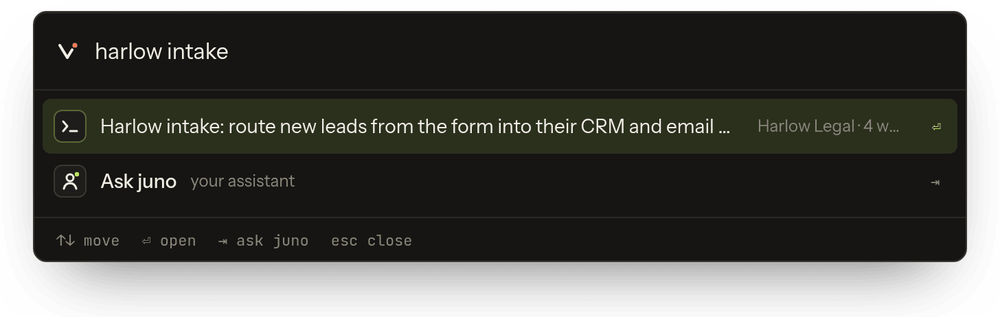
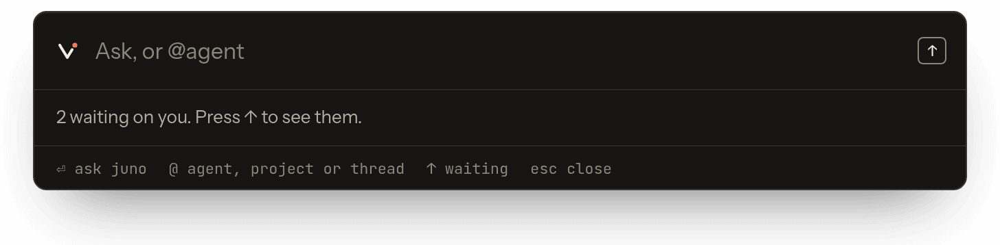
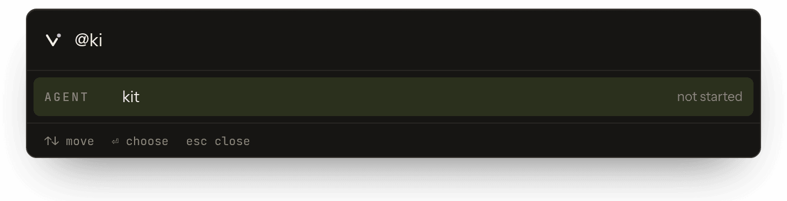
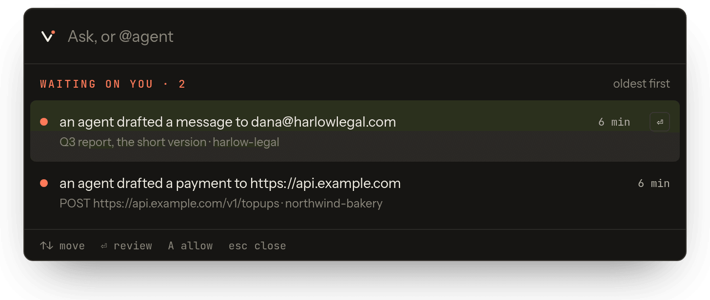
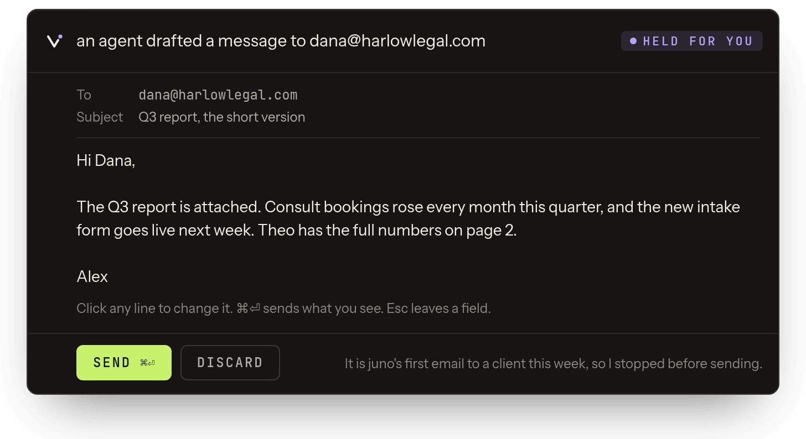

# Capsule

The Capsule is Vyre's command bar on the Mac. Press Control twice, anywhere, and a bar 680 pixels
wide opens over whatever app you are in, where Spotlight would. One box does two jobs: it finds
local things (apps, settings, files, contacts, sums) the way Spotlight does, and it sends words
to your assistant, an agent or a running session. It also holds the list of what is waiting on
you: permission questions from sessions and drafts held at the Gate. The vyred on your Mac runs
it (a module with role `local`). Local search keeps working when vyred or your box is down.

::: demo capsule

Type in the Capsule and it finds your threads, projects and agents, and offers to ask your assistant about the rest.
:::

## Install it

1. Install the app:

   ```sh
   vyre capsule install
   ```

   This builds `Vyre.app` on your Mac from the package you installed: it fetches the Capsule's
   Electron into the package's own folder, builds the helpers with the Xcode command line
   tools, and signs the app ad hoc. Nothing is downloaded from vyre.run, and it never uses
   `/Applications` or sudo.

2. Open it:

   ```sh
   vyre capsule
   ```

   ```output
     Capsule open · press Control twice anywhere · log ~/.vyre/logs/capsule.out
   ```

   `vyre capsule` starts vyred first if it is not running. `vyre up` on a Mac also opens the
   Capsule when it is installed; `vyre up --no-capsule` starts vyred without it.

3. Allow double-Control (next section).



The Capsule lives in the menu bar. Click its mark for a menu that says whether anything is
waiting on you, whether double-Control works, and whether vyred is running.

## Allow double-Control

The double-Control listener needs Input Monitoring, and macOS grants it to `Vyre.app` (or to the
terminal you ran `vyre capsule --dev` from).

1. Click the Capsule's mark in the menu bar. If it reads "Control twice opens it", you are done.
2. If it reads "Double-Control is off", open System Settings, Privacy and Security, Input
   Monitoring, and turn on Vyre.
3. Press Control twice. The Capsule opens with the caret in the box.

Only two bare taps of Control within 450 ms count, so Control-C and Control-arrow keep working.

> [!SNAG] Double-Control stopped working after a rebuild
> A Vyre.app you built yourself (`vyre capsule build --app`) is signed ad hoc, so each build is a
> new identity to macOS. Turn Vyre off and on again under Input Monitoring.

## Find something on this Mac

Type in the box without `@`. One list ranks:

- apps and System Settings panes;
- a sum or a unit conversion (`12 * 18`, `5 km in mi`); Enter copies the answer;
- contacts (the first time, a "Show contacts here" row asks macOS for access; typing never does);
- a definition: `define ledger`;
- files and folders, through Spotlight's index (`mdfind`), and up to three files from your box
  once a box is paired;
- your agents, projects and threads, from vyred;
- logins from the [Vault](vault.md) (see below);
- clipboard history: type `clipboard`, `clip` or `paste`. Enter puts the item back on the
  clipboard; you paste it with Command-V. Items that look like secrets are never kept, and a
  "Clear clipboard history" row forgets the rest.

Things you pick often rise over time. Enter opens the top match only when it is a strong match
and your words do not read as a question; otherwise Enter sends the words on (next section).
Tab always sends them on.

## Fill a login from the Vault

1. Type part of the login's name, for example `harlow`.
2. With the Vault row highlighted, press Enter to fill it into the app you were in.
3. For more (copy the password, copy the username, copy or show the one-time code, lock the
   vault), press the right arrow or Command-K instead.

The Vault may ask for Touch ID first. See [Vault](vault.md).

## Ask your assistant, or a model

Type a question and press Enter. The "Sends to" row under the box shows where it will go before
anything is sent, and Enter uses exactly that destination:

- A question about your own work ("what did I promise Harlow Legal?") goes to your assistant,
  which has your memory.
- Any other question (one that ends in `?` or opens with a question word) goes to a fast model,
  haiku. The down arrow offers your assistant and a deeper model, sonnet.
- Anything that is not a question ("draft a reply to Northwind Bakery") goes to your assistant,
  which can act.
- With no assistant made yet, memory answers on its own, with no model.


Answers render in place as markdown, with a copy button and the cost. Anything that came from
memory is drawn in gold, with its source.

## Talk to an agent or a session

Type `@` to name one. It completes agents, projects and threads:

- `@juno what is left on the intake form?` asks the agent juno, in its current thread
  (`agents.ask`). If your words match one of juno's other threads, "Sends to" offers that one
  too.
- `@harlow-intake run the tests` types into that session as you (`threads.send`). While you type
  you hold the session's keyboard (its lease). If another surface holds it, the Capsule says who,
  and Command-Enter takes it.
- `@` a project starts a new thread in it, or sends to a matching thread there.



## Drive or watch a session without `@`

Two phrases work in the plain box. Each shows a row naming the thread before you press Enter:

```
tell the intake thread to run the tests
watch the intake thread and tell me
```

The first sends "run the tests" to the session as you, then watches it. A watch sends a macOS
notification when that thread finishes, stops or asks something, and keeps a short report in the
Capsule until you read it. `tell me when the intake thread is done` also sets a watch.

## Answer what is waiting on you

When a session asks permission or the Gate holds a draft, the menu-bar mark turns to the Beacon
colour. The Capsule does not open itself for this and never takes your keyboard: you open it when
you choose.



1. Open the Capsule and press the up arrow in the empty box to reach the waiting list.
2. Pick the item:
   - **A permission question**: Allow or Deny. Command-Enter allows.
   - **A held draft** (an email, for example): To, Subject and body read as text and become
     editable when you click them. Command-Enter sends exactly what is on screen, through
     `gate.approve`. Discard drops it. Escape leaves a field.



## Open Glass

For an agent that has a computer, the Capsule offers "Open Glass", which opens that agent's
screen in the Deck in your browser. Type `glass` to list what you can open, `glass juno` for one
agent, or `glass box` for the box's files. See [Glass](glass.md).

> [!SNAG] No "Open Glass" row
> The row only shows when this Mac is paired with a box (`vyre link`) and the agent has a
> computer. Pair the Mac first: [Connect a Mac to your box](tailscale.md).

## Keys

| Key | Does |
| --- | --- |
| Control, Control | open or close the Capsule |
| Enter | open the top match, or send to the "Sends to" destination |
| Tab | send to the "Sends to" destination, whatever the top match is |
| Down arrow | move down the list, or choose another destination |
| Up arrow, in an empty box | the waiting list |
| Right arrow or Command-K | more actions on a Vault row |
| Command-Enter | send a held draft, allow an ask, or take a session's keyboard |
| Escape | hide the Capsule and give the keyboard back to the app behind |

## When vyred or the box is down

When vyred on your Mac is not running, everything that came from it is cleared from the Capsule
and it says so. Apps, settings, files, sums and the clipboard keep working. When your box is out
of reach, box features say the box is not reachable; they never hang.

## Start it with vyred

Only for a Capsule run from source: add a `capsule` key to `~/.vyre/config.json`, then restart
vyred (`vyre down`, then `vyre up`):

```json
{ "capsule": { "autostart": true } }
```

vyred then starts the Capsule hidden in the menu bar each time it starts.

> [!SNAG] vyred's log says "capsule.autostart is on, but Electron is not installed"
> Autostart runs the Capsule from source, with the Electron in `local/capsule`. A `Vyre.app` from
> `vyre capsule install` does not count. Run `vyre capsule` after `vyre up` instead, or build from
> source (below).

## What it will not do

- It does not open for something waiting on you. It opens when you press Control twice, run
  `vyre capsule`, use its menu, or a tool calls `capsule.show`.
- It does not send anywhere other than the destination the "Sends to" row showed.
- It does not paste for you: a clipboard item waits for your Command-V.
- It runs on macOS only. On Linux or Windows, use `vyre` in a terminal or the [Deck](deck.md).
- Asking about your screen, and reading text on it, are not built yet.

## Build from source

For work on the Capsule itself:

```sh
vyre capsule build         # install Electron in local/capsule, build the Swift helpers
vyre capsule build --app   # also package and sign Vyre.app
vyre capsule --dev         # run from source in this terminal; Control-C quits
```

`vyre capsule` runs a packaged build only while it matches the source it was made from. If the
source changed, it runs the source and says so:

```output
  The packaged app is older than its source, so this runs the source. vyre capsule build --app repackages it.
```

> [!WHY] Why check the source at all?
> A packaged Electron app runs `app.asar`, so an edit to the source does nothing until the app is
> packaged again, and nothing says so. The package records a hash of the source it was made from,
> and `vyre capsule` compares it.

## Next

- [Deck](deck.md), the same work in a browser and on your phone.
- [Projects and threads](projects-and-threads.md), what `@` completes.
- [Agents](agents.md), who you can talk to.
- [CLI reference](../reference/cli.md#vyre-capsule) for every `vyre capsule` form.
