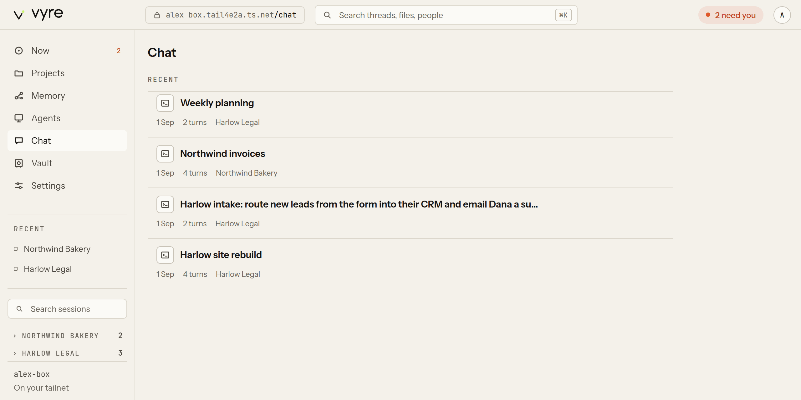

# Chat

Chat is the Deck's view of sessions as conversations, on a laptop and on your phone. It lists
every session on the machine that serves the Deck (normally your server): the Claude Code
sessions you ran in a terminal, and the ones Vyre runs for you on Claude, Codex, Grok or
OpenRouter (an agent's thread, the assistant, a thread you started). A session shows its text
as it is written, its tool calls, file edits as diffs, and anything it needs from you, inline. You
type into it like a message box, and the words go to the session as you. Chat lives at `/chat`
in the [Deck](deck.md). On a server with a paired Mac, Chat also lists the Mac's sessions, and
a message you type into one goes to the Mac (see [Sessions from your Mac](#sessions-from-your-mac)).

## Find a session

1. Open `/chat` (on a phone, the Chat tab). The main area lists sessions, newest first, each
   with its agent, turn count, who holds its keyboard, and how many things it needs from you.
2. Pick one, or use the rail (on a phone, the page itself): search, your projects with their
   sessions, sessions in no project, and your agents' threads.

A session in two projects is listed under both. A new session, a rename or a new turn shows up
on its own, without a reload.

| Path | Opens |
| --- | --- |
| `/chat` | every session, newest first |
| `/chat/<project>` | the sessions in one project |
| `/chat/<project>/<thread>` | one session, in its project |
| `/chat/thread/<thread>` | one session in no project |

## Read a session

A session's view shows, as they arrive:

- the model's text, growing while it is written, as markdown;
- each tool call as a chip you can open to see its input and output (the last six stay in the
  timeline);
- a file edit as a diff;
- a fact from memory in gold, beside the turn that used it;
- the logo of the provider that wrote each reply (Claude, Codex, Grok or OpenRouter), so a
  session that moved between them shows who said what.

A session you run in a terminal is read from its transcript, and Chat adds each turn when the
turn completes, not word by word.

## Type into a session

1. Type in the server at the bottom. Enter sends, Shift+Enter makes a new line.
2. `@` opens a small menu of files in the session's folder, people and agents, and, as the first
   word of a message, your signed-in AI accounts. `@codex fix the failing test` sends that one
   message to Codex and leaves the session on its own provider (see
   [one message on another provider](sessions.md#one-message-on-another-provider)). While you
   type it, the server says "This turn runs on" the account that will answer.
3. Anything starting with `/` goes to Claude Code as is, so its own commands (`/rename`, for
   example) work. A line starting with `!` runs as a shell command in the session's folder.
4. Paste an image to send it with the words (up to 5 pictures of 5 MB each: png, jpeg, gif or webp).

One surface holds a session's keyboard at a time (its lease). The line above the conversation
says who has it: "You have the keyboard here", or another surface's name with "has the
keyboard". It stays hidden while nobody holds the keyboard. A session that Vyre closed when idle
shows "Resumes on your next message". If another surface holds it, press **Take**. Your first keystroke takes it
too. What you send shows as yours, and the session's replies as claude's (or the agent's name).

On a phone, Enter makes a new line and the send button sends.

**While a session works.** On a Claude session, a message you send joins the running turn at its
next step (steering). Press Alt+Enter, or turn on "Queue for after this turn", to hold it until
the turn ends. A held message shows above the server as "Queued for after" with **Edit**,
**Take back** and **Steer now**. A session that is busy in your terminal queues every message,
and sends it when that turn ends.

**Who answers.** The chip above the server shows the provider's logo, its model and the effort, for
example "Codex · GPT-5 high". Press it to choose another account, a model or (for Claude) an
effort. Moving a session to another provider puts a line in the thread, such as "Switched to
Codex. It has this session's memory and files." You cannot switch while a turn is running:
press Escape first, or wait. [Sessions](sessions.md#one-picker-per-session) has the rest.

Typing into a session you started in a terminal makes Vyre resume it from then on.

> [!SNAG] "This session is open somewhere else"
> Only one process may write a session's transcript. Vyre refuses while the session is still
> open in a terminal (or wrote to its transcript in the last 30 seconds). Close it there, or type
> there.

> [!SNAG] "... ran in <folder>, which is not here"
> The session's folder does not exist on the machine serving the Deck, so it cannot be resumed
> there. Type into it on the machine where it ran.

## Answer a question inline

When the session asks permission for a tool, a card appears in the conversation: "juno asks to
...", with the tool and where it acts. Choose Allow or Deny. The card goes away once it is
answered, from here or from any other surface.

## Edit and send a held draft inline

When the session's work is held at the Gate (an email, a web request), the draft appears as a card
in the conversation.

1. Edit its fields in place. Your edits are saved to the Gate as you type (`gate.revise`).
2. Press **Send** (Command-Enter) to approve exactly what the card shows, or **Discard** to reject
   it.

The first Send may ask for your passkey (see [Deck](deck.md#add-a-passkey)); one proof covers
30 minutes on this device. Editing and Discard ask for nothing. If the send fails,
the card says "failed:" with the reason, and Send tries again.

## Open a terminal on the server

Press **Folders** at the top of Chat, go to a folder, and press **Open in terminal**. A shell
opens in that folder on the server, in the Deck. It asks for no passkey: it is your own screen.
Agents, tailnet guests and Claude's sessions can't open one.

A terminal belongs to the screen that opened it; another device can't pick it up. It outlives
your connection:

- Close the tab or lose the network, and the shell keeps running. Come back and the Deck picks
  up where it left off, with its own scrollback: the server sends only what this screen missed.
  It keeps the newest 1 MB of output; if more than that went by while you were away, a dim line
  says how much output was not kept, and the rest follows.
- Keys you type while the link is down are held, up to 4 KB, and sent once the terminal has
  caught up. The screen dims until then. Past 4 KB it says which keys were not kept.
- With nobody looking at it, it is kept for 12 hours, then ended. Change that with the config
  key `term.keep_hours`.
- On a server, the shell survives Vyre restarting, and the screen reattaches at once. Updating
  the server ends it: the terminal says "The server was updated and this terminal was closed." with a
  button, **Open a new terminal here**, for a new one in the same folder.
- Typing `exit` ends it at once.

When the same terminal is open in two windows, the first one sets its size. The other draws at
that size, scaled to fit, and says "Watching at" the size, with **Take size** to size the
terminal to that window instead.

On a phone, a key bar under the terminal gives Esc, Tab, Ctrl, Alt, the arrows and Paste.

On a Mac, the terminal ends when Vyre stops.

## Sessions from your Mac

With a Mac paired, the server's Chat lists the Mac's sessions and projects beside its own, newest
first, each with a chip that names the Mac, for example `alex-mac`
([ADR 0021](../adr/0021-box-reads-the-mac.md)). Open one and its turns load from the Mac; the
server keeps no copy.

A message you type into a Mac session goes to the Mac, and the line above the conversation says
"On alex-mac". The Mac holds that session's keyboard, so there is no **Take**, and the chip
with the provider and model is not shown. If the Mac does not answer, Chat says "alex-mac is
offline; your message was not sent", puts your words back in the server and offers to retry. If it
times out, the message may have gone through, so check before you send again.

When the Mac cannot be reached, the Chat header shows a dashed "alex-mac offline" chip and lists
only the server's sessions.

## When the server is out of reach

Chat shows the session list from your last visit, with the time it was saved. The list holds
names, ids, projects and times, never a message's words. A session you opened before may also open
from the Deck's offline cache.

## What it will not do

- It is not a separate chat server. Everything is a call to Vyre, so a message typed here is the
  same as one typed in Lumen or with `vyre threads send`.
- It never renders a session's text as HTML.
- It does not move a session on your paired Mac to another provider. The picker is for sessions
  the server runs.

## Next

- [Projects and threads](projects-and-threads.md), how sessions are grouped.
- [Agents](agents.md), who runs the sessions.
- [CLI](cli.md#drive-a-running-session), to do the same from a terminal.
