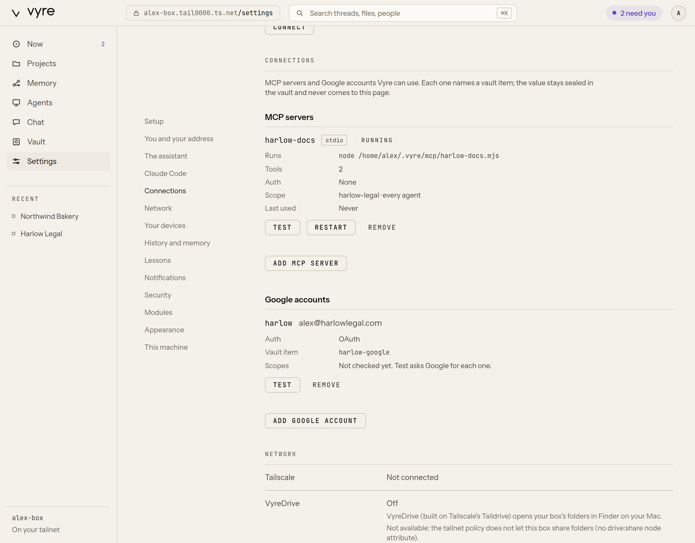

# Connectors

A connector is how a Claude session reaches something outside itself: a tracker, a CRM, a docs
tool, your calendar or your mail. Vyre connects two kinds:

- **MCP servers**, run by the MCP hub (the `mcp` module) behind Vyre.
- **Google accounts**, for Calendar and Gmail, handled natively by the `google` module.
- **Apps from the catalog**, run by their vendor's own hosted server and added through the `connectors` module: `vyre connect apps`.

Both keep the same promises. A connection names [vault](vault.md) items and never holds a value.
Anything that goes out as you waits at the Gate until you approve it.

You manage both in the Deck, under Settings, Connections, or from the terminal with
`vyre connect`. See the [CLI reference](../reference/cli.md) for every flag.

## Add an MCP server



Put the server's credential in the vault first. Values are never typed on the command line:

```
vyre vault put tracker-token --kind api-key
```

Then add the server, naming the item. For a server that runs on this machine (stdio):

```
vyre connect add mcp tracker --env TRACKER_TOKEN=tracker-token -- npx -y @northwind/tracker-mcp
```

For a server on the web (streamable HTTP, or SSE with `--sse`):

```
vyre connect add mcp docs --url https://docs.example.com/mcp --auth bearer --item docs-api
```

After the add, Vyre asks the vault to let the `mcp` module use each item. That grant needs you
to be present. Then it tries the server and prints how many tools it has. In the Deck, **Add MCP
server** does the same and asks for your passkey for the grant.

What else you can set:

- `--project` and `--agent`, repeatable, to limit which projects and agents see the server. The
  default is every project and every agent.
- `--var VAR=value` for a plain setting a stdio server needs. Vyre refuses one that looks like a
  credential; put that in the vault and use `--env` instead.
- `--header Name:Value` for a header that is not a secret.

Plain `http://` is allowed only to this machine, your tailnet, or an origin you list under
`mcp.httpHosts` in `config.json`. Everything else needs `https://`.

A server starts on its first use, not at boot. It stops after 10 minutes idle. A server that
crashes three times in five minutes stays stopped until you restart it (**Restart** in the Deck).

`vyre connect list` shows every connection. `vyre connect test mcp tracker` tries one now.
`vyre connect remove mcp tracker` disconnects it and leaves its vault items where they are.

## Hold and approve a send

The hub reads each tool's name. A tool is a read when its name is plainly a read (`list`, `get`,
`search`, `read` and the like) with no word that writes, sends or deletes. Everything else is
outward, and an unknown tool counts as outward.

- A read runs and returns the server's answer.
- An outward call is held at the Gate. Claude gets back the held item and a sentence that says
  so, and the tool's description starts with "(held for approval)", so Claude expects to wait.
  Nothing reaches the server until you approve it, and then it runs with exactly the arguments
  you approved, edits included.

You can change a tool's mode after **Test** in the Deck: **Read**, **Held** or **Off** (hidden).
A tool whose name sends (`send`, `post`, `reply`, `forward`, `publish`, `share`, `invite`,
`tweet`, `dm`, `comment`) is always held. It can be Held or Off, never Read.

## Use Vyre's tools in a plain claude

Every session Vyre starts already loads Vyre's MCP server, `vyre`. It offers the tools of every
running module and every hub tool you may use, as `<server>__<tool>` (for example
`tracker__list_issues`). No server needs its own line in a Claude config.

For a `claude` you start yourself, outside Vyre, install the Vyre plugin. It brings the `vyre`
server with Vyre's hooks, skills and `/vyre` command. See [Vyre in Claude Code](claude-code.md).

To add only the MCP server, without the plugin:

```
vyre mcp install
```

It prints the one line that registers Vyre with Claude Code,
`claude mcp add -s user vyre -- vyre mcp`, and runs it only with `--yes`. Vyre never edits a
Claude config on its own.

## Connect an app from the catalog

Most apps you would want to connect already run their own hosted MCP server. Vyre keeps a catalog of
them, so connecting one is a sign-in, not a setup. Nothing passes through a Vyre server: your box signs
in to the vendor directly, and the credential is a [vault](vault.md) item that only that vendor's own
address can receive.

```
vyre connect apps            # the catalog, and what each one asks of you
vyre connect add app ghl     # GoHighLevel: opens the sign-in address, then lists its tools
vyre connect add app notion --label work   # a second account of the same app
```

There are three ways an app signs in, and Vyre picks the one the vendor offers:

- **Sign in.** The vendor lets an app register itself. You open the address Vyre prints, approve, and
  it is done. On a browser that is not on the box, paste the address the browser lands on back into the
  terminal, or into the Deck's Connections screen.
- **Your own app.** The vendor wants you to make an OAuth app in your own account first (Asana,
  HubSpot, Google Workspace). `vyre connect apps` says so, and `vyre connect add app <id>` prints the
  steps and the redirect address to enter. Put the app's client ID and secret in a vault item, then
  run `vyre connect add app <id> --client <item>`.
- **A token.** Some apps also take a personal token or API key (monday.com prefers it). You type it at
  a hidden prompt; it goes straight into the vault and is never shown again.

Each connection to an app that has a hosted server is a hub server, so what you read above applies: reads run, and anything that sends or
changes something waits at the Gate. `vyre connect remove <name>` disconnects it and leaves the vault
item where it is. A vendor that was checked and cannot be connected by a person (Slack, Dropbox, Figma
and a few more) is listed by `vyre connect apps --all` with the reason, not hidden.

Some apps have no hosted server an individual can use, or none that takes a person's own login
(Microsoft mail and calendar, personal Gmail, Slack's Web API). Those connect as a **vault
credential** instead: Vyre walks you through making a small app in your own account, signs in, and
stores the result in the vault. Your agent then calls the vendor's API through `vault.request`, which
adds the sign-in, runs reads at once, and holds anything that sends or changes something at the Gate
(unless you asked for that exact thing). `vyre connect apps` marks these.

Slack, Zoom, Microsoft and Google each print a numbered guide with the links and the exact settings.
For Slack the link fills in a private app's settings for you. When a vendor requires an https redirect
(Slack) or `localhost` (Microsoft), your browser ends on a page that cannot load: copy the full
address from the browser bar and paste it into the terminal.

For Google, publish the app you make (its status is In production) or Google ends the sign-in every
7 days; the app stays unverified, which for one person only means a warning screen to click through.

GoHighLevel signs in once for every sub-account you approve. Use the generic `services.leadconnectorhq.com/mcp/`
address that Vyre uses; HighLevel's Claude-only address refuses any other app.

## Connect Google Calendar and Gmail

In the Deck, open Settings, Connections, and press **Add Google account**. Give the account a
name (like `work`) and its address, pick how it signs in, and pick the vault item that holds the
credential. **Add account** adds it, asks for your passkey to let the `google` module use the
item, then checks each scope with Google. There are two ways to sign in.

**OAuth.** The vault item is an env-set with `client_id`, `client_secret`, `refresh_token` and
`token_uri`:

```
vyre vault put home-google --kind env-set --field client_id --field client_secret --field refresh_token --field token_uri
vyre connect add google home --email alex@example.com --item home-google
```

**Service account.** For a Google Workspace domain, a service account can act as a person
through domain-wide delegation. Store its JSON key as a `note` or `secret` vault item, then add the account with the
address it acts as:

```
vyre connect add google work --email alex@harlowlegal.com --item harlow-google-sa --dwd
```

**Test** asks Google for each scope and lists which were refused. For a service account, the
message names the scopes to allow for its client ID in the Google Workspace admin console, under
Security, API controls, Domain-wide delegation.

To sign in with a browser instead, run `vyre connect add google home --sign-in`. It opens
Google's consent page, finds the address itself and puts the refresh token in the vault. It uses
the OAuth client in the vault item `google-oauth-client` unless you name another with `--client`.
A **Sign in with Google** button in the Deck is coming next.

What Vyre does with the account:

- Reads your calendar and mail on demand, with the narrowest scope each call needs. Nothing
  polls or syncs in the background.
- `google.mail.send` is always held at the Gate. So is an event with attendees, since Calendar
  mails each of them an invite. A draft and an event with no attendees are written directly.
- Each account is its own sender at the Gate, so you see which address a message would leave
  from.

## What it never does

- A connection never holds a value. `mcp.add` refuses a header, env value, argument or url that
  looks like a credential. Tokens are fetched from the vault at call time and scrubbed from every
  result and error.
- A model never adds, changes or removes a server or an account, and never widens a scope.
  Those are for you, in the Deck or the terminal.
- A tool that sends is never run without your approval.
- Vyre's own MCP server is never a hub server: it refuses to run inside the hub.

Sessions Vyre starts still load your own Claude Code settings, so MCP servers you configured in
Claude Code are there too. Vyre does not manage those: their credentials and their sends are
outside the vault and the Gate.

## Next

- [Tools reference](../reference/tools.md): every `mcp.*` and `google.*` tool.
- [CLI reference](../reference/cli.md): `vyre connect` and `vyre mcp`.
- [Vyre in Claude Code](claude-code.md): the plugin for a `claude` you start yourself.
- [The MCP hub](../build/mcp-hub.md), for builders.
- [The vault](vault.md): items, grants and presence.
