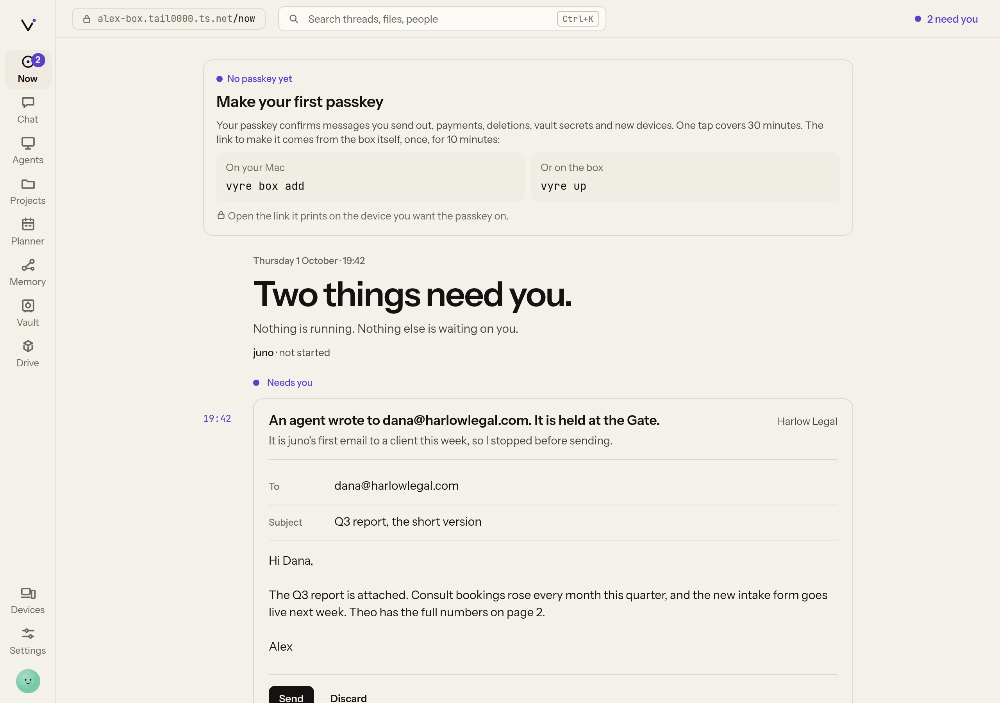
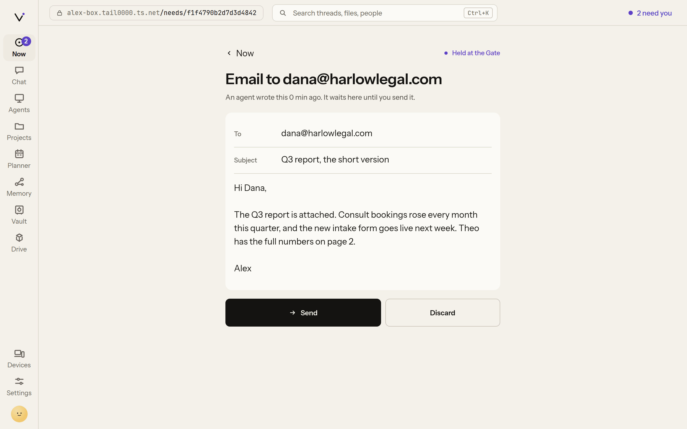
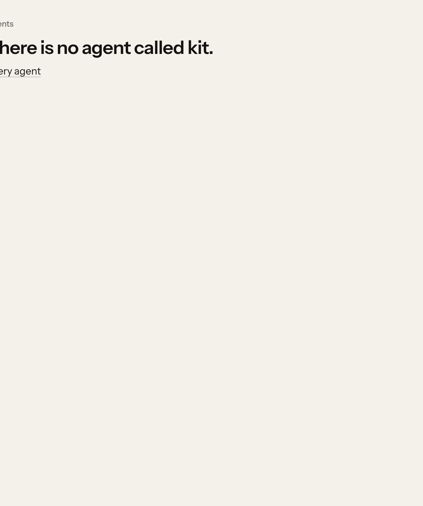
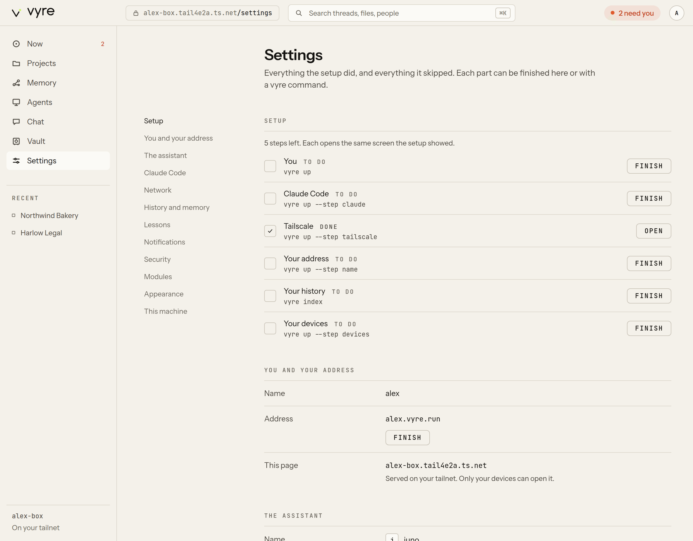

# Deck

The Deck is Vyre's web app. Your box serves it at its own address, usually
`https://vyre.<tailnet>.ts.net`, and only your devices on your tailnet can open it: there is no
separate login, because Tailscale says who is on the other end (see [Tailscale](tailscale.md)).
It shows what needs you, what is running, your projects, agents, memory and vault, and every
setting the onboarding made or skipped. The same pages work on a phone, and it installs as an app
there (see [Mobile](mobile.md)). The Deck reads and writes only through vyred's API, so it never
disagrees with the terminal or the [Capsule](capsule.md). On a box with a paired Mac, it also lists
the Mac's projects and sessions, read from the Mac as you look (see
[Your Mac's sessions on the box](#your-macs-sessions-on-the-box)).

## Open it

Run `vyre up` on the box, or on your Mac once it is paired. It prints the address:

```output
  Vyre is ready.

    your box        https://vyre.tail1234.ts.net
    your assistant  juno
    next            vyre      (your projects and threads)
```

Open that address in a browser on any device signed in to your tailnet as the box's owner. A
device signed in as anyone else gets `403 not_owner` ("This Vyre serves only its owner.").

> [!SNAG] The last line reads "Almost there: your box has no address yet."
> The address step of the onboarding is not done, and the Deck is served only at the address.
> Finish that step: see [Onboarding](../get-started/onboarding.md).

## What is on each view

The rail on the left holds the views. On a phone, a tab bar holds Now, Projects, Chat, Find and
Agents; your initials at the top open Settings.

| View | Path | What it shows |
| --- | --- | --- |
| Now | `/now` | what needs you (held drafts, permission questions), what is running, recent projects, and what memory learned today |
| Projects | `/projects` | every project, its threads, and each thread's live output with a box to type into |
| Memory | `/memory` | what memory holds, with its sources; see [Memory](memory.md) |
| Agents | `/agents` | each agent, what it is doing, its threads, usage and computer |
| Chat | `/chat` | sessions as conversations; see [Chat](chat.md) |
| Vault | `/vault` | credentials, never their values; see [Vault](vault.md) |
| Settings | `/settings` | setup, network, notifications, passkeys, modules, appearance |
| Find | `/find` | one box for sessions, files, agents, memory and projects, and for asking your assistant (a tab on the phone) |
| Ask | `/ask` | talk to your assistant or any agent (open it by its path) |

A view whose module is not running says which module is missing instead of failing.

The Deck draws its first screen at once. It asks the box whether setup is finished, but waits at
most a moment for the answer: if the answer comes later and says there is no owner yet, the page
then moves to the onboarding.



## Search what was said

Type in the search box at the top (Command-K) to search every session's words, the same search
as `vyre recall`. Pick a hit to open that thread.

## Approve or change a held draft

When an agent wants to send something, the Gate holds it and Now lists it in the Beacon colour.

1. Open it from Now (on a phone, it opens full screen at `/needs/<id>`).
2. Click a field to edit it: To, Subject and Body for an email; for a web request, Method, URL,
   Headers and Body. The fields read as text until you click them.
3. Press Send to send exactly what is on screen, or Discard to drop it.



Send, Discard, Allow and Deny are a person's actions, so the Deck sends each one with a passkey
proof: the browser asks for Touch ID, Face ID or your security key first (see
[Add a passkey](#add-a-passkey)). If the send fails, the item goes back to held with the error
shown above the fields ("Held again: ...").

## Answer a permission question

A session that wants to use a tool it has no permission for raises an ask. Now lists it; open it
and choose Allow or Deny. Your answer carries a passkey proof, as a send does.

## Follow and type into a thread

1. Open Projects, then a project, then a thread. Its output streams in as the session works:
   text as it is written, tool calls as lines.
2. Type in the box at the bottom. It types into the session as you.

Only one surface holds a session's keyboard at a time. When another holds it, the box reads
"<surface> is typing"; press **Take the keyboard** to take it.

A thread from your paired Mac has no box to type into. In its place: "On alex-mac. Open it there
to continue." (with your Mac's name).

To start a thread, open a project and press **New thread**. A thread that is in no project opens at
`/threads/<id>` with **Add to a project**.

## Look after an agent

Open Agents, then an agent. You see what it is doing, its threads, and its usage: money spent
against its budget for an agent on an API key, or turns and time for one on a subscription. From
here you can change its instructions and model, stop it, give it a computer or restart that
computer, and open its screen in [Glass](glass.md). **New agent** on the Agents list makes one;
see [Agents](agents.md).

If you skipped the assistant during onboarding, Now and Agents show **Create your assistant**
instead: type its name, tick **Give it its own computer, from the pool.** if you want one, and
press **Create**. The assistant is made on every project with the Claude sign-in onboarding
stored, the same as onboarding would have made it.



## Finish setup, or change it

Settings starts with Setup: every onboarding step (you, Claude Code, Tailscale, your address,
your history, your devices) and whether it is done. **Finish** beside a skipped step opens the
onboarding at that step. `vyre index` does the history step from a terminal.



Beside each step is the command that does the same from a terminal: `vyre up` (it picks up at
the first step not finished) or, for history, `vyre index`.

Other sections: You and your address, The assistant, Claude Code, Connections, Network, Your
devices, History and memory, Lessons, Notifications (see
[Mobile](mobile.md#turn-on-notifications)), Security (add a passkey), Modules, Appearance and This
machine. `/settings#devices` or `/settings?section=devices` jumps to a section.

**Your devices** lists your devices on the tailnet as Tailscale reports them, phones and tablets
first, each Online or Offline. The Mac paired with this box says "Paired with this box". A phone
that is offline says so in plain words: "Your iPhone is offline in Tailscale. Open the Tailscale
app and turn it on." **Add a device** opens the onboarding's devices step.

## Change the colours

**Appearance** switches this browser between Dark and Paper; the choice stays in that browser
only. To change the colours themselves for every device, set `theme.colors` in `config.json` on
the box, for example:

```json
{ "theme": { "colors": { "dark": { "signal": "#B8E65A" } } } }
```

The Deck loads `/theme.css`, which the box writes from `theme.colors`: `dark` keys override the
dark theme and `light` keys the Paper theme. A value that is not a plain CSS colour is dropped.
Reload the Deck to see the change. The token names and their defaults are in
[Design tokens](../design/TOKENS.md).

## Add a passkey

A passkey proves a person is at the device, for a Gate approval, an answer to a permission
question, approving a new Mac, or a Glass take-over ([ADR 0004](../adr/0004-presence.md)).

Your first passkey comes from a one-time link that the box hands only to its own terminal. Until
you have one, Now shows **Make your first passkey** with the two commands that print the link:

- on your Mac, `vyre box add`;
- or on the box, `vyre up`.

Open the link on the device you want the passkey on, from your tailnet. It works once, for 10
minutes. A passkey made in Safari syncs to your other Apple devices through iCloud Keychain, so
your iPhone can use it too.

To add a passkey on another device from the Deck:

1. Get a one-time code with `vyre presence code`. It asks you to prove presence first, which a
   Mac does with Touch ID.
2. In the Deck, open Settings, Security.
3. Paste the code, name the device, press **Add a passkey**, and follow the browser's prompt.

```output
Passkey added.
```

A code works only where it was made. The box never takes a terminal as proof, so on the box
`vyre presence code` stops and asks for a passkey; a code from your Mac enrolls a passkey on the
Mac's own vyred, not the box's.

> [!SNAG] "This browser cannot create or use a passkey."
> The browser must reach the Deck at its real address over your tailnet, in Safari or Chrome. A
> passkey cannot be made on `127.0.0.1` or through an SSH tunnel.

## Your Mac's sessions on the box

With a Mac paired, the box's Deck lists the Mac's projects and sessions beside its own
([ADR 0021](../adr/0021-box-reads-the-mac.md)). The box asks the Mac while you look and keeps
nothing: no transcript from the Mac is written to the box.

- Every row from the Mac carries a chip with the Mac's name, for example `alex-mac`: in Chat, in
  Now's working and recent rows, in search results and on a project board.
- A Mac thread is read-only here. It opens, with its turns, but in place of the box to type into
  it says "On alex-mac. Open it there to continue." Sending, answering and stopping happen on the
  Mac.
- A Mac project is listed with its chip and that note, but it has no board and cannot be pinned.
- When the Mac is not reachable, Chat and Now show a dashed "alex-mac offline" chip, and only the
  box's own rows are listed. The Deck never waits on the Mac for this: it reads which Macs are
  online from the box's own record.

## When the box is out of reach

The Deck's files are cached, so it opens when the box is briefly out of reach. Now shows
"Offline. As of ... ago" with counts from the last visit, never a draft's words. Only two reads,
`projects.list` and `threads.get` for threads you opened, are kept for offline use: the last 20,
for up to a week. Nothing you can send or approve works offline.

## What it will not do

- It never shows a vault value. There is no API for one.
- It never renders text from a thread as HTML. Model output is untrusted.
- It is not reachable from the public internet. Without Tailscale on a device, that device cannot
  open it.

## Next

- [Chat](chat.md), for sessions as conversations.
- [Glass](glass.md), to watch and drive an agent's computer.
- [Mobile](mobile.md), to install the Deck on your phone and get notifications.
- [Security](../security/index.md), for passkeys and what the Deck is allowed to do.
