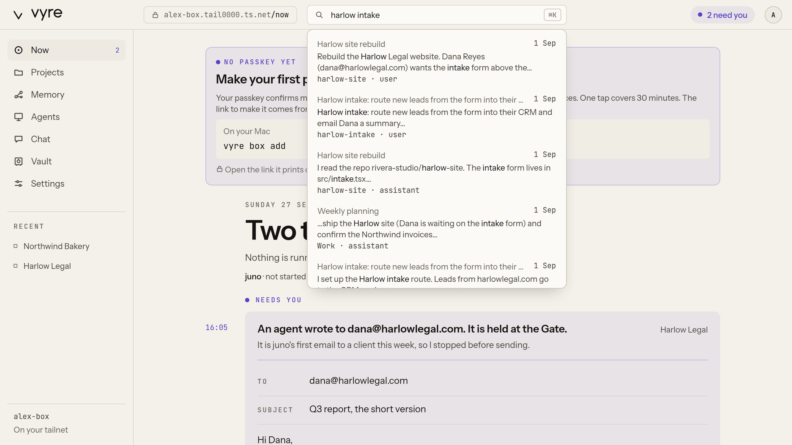
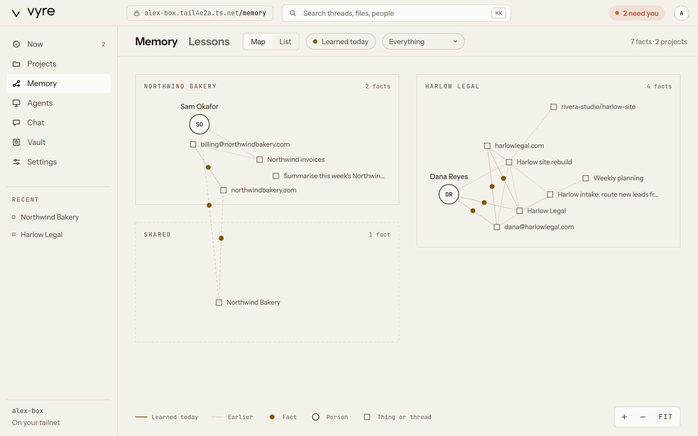

# Memory

Vyre remembers in two parts. **Recall** is search over every turn of every Claude Code session on
this machine: full-text plus local embeddings, so it finds a turn by its words or by what it
meant. **Memory** is a graph of facts the curator reads out of those turns: people, organisations,
addresses, domains, repositories, titles, clients and deadlines. Every fact points at the turn it
came from, and no model runs to produce it. Recall owns finding passages; Memory owns facts,
people and links.

## The gold marking

Anything Vyre shows you in **gold** (the Recall colour) came from memory or the search index, not
from a model's words: a matched quote in search results, a fact, a fact's source thread, your own
correction. When text is gold you can ask where it came from, and Vyre can show you the turn.
This is floor rule 7: anything Vyre tells you, it can show the source of. The gold appears in the
terminal (`vyre recall`, `vyre memory`, `vyre why`), in the Deck's Memory view and Now page, in
Chat next to a thread, and in the Capsule when memory answers.

## Search past sessions

```
vyre recall stripe webhook retries
vyre recall "the engagement letter for Dana" --here    # only sessions started in this folder
vyre recall invoice --user --limit 20                  # only what you said (--assistant: only Claude)
vyre recall invoice --keyword                          # full-text only, no embeddings
```

Each hit shows the session's name, its full id, how long ago, who said it and the folder, with
the matching words in gold:

```output
  Harlow billing export
    3f9c2a10-7d4e-4b1a-9c55-0e2f8a6b1d77 · 2d ago · user · /work/harlow-legal
    the «stripe webhook» retries three times, then marks the invoice as failed

  resume one with: claude --resume <id>  ·  vyre call recall.thread '{"session":"<id>"}'
```

Resume a hit with `claude --resume <id>`, or `vyre resume <thread>` to open it with its project's
brief.

In the Deck, the search field at the top (Command-K) runs the same search:



### Keep the index up to date

vyred indexes on its own: a session a moment after each Claude Code turn ends, and every folder
every 5 minutes (`recall.every` in `config.json`; 0 turns the timer off). `vyre index` indexes
new and changed sessions now.

With no query, `vyre recall` says how much is indexed and whether search can rank by meaning:

```output
  412 sessions · 18230 turns indexed
  vectors: on (Xenova/all-MiniLM-L6-v2) · 18230 embedded, 0 to go
  vyre recall <query> to search
```

> [!WHY] Why does the first search after an install only match words?
> Search by meaning needs a small embedding model. vyred downloads it once (23 MB) into
> `~/.vyre/models` and embeds your sessions in the background. Until that finishes, recall
> searches full text only, and `vyre status` says "downloading the search model".

> [!SNAG] vyre recall says nothing matches
> On a new install the first pass takes a while: `vyre recall` with no query says "indexing now"
> while it runs. Run `vyre index` to index now. See [troubleshooting](../get-started/troubleshooting.md).

Elsewhere:

- **Deck**: the search field in the header searches every session; a hit opens the thread.
- **Capsule**: press Control twice and ask; when memory can answer, the answer shows in gold with
  its sources.
- **Claude**: `/vyre recall <query>` inside a session, or the `recall.search` and `recall.thread`
  tools. An agent's search is held to its own projects' folders.

<a id="search-your-macs-sessions-from-the-box"></a>
### Search your Mac's sessions from the server

On a server with a paired Mac, your own searches (`vyre recall` on the server, the Deck's search
field) also ask the Mac, and its hits come back in the same list. In the Deck each Mac hit carries
a chip with the Mac's name. Opening one reads its turns from the Mac. The server does not index or
store the Mac's sessions, and an offline Mac only means its hits are missing. Agents and MCP
clients search the server's own sessions only. The decision is [ADR 0021](../adr/0021-box-reads-the-mac.md).

Memory's facts come from the sessions indexed on the machine itself, so the server's graph holds
no facts from the Mac's sessions.

## See what memory holds

```
vyre memory                          # counts, and the most recent facts
vyre memory "Harlow Legal"           # everything about one thing
vyre memory "Dana Reyes" --project harlow-legal
vyre why '<fact id>'                 # the turns a fact came from
```

Each fact prints on two lines, then the commands for it:

```output
  · Dana Reyes works at Harlow Legal
      3 weeks ago · confidence 0.9 · Harlow intake #14
      vyre why '<fact id>' · vyre memory correct '<fact id>' wrong|ended|replace|confirm
```

Each fact shows its age, a confidence and its source (`session #turn`). Facts fade at read time:
one not said for months is marked `stale` with "last said 7 months ago", and your own or confirmed
facts do not fade. A fact two projects disagree about is marked "two projects disagree".

In the Deck, **Memory** (`/memory`) draws the graph as a floor plan, one room per project, with
people, things and threads inside and each fact as a gold dot on its link. Choose a fact to see
its source turns. **Now** shows **Memory learned today**, each fact with its source thread.



> [!SNAG] The Deck says "Memory is not available."
> The Memory view could not read the graph from vyred. Choose **Try again**. If it keeps failing,
> check that vyred runs (`vyre status`) and that the memory module started (`vyre modules`).

## How projects keep memory apart

Memory is kept in **rooms**: one per project, and `unfiled` for sessions in no project. A room's
facts come only from its own sessions and what its watchers taught. A project's brief and a
session in that project draw only on that room, so nothing from one client's project reaches
another's. The main graph, across every room, is visible only to you on your own surfaces (the
terminal, the Deck, the Capsule), to the assistant, and to an agent granted every project.
`--project <slug>` reads one room; `--project unfiled` reads the room of no project.

## Correct a fact

You are the only one who can change memory: correcting, merging and splitting are open to your
own surfaces (the CLI, the Deck, the Capsule) and ask nothing more. A session's tools and an
agent never write memory: they are refused.

```
vyre memory correct '<fact id>' wrong                  # never true
vyre memory correct '<fact id>' ended --at 2026-08-01  # stopped being true
vyre memory correct '<fact id>' replace Northwind Bakery
vyre memory correct '<fact id>' confirm                # sure; it no longer fades
vyre memory correct 'Dana Reyes|works_at|Harlow Legal' add   # a fact memory missed
vyre memory merge "D. Reyes" "Dana Reyes"              # two nodes are one
vyre memory split "Dana Reyes" --project harlow-legal  # that project's Dana is someone else
vyre memory corrections
vyre memory uncorrect <id>
```

Each fact line in `vyre memory` prints the exact `vyre why` and `vyre memory correct` commands for
it. In the Deck, choose a fact and edit its object in place, or choose **No longer true** or
**Wrong**; the old fact stays above the new one, and **Undo** takes it back.

A correction also teaches [learning](learning.md): a rule you keep correcting shows in
`vyre learn signals`.

## Steer what memory offers

```
vyre memory pin "Harlow Legal"      # ranks first wherever it is relevant
vyre memory mute "Old Vendor Inc"   # never offered
vyre memory mute "Old Vendor Inc" --off
```

Pin and mute are `memory.pin` and `memory.mute`. While you type a prompt, the Harness's Enrich hook
asks `memory.relevant` for the few facts worth adding, and adds nothing when nothing in the prompt
is known.

## Which surface does what

| Task | Terminal | Deck | Capsule | Claude |
| --- | --- | --- | --- | --- |
| Search sessions | `vyre recall` | header search | ask | `/vyre recall`, `recall.search` |
| Read one session | `vyre resume` | open the thread | | `recall.thread` |
| See facts | `vyre memory` | `/memory`, Now | memory answers | `memory.facts` |
| Where a fact came from | `vyre why` | a fact's sources | | `memory.why` |
| Correct, merge, split | `vyre memory correct`, `merge`, `split` | edit in place | | never |
| Pin or mute | `vyre memory pin`, `mute` | the fact panel | | `memory.pin`, `memory.mute` |

## What it will not do

- Run a model to make a fact. Extraction is code, and every fact has a source turn.
- Let a session or Claude change memory. Only you correct, merge or split.
- Carry facts from one project's room into another project's brief.
- Close a fact because nobody mentioned it. Only newer evidence, a passed deadline or you close
  one.

## Next

- [Learning](learning.md): how corrections become lessons.
- [Projects and threads](projects-and-threads.md): what a project's brief draws from memory.
- Design: [ADR 0007](../adr/0007-intelligence.md).
- Every tool: [recall](../reference/tools.md#recall), [memory](../reference/tools.md#memory).
  Every command: [`vyre recall`](../reference/cli.md#vyre-recall),
  [`vyre memory`](../reference/cli.md#vyre-memory), [`vyre why`](../reference/cli.md#vyre-why).
