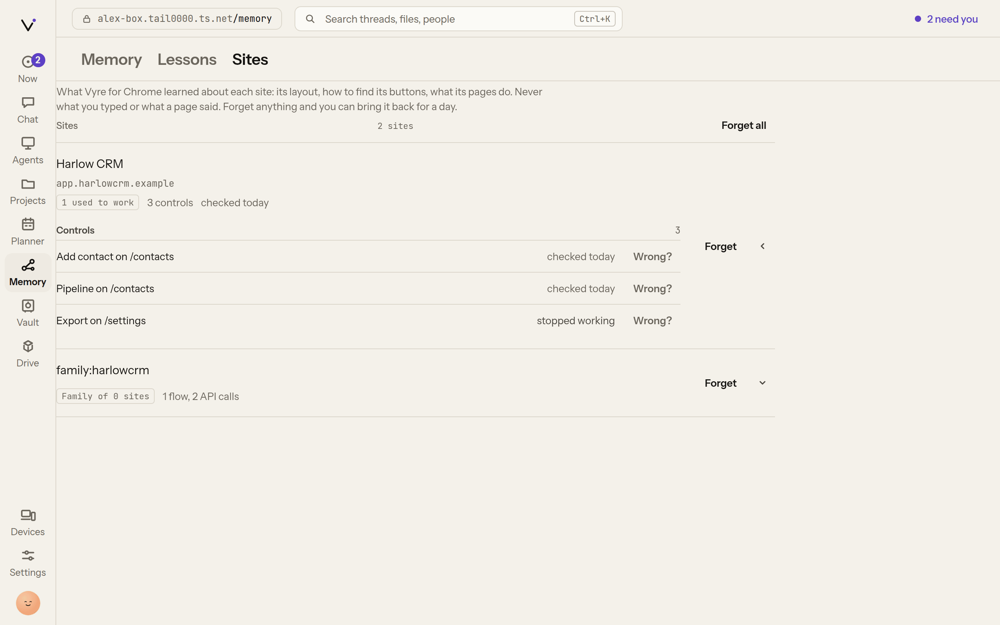

# Memory

Vyre remembers in two parts. **Recall** is search over every turn of every Claude Code session on
this machine: full-text plus local embeddings, so it finds a turn by its words or by what it
meant. **Memory** is a graph of facts the curator reads out of those turns: people, organisations,
addresses, domains, repositories, titles, clients and deadlines. Every fact points at the turn it
came from, and no model runs to produce it. Recall owns finding passages; Memory owns facts,
people and links.

## The gold marking

Anything Vyre shows you in **gold** (the Recall colour) came from memory or the search index, not
from a model's words: a matched quote in search results, a fact, a fact's source thread, your own
correction. When text is gold you can ask where it came from, and Vyre can show you the turn.
Vyre holds itself to one rule here: anything it tells you, it can show the source of. The gold appears in the
terminal (`vyre recall`, `vyre memory`, `vyre why`), in the Deck's Memory view and Now page, in
Chat next to a thread, and in Lumen when memory answers.

## Search past sessions

```
vyre recall stripe webhook retries
vyre recall "the engagement letter for Dana" --here    # only sessions started in this folder
vyre recall invoice --user --limit 20                  # only what you said (--assistant: only Claude)
vyre recall invoice --keyword                          # full-text only, no embeddings
```

Each hit shows the session's name, its full id, how long ago, who said it and the folder, with
the matching words in gold:

```output
  Harlow billing export
    3f9c2a10-7d4e-4b1a-9c55-0e2f8a6b1d77 · 2d ago · user · /work/harlow-legal
    the «stripe webhook» retries three times, then marks the invoice as failed

  resume one with: claude --resume <id>  ·  vyre call recall.thread '{"session":"<id>"}'
```

Resume a hit with `claude --resume <id>`, or `vyre resume <thread>` to open it with its project's
brief.

In the Deck, the search box at the top (Command-K) runs the same search:


### Keep the index up to date

Vyre indexes on its own: a session a moment after each Claude Code turn ends, and every folder
every 5 minutes (`recall.every` in `config.json`; 0 turns the timer off). `vyre index` indexes
new and changed sessions now.

With no query, `vyre recall` says how much is indexed and whether search can rank by meaning:

```output
  412 sessions · 18230 turns indexed
  vectors: on (Xenova/all-MiniLM-L6-v2) · 18230 embedded, 0 to go
  vyre recall <query> to search
```

> [!WHY] Why does the first search after an install only match words?
> Search by meaning needs a small embedding model. Vyre downloads it once (23 MB) into
> `~/.vyre/models` and embeds your sessions in the background. Until that finishes, recall
> searches full text only, and `vyre status` says "downloading the search model".

> [!SNAG] vyre recall says nothing matches
> On a new install the first pass takes a while: `vyre recall` with no query says "indexing now"
> while it runs. Run `vyre index` to index now. See [troubleshooting](../get-started/troubleshooting.md).

Elsewhere:

- **Deck**: the search box in the header searches every session; a hit opens the thread.
- **Lumen**: press Control twice and ask; when memory can answer, the answer shows in gold with
  its sources.
- **Claude**: `/vyre recall <query>` inside a session, or the `recall.search` and `recall.thread`
  tools. An agent's search is held to its own projects' folders.

### Search your Mac's sessions from the box

On a box with a paired Mac, your own searches (`vyre recall` on the box, the Deck's search box)
also ask the Mac, and its hits come back in the same list. In the Deck each Mac hit carries a chip
with the Mac's name. Opening one reads its turns from the Mac. The box does not index or store
the Mac's sessions, and an offline Mac only means its hits are missing. Agents and MCP clients
search the box's own sessions only. The decision is [ADR 0021](../adr/0021-box-reads-the-mac.md).

Memory's facts come from the sessions indexed on the machine itself, so the box's graph holds no
facts from the Mac's sessions.

## Read a turn word for word

A search hit is a passage. The turn around it is one tool call away, exactly as it was said: no summary, no model.
Agents get this as `memory_turn`; the same tool is `recall.turn`, which you can call yourself:

```
vyre call recall.turn '{"session":"3f9c2a10","seq":14,"before":2,"after":2}'   # turn 14 and two either side
vyre call recall.turn '{"session":"3f9c2a10","from":10,"span":5}'              # a range
vyre call recall.links '{"ref":"auth.ts"}'                                      # every turn that touched a file
vyre call recall.links '{"kind":"commit","ref":"c0ffee1"}'                      # the turn that made a commit
```

Every turn comes back with its **pointer** (`session:turn`, a session id or the first 8 characters of one), its time, and what it
touched: files it changed or read, commits it made or named, and urls. A long turn that the search index holds only the start of is
read whole from the transcript. Everything is redacted the way search is, and a session is readable only by the callers that could
search it: an agent reads inside its own projects, and a session outside them is "not found", not "denied".

`memory_search` takes `file` and `commit` to keep only turns that touched them: `memory_search {query: "login", file: "auth.ts"}`.
The links are plain lookups the indexer writes when it reads a transcript, with no model: a tool call's file goes to the next
assistant turn of its exchange, and a hash printed by `git commit` goes to the turn that made it.

## Long sessions: Vyre rolls the window over

An agent's own compaction keeps a summary and loses the lines. Vyre rolls over first. For every session it runs (a chat, a project
session, an agent's), once a turn has ended and the window is 60% full and nothing is running, Vyre ends the agent's session and starts a fresh
one in the same folder. The thread, its history and its folder do not change; the transcript says once "Continued in a fresh session".
The person's next message goes to the fresh session with a **seed** in front of it:

- the decisions you made for this project, newest first;
- the plan as the agent last left it;
- an index of what came before, as pointers: your own requests with their turn numbers, the files touched, the commits made;
- the last turns, word for word.

Every turn the fresh window dropped is still stored, so the agent reads any of it back with `memory_search` and `memory_turn`.
It works on any agent Vyre runs: Claude, Codex, Grok and the rest. An agent that does not say how full its window is has it counted from
the characters said, and rolls at the earlier 50%. A conversation with an agent other than Claude is kept under your Vyre home, in Claude Code's
own layout, so it is searchable like any other session.

It waits for a running tool, subagent or background job for up to 3 turns, rolls at 75% whatever is running, and never rolls twice
within 10 turns. Two settings (`vyre config`, in the Deck under Sessions; each can be set per project) change it:

| Setting | Default | What it does |
| --- | --- | --- |
| `sessions.rollover` | on | Off lets the agent compact its own window instead. |
| `sessions.rollover_at` | 60 | The percent of the window to roll at, from 20 to 90. |

`vyre call threads.roll '{"thread":"<id>"}'` rolls a session now (or `vyre roll --thread <id>`), and `threads.rolls` lists a thread's rollovers.
A rolled session's earlier windows are separate sessions in search, each readable by `memory_turn`.

## Continue a long terminal session

A Claude Code session you run in your own terminal is not Vyre's to stop. Vyre tells you instead: once, when the window passes the line
(60% unless you changed it), the next prompt shows "This session's window is 61% full ..." Then:

```
/exit
vyre roll
```

`vyre roll` builds the same seed, starts `claude` in this folder under a fresh session with the seed as its first message, and remembers
which session it came out of, so a second roll reaches back through the first. `vyre roll --print` prints the seed and starts nothing, for any
agent to use; `--session <id>` rolls a session other than the folder's newest; `--no-start` writes the seed to a file under `~/.vyre/rolls/` and
says how to start it. A seed too long for a command line goes in that file, and the first message names it.

## Three layers: identity, Spaces, projects

Memory is kept in three layers, each with its own facts. A **project's** memory holds that project's facts, decisions and sessions. A **Space's** memory holds the Space's own. Your
**identity** memory is yours alone: how you like to work, your writing style, how you run projects, your tech stack, what is true everywhere, plus a marker for every Space and
project. Nothing learned in one Space or project is copied into another.

Layers find each other by **markers**. A marker names a project's (or the Space's) memory with a short summary: counts of facts, decisions and sessions, and a few topics. It holds
no content and grants nothing. `memory_markers` lists the markers you may see; `memory_follow` asks the memory behind one a question, with your own grants:

```
vyre call memory.markers '{}'
vyre call memory.follow '{"marker":"Northwind","question":"what did we decide about the weekly invoice?"}'
```

You and your assistant follow every marker. An agent bound to a project reads only its own layer; a marker for a project it is not granted is only named ("exists"), with no
summary, and following it is refused. `memory.profile` takes `class` (`working_style`, `writing_style`, `pm_style`, `stack`, `life`) to read one part of your identity memory.

## See what memory holds

```
vyre memory                          # counts, and the most recent facts
vyre memory "Harlow Legal"           # everything about one thing
vyre memory "Dana Reyes" --project harlow-legal
vyre why '<fact id>'                 # the turns a fact came from
```

Each fact prints on two lines, then the commands for it:

```output
  · Dana Reyes works at Harlow Legal
      3 weeks ago · confidence 0.9 · Harlow intake #14
      vyre why '<fact id>' · vyre memory correct '<fact id>' wrong|ended|replace|confirm
```

Each fact shows its age, a confidence and its source (`session #turn`). Facts fade at read time:
one not said for months is marked `stale` with "last said 7 months ago", and your own or confirmed
facts do not fade. A fact two projects disagree about is marked "two projects disagree".

In the Deck, **Memory** (`/memory`) draws the graph as a floor plan, one room per project, with
people, things and threads inside and each fact as a gold dot on its link. Choose a fact to see
its source turns. **Now** shows **Memory learned today**, each fact with its source thread.


> [!SNAG] The Deck says "Memory is not available."
> The Memory view could not read the graph from Vyre. Choose **Try again**. If it keeps failing,
> check that Vyre runs (`vyre status`) and that the memory module started (`vyre modules`).

## See what Vyre has learned about a site

When Vyre for Chrome learns how a website works, the Deck lists it under **Memory**, on the
**Sites** tab. Open a site to see what Vyre kept: the flows that worked, the controls it knows how
to find, the site's own API calls and its notes. Each row has **Wrong?**, which forgets just that
item. **Forget** on a site removes everything Vyre learned about it. Neither asks first, because
each can be undone for 24 hours: the line says "Forgot ... Undo", and **Recently forgotten** at
the bottom lists what can still be brought back, on any device.



## How projects keep memory apart

Memory is kept in **rooms**: one per project, and `unfiled` for sessions in no project. A room's
facts come only from its own sessions and what its watchers taught. A project's brief and a
session in that project draw only on that room, so nothing from one client's project reaches
another's. The main graph, across every room, is visible only to you on your own surfaces (the
terminal, the Deck, Lumen), to the assistant, and to an agent granted every project.
`--project <slug>` reads one room; `--project unfiled` reads the room of no project.

A [teammate's](teammates.md) notes are not part of this graph. They are a text file the teammate keeps for
itself, shown in the project's **Team** tab. Its sessions are ordinary sessions in the project, so
search finds them and they feed the project's room like any other.

## Correct a fact

You are the only one who can change memory: correcting, merging and splitting are open to your
own surfaces (the CLI, the Deck, Lumen) and ask nothing more. A session's tools and an
agent never write memory: they are refused.

```
vyre memory correct '<fact id>' wrong                  # never true
vyre memory correct '<fact id>' ended --at 2026-08-01  # stopped being true
vyre memory correct '<fact id>' replace Northwind Bakery
vyre memory correct '<fact id>' confirm                # sure; it no longer fades
vyre memory correct 'Dana Reyes|works_at|Harlow Legal' add   # a fact memory missed
vyre memory merge "D. Reyes" "Dana Reyes"              # two nodes are one
vyre memory split "Dana Reyes" --project harlow-legal  # that project's Dana is someone else
vyre memory corrections
vyre memory uncorrect <id>
```

Each fact line in `vyre memory` prints the exact `vyre why` and `vyre memory correct` commands for
it. In the Deck, choose a fact and edit its object in place, or choose **No longer true** or
**Wrong**; the old fact stays above the new one, and **Undo** takes it back.

A correction also teaches [learning](learning.md): a rule you keep correcting shows in
`vyre learn signals`.

## Steer what memory offers

```
vyre memory pin "Harlow Legal"      # ranks first wherever it is relevant
vyre memory mute "Old Vendor Inc"   # never offered
vyre memory mute "Old Vendor Inc" --off
```

Pin and mute are `memory.pin` and `memory.mute`. While you type a prompt, Vyre's Claude Code plugin
asks `memory.relevant` for the few facts worth adding, and adds nothing when nothing in the prompt
is known.

## Which surface does what

| Task | Terminal | Deck | Lumen | Claude |
| --- | --- | --- | --- | --- |
| Search sessions | `vyre recall` | header search | ask | `/vyre recall`, `recall.search` |
| Read one session | `vyre resume` | open the thread | | `recall.thread` |
| See facts | `vyre memory` | `/memory`, Now | memory answers | `memory.facts` |
| Where a fact came from | `vyre why` | a fact's sources | | `memory.why` |
| Correct, merge, split | `vyre memory correct`, `merge`, `split` | edit in place | | never |
| Pin or mute | `vyre memory pin`, `mute` | the fact panel | | `memory.pin`, `memory.mute` |

## What it will not do

- Run a model to make a fact. Extraction is code, and every fact has a source turn.
- Let a session or Claude change memory. Only you correct, merge or split.
- Carry facts from one project's room into another project's brief.
- Close a fact because nobody mentioned it. Only newer evidence, a passed deadline or you close
  one.

## Next

- [Learning](learning.md): how corrections become lessons.
- [Projects and threads](projects-and-threads.md): what a project's brief draws from memory.
- Design: [ADR 0007](../adr/0007-intelligence.md).
- Every tool: [recall](../reference/tools.md#recall), [memory](../reference/tools.md#memory).
  Every command: [`vyre recall`](../reference/cli.md#vyre-recall),
  [`vyre memory`](../reference/cli.md#vyre-memory), [`vyre why`](../reference/cli.md#vyre-why).
