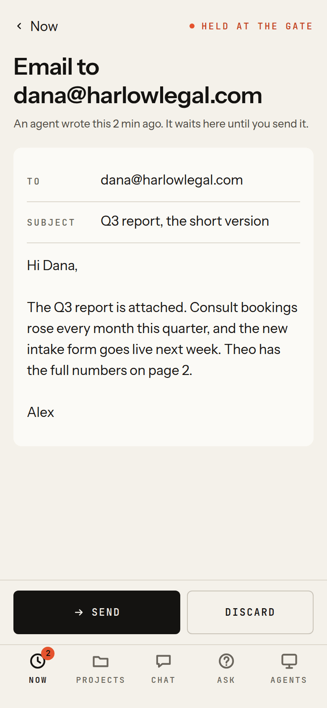

# Mobile

On a phone, Vyre is the [Deck](deck.md) installed as a web app. You add it to your home screen
from the browser, it opens full screen like an app, and it can notify you when a session asks
permission, a draft waits at the Gate, a thread you watch finishes, or Vyre proposes a lesson.
The phone reaches your box over Tailscale, like every other device (see
[Tailscale](tailscale.md)). Native iPhone and Android apps are being built and are not released.

## Set up the phone

1. Install the Tailscale app and sign in with the box owner's login. Onboarding's last step shows
   a QR code for the Tailscale app and one for your box's `/now`. Step by step for iPhone and
   Android: [Tailscale, from zero](../get-started/tailscale.md#2-install-tailscale-on-each-device).
2. Open your box's address in Safari (iPhone) or Chrome (Android), for example
   `https://vyre.tail1234.ts.net/now`.
3. Add it to the home screen. On an iPhone: the Share button, then Add to Home Screen. On Android:
   the browser menu, then Install app or Add to Home screen.
4. Open Vyre from the home screen icon. It opens at once, full screen, on the screen you
   last had open if that was within a day, else on Now.

Now then shows **Set up this phone**, three steps with what is left:

- **Install**: done once Vyre runs from the Home Screen. On Android, **Install** opens Chrome's
  install prompt.
- **Notifications**: **Turn on**, then allow the prompt (see
  [Turn on notifications](#turn-on-notifications)).
- **Passkey**: **Add**, then a code and a name for the phone (see
  [Approving from the phone](#approving-from-the-phone)).

**Not now** hides the card on that phone.

> [!SNAG] The phone QR code says "After Tailscale and your address"
> Onboarding never shows a QR code for `127.0.0.1`: until your box has its address, the phone has
> nowhere to go. Finish the Tailscale and address steps (see [Tailscale](tailscale.md)), and the
> QR code for your box's `/now` appears.

## What you can do from the phone

The tab bar at the bottom has Now, Projects, Chat, Find and Agents.

- **Now**: what needs you and what is running.
- **Approve or edit a held draft**: tap it in Now. It opens full screen; tap a field to edit it,
  then Send or Discard.
- **Answer a permission question**: tap it in Now, then Allow or Deny.
- **Chat**: your Claude Code sessions, including the ones you run in a terminal, mirrored a
  moment after each turn. With a Mac paired to the box, the Mac's sessions are listed too, each
  with the Mac's name on a chip; you can read them, and continue them on the Mac. If a session is
  busy in your Mac's terminal, what you send waits and the line above the box says "Queued for"
  the session's name; it goes in when that turn ends.
- **Find**: one box for sessions, files, agents, memory and projects, and for asking your
  assistant. Pull down from the top of any screen to open it. `@kit ...` asks an agent,
  `tell <session> to ...` types into a session, and `watch <session>` notifies you when it
  finishes or asks. The line under the box says what Enter will do.
- **Ask**: talk to your assistant or any agent, at `/ask`.
- **Glass**: watch an agent's computer and take over. A tap is a click, a long press a right
  click, two fingers scroll, pinch zooms your view, and a keyboard button opens the soft
  keyboard. See [Glass](glass.md).

Memory, Vault and Settings open from their paths (`/memory`, `/vault`, `/settings`), laid out for
a narrow screen.

## Turn on notifications

1. In the installed app, open **Settings**, then **Notifications**.
2. Press **Turn on notifications**, and allow the browser's prompt.
3. Choose which moments notify you: **Permission questions**, **Held drafts**, **Threads you're
   watching**, **Lessons**.
4. Set **Quiet hours** if you want them (22:00 to 07:00 by default once turned on, in your phone's
   time zone).
5. Press **Send a test**.

Other devices you turned on are listed with when a notification last reached them, and Remove.
Settings, **Your devices** lists every device on your tailnet and whether Tailscale sees it
online.

> [!SNAG] On an iPhone there is no Turn on notifications button
> iOS delivers notifications only to an installed app (iOS 16.4 or later), not to a Safari tab.
> Settings shows the steps instead of the button: add Vyre to your Home Screen, open it from
> there, and come back to Settings.

Tapping a notification opens the Deck at the right place: the held item, the thread, or the
lessons in Settings.

## What a notification shows

Only that something needs you, and a link. The title is a fixed sentence per kind ("Something is
waiting for your approval"), and the link holds only an id. It never carries a draft's words, a
recipient, a tool's input or anything you typed: a push crosses Apple's, Google's or Mozilla's
servers, and a lock screen shows it to whoever holds the phone. The payload is encrypted end to
end. The details load after you tap, over your own connection to the box. The decision is
[ADR 0011](../adr/0011-web-push.md).

During quiet hours nothing is sent and nothing is queued; the moment stays in Now. A box that
cannot reach the internet cannot notify, but the Deck still shows everything when you open it.

## Approving from the phone

Send, Discard, Allow, Deny and taking over an agent's screen need proof that a person is at the
device. On the phone that is a passkey, with Face ID or Touch ID. If you made your first passkey
in Safari on your Mac, iCloud Keychain brings it to your iPhone, and the phone offers it when you
approve. To make one on the phone itself, see [Deck](deck.md#add-a-passkey).

## Offline

When the box is out of reach, the installed app still opens. One line says "This phone is
offline." or "Your box is not answering.", with **Retry**. Now shows the counts from your last
visit and when they were taken, and Chat shows your recent session list. Nothing can be sent or
approved until the box answers.

## What it will not do

- It will not work off your tailnet. Without Tailscale connected on the phone, the address does
  not load ([what to check](../get-started/tailscale.md#the-phone-cannot-open-the-address-but-the-mac-can)).
- It will not show a draft's contents in a notification.

Coming, from the mobile workstream (not on this branch): native iPhone and Android apps with Now,
Chat, a mobile Capsule with voice, Files, Agents, Memory, Vault and native push, and a device key
on the phone for approvals.

## Next

- [Deck](deck.md), every view in detail.
- [Tailscale](tailscale.md), getting the phone onto your tailnet.
- [Tailscale, from zero](../get-started/tailscale.md), if you have never used Tailscale.
- [Security](../security/index.md), passkeys and what a phone may approve.
