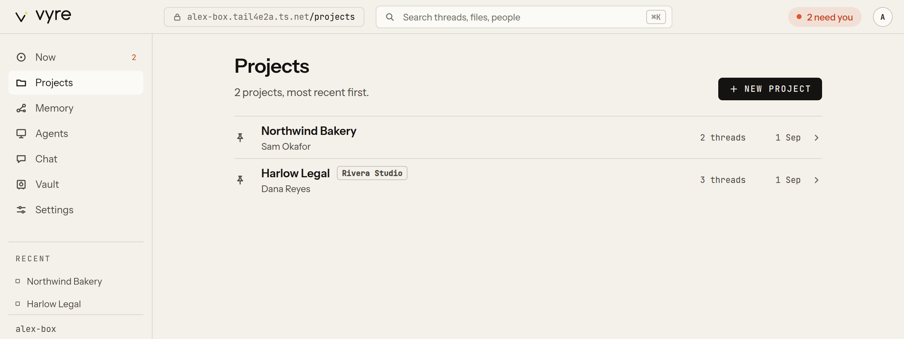
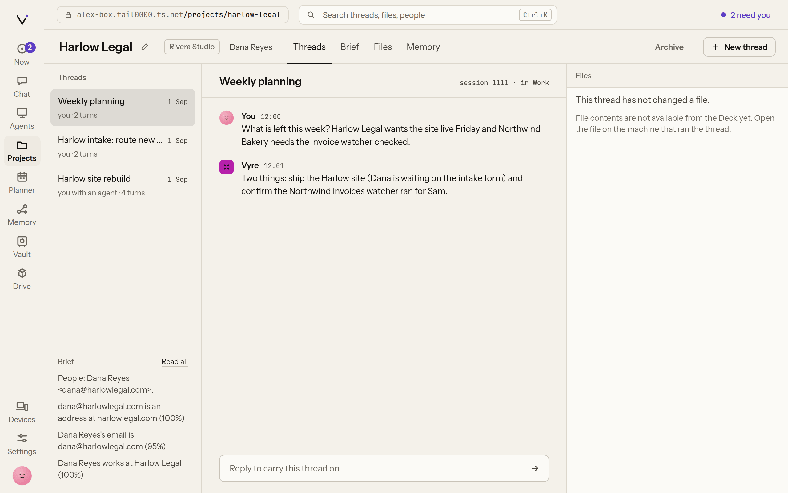

# Projects and threads

A **thread** is a Claude Code session. A **project** is a home folder, the other folders it owns,
the threads in it, its people and its watchers. Vyre uses projects to decide what a thread is
told when it starts (the project's **brief**) and which memory it may draw on. Nothing from one
project's threads or memory reaches another project's brief, so two clients' work stays apart.

A thread belongs to a project in one of two ways:

- **Picked**: you put it there. A pick is written into the project's marker file and only a
  person removes it. One thread can be picked into several projects, for example a weekly
  planning session that covers Harlow Legal and Northwind Bakery.
- **By folder**: it ran in one of the project's folders. This is worked out on every read, so
  adding a folder to a project brings that folder's sessions with it.

Vyre never sorts threads into projects on its own. You make every project by hand.

## Where a project lives

A project is declared by one file, `<home>/.vyre/project.json`. The file is the truth; Vyre's
database only caches it, so you can move the folder, edit the file by hand or commit it to the
project's own repository.

```json
{
  "name": "Harlow Legal",
  "org": "Harlow Legal",
  "workspaces": ["../harlow-site"],
  "threads": ["<claude session id>"],
  "people": [{ "name": "Dana Reyes", "email": "dana@harlowlegal.com" }],
  "watchers": ["harlow-invoices"]
}
```

Paths are relative to the home folder. New projects are made in `projectsDir` (default
`~/Vyre/projects`; on a new server, `/work/projects`, which VyreDrive can share to your Mac), and
Vyre also looks for markers under `roots`. A server that already has projects in `~/Vyre/projects`
keeps them there until you move them yourself: `vyre projects move --dry-run` lists what would
move, what would be skipped and why, and changes nothing; `vyre projects move` then moves each
home once, leaves a link at each old folder so older sessions still resume, and asks you to
restart vyred, which then uses `/work/projects`. The real move stays off until it has been tried
on a copy of a server: it runs only with `VYRE_PROJECTS_MOVE=1` set, or
`"projects": { "move": "enabled" }` in config.json.
Sessions come from the folders
in `transcripts` (default `~/.claude/projects` and `~/.claude/projects-archive`). See
[configuration](../reference/config.md).

## Make a project

1. Run `vyre new` with the project's name:

   ```sh
   vyre new "Harlow Legal"
   ```

2. Give its home folder, or press Enter for a new folder in `~/Vyre/projects`.
3. Pick sessions from the catalogue of every session on this machine, or pick none.

```output
  made Harlow Legal at ~/Vyre/projects/harlow-legal
```

Every step has a flag, so a script or an agent can do the same without prompts. `--thread`,
`--workspace` and `--person` can be given more than once:

```sh
vyre new "Harlow Legal" --home ~/work/harlow --workspace ~/work/harlow-site \
  --person "Dana Reyes <dana@harlowlegal.com>" --org "Harlow Legal" --no-pick
```

> [!SNAG] "... is already a project home"
> That folder already has a `.vyre/project.json`. Open the project with `vyre open`, or pick
> another folder.

In the Deck, open **Projects** (`/projects`) and choose **New project**. Claude can call
`projects.create`.



## Find a session and pick it into a project

The **catalogue** lists every session on this machine with its `/rename` name, first message,
folder, last activity and the projects it is in. It is searchable by what was said.

```sh
vyre threads harlow invoice        # search sessions by what was said
vyre threads --project harlow-legal
vyre pick harlow-legal 3f2a9c1e    # pick one or more threads into a project
vyre unpick harlow-legal 3f2a9c1e  # remove a pick
```

A thread can be named by the first characters of its id or by its name. `vyre unpick` removes
only picks. A thread that ran in the project's folders stays in the project by folder, and the
command says so:

```output
  1 unpicked from harlow-legal
  1 still in it: they ran in its folders
```

In the Deck, a session in no project opens at `/threads/<thread>` with **Add to a project**. The
tools behind these are `projects.catalog`, `projects.add-threads` and `projects.remove-threads`.

## Sessions on your paired Mac

On a server with a paired Mac, the catalogue, `vyre threads`, the Deck's lists and search also
take in the Mac's sessions and projects, asked from the Mac as you read
([ADR 0021](../adr/0021-box-reads-the-mac.md)). In the Deck each of them carries a chip with the
Mac's name. The server keeps none of them: a Mac session's turns load from the Mac when you open
it.

- You can pick a Mac session into a server project (**Add to a project** offers the server's
  projects). The pick keeps the session's id, and the project's thread list finds it on the Mac.
- A project's brief never includes a Mac session, so a new thread on the server is not told about
  one.
- A Mac thread is read-only on the server: "On alex-mac. Open it there to continue." Resume it on
  the Mac.
- A Mac project is listed with its chip, but opens no board on the server.
- When the Mac is offline, you see the server's own sessions only, and the Deck shows an offline
  chip for the Mac.

Agents, MCP clients and guests see only the server's own sessions, never the Mac's.

## See a project and its brief

```sh
vyre projects                 # every project, newest activity first
vyre open harlow-legal        # what its threads are told, and its threads
vyre context harlow-legal     # only the brief
```

The brief is short on purpose: what the project is, its people, what its other threads have been
doing, and headlines from the project's memory, in about 2,400 characters. A thread asks for more
when it needs it. The tool is `projects.context`.

> [!WHY] How does a thread get the brief?
> The Harness's SessionStart hook prints it into every thread that starts in a project folder.
> `vyre resume` and `vyre start` load the Harness with `--plugin-dir`, so the hook adds it; only
> when the Harness is missing do they pass the brief with `--append-system-prompt` instead. Never
> both, or Claude would read it twice.

In the Deck, `/projects/<slug>` is the project board: threads and the brief on the left, the open
thread in the centre, and the files it touched on the right, with tabs for the brief, files and
memory.



## Resume a thread or start a new one

```sh
vyre resume 3f2a9c1e          # opens it in Claude Code, in the folder it ran in, with the brief
vyre start                    # a new thread in this folder's project
vyre start --project harlow-legal "engagement letter"   # named "engagement letter"
```

`vyre resume` runs `claude --resume` in the folder the thread ran in, because Claude Code finds a
transcript by that folder. `vyre start` opens Claude Code in the project's home; the words after
it are the thread's name, not a first message. Your terminal belongs to Claude Code until it
exits.

> [!SNAG] "this folder is in no project"
> `vyre start` with no `--project` uses the current folder's project. Run it inside a project's
> folder, or add `--project <slug>`.

> [!SNAG] "Claude Code is not installed: no claude on PATH"
> `vyre resume` and `vyre start` run `claude`. Install Claude Code on this machine first.

## The `vyre` home

`vyre` with no arguments, from any folder, opens the home: every project with its thread count
and last activity, **New session without a project**, and your agents. Pick a project to see its
sessions, newest first, and resume one or start a new one. Inside a project's folder that project
is preselected, not opened. It is an arrow-key list with type-to-filter in a terminal, a plain
list when piped, and works the same over SSH. See [agents](agents.md) for the agents half.

## Headless threads

vyred can also run a thread itself, headless, so it outlives every window. Any surface can watch
it, and one surface at a time holds its keyboard.

```sh
vyre threads start --project harlow-legal "Summarise this week's invoices"
vyre threads send 3f2a9c1e "Now draft a reply to Dana"
vyre threads watch 3f2a9c1e
vyre threads answer <ask> allow   # answer a permission question
vyre threads stop 3f2a9c1e
```

A permission question from a headless thread goes to wherever you are: the terminal, the Deck,
the Capsule or your phone. Only a person answers it (`threads.answer`); a model never approves a
permission. The tools are `threads.start`, `threads.send`, `threads.lease`, `threads.release`,
`threads.asks`, `threads.answer` and `threads.stop`. For every flag, see
[Drive a running session](cli.md#drive-a-running-session).

## Which surface does what

| Task | Terminal | Deck | Capsule | Chat | Claude |
| --- | --- | --- | --- | --- | --- |
| List projects | `vyre projects`, `vyre` | `/projects` | `@` a project | `/chat` | `projects.list` |
| Make a project | `vyre new` | New project | | | `projects.create` |
| Pick threads | `vyre pick`, `vyre unpick` | Add to a project | | | `projects.add-threads` |
| Search sessions | `vyre threads <words>` | the search field in the header | `@` a thread | | `projects.catalog`, `recall.search` |
| Read the brief | `vyre context` | Brief tab | | | `projects.context` |
| Resume or start in Claude Code | `vyre resume`, `vyre start` | | | | |
| Type into a thread | `vyre threads send` | open a thread | `@` a thread | `/chat/<project>/<thread>` | `threads.send` |
| Start a headless thread | `vyre threads start` | New thread | `@` a project | | `threads.start` |

Inside a Claude Code session, `/vyre project` shows the current folder's brief.

## What it will not do

- Sort sessions into projects by topic. Projects and picks are yours.
- Remove a pick on its own. Only `vyre unpick` or `projects.remove-threads` does.
- Put one project's threads or memory into another project's brief.
- Copy a session from your paired Mac onto the server, or type into it from the server.

## Next

- [Memory](memory.md): search what was said, and the facts each project remembers.
- [Watchers](watchers.md): file things from outside into a project.
- [Chat](chat.md) and the [Deck](deck.md).
- Every tool: [projects](../reference/tools.md#projects) and
  [threads](../reference/tools.md#threads). Every command: [CLI reference](../reference/cli.md).
