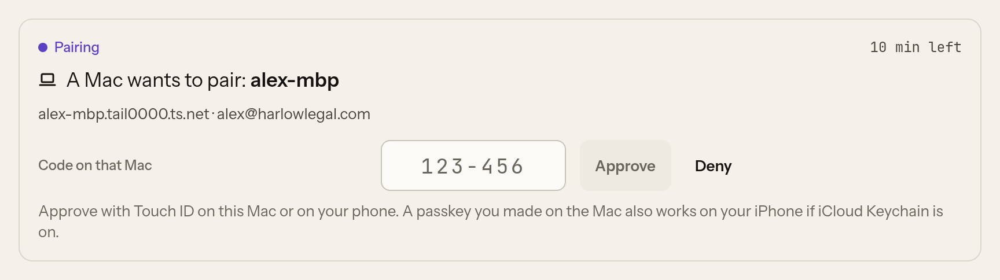

# Tailscale

Your box is not on the public internet. It is on your tailnet, the private network Tailscale
makes between your own devices, and every device you use Vyre from joins that tailnet. There is
no Vyre password: when a device connects, Vyre asks Tailscale who is on the other end
(`tailscale whois` of the connection's source address) and serves only the box's owner, one
Tailscale login. Why it works this way is in [ADR 0002](../adr/0002-network-and-identity.md);
how the pieces fit is in [Tailnet](../concepts/tailnet.md). New to Tailscale? See
[Tailscale, from zero](../get-started/tailscale.md).

## Know your box's address

Setup at <https://vyre.run/setup> ends with the address you claimed, such as
`https://alex.vyre.run`, and optionally a domain of your own. `vyre name` prints it. The address
points at your box's Tailscale address, so it opens only on devices on your tailnet.

If you chose Tailscale's own name instead, the box's Tailscale name is `vyre` (a second box is
`vyre-2`) and, with MagicDNS, which Tailscale turns on by default, its address is:

```
https://vyre.<tailnet>.ts.net
```

for example `https://vyre.tail1234.ts.net`. The certificate comes from `tailscale cert`.

### If the address has no certificate

Tailscale gives a ts.net name a certificate only when HTTPS certificates are on for your tailnet.
If they are off, onboarding says so and offers "Turn on HTTPS", which opens
`https://login.tailscale.com/admin/dns`. Turn on HTTPS Certificates there, then choose
Check again. From a terminal, `vyre name ts.net` retries. Step by step:
[Turn on HTTPS certificates](../get-started/tailscale.md#5-turn-on-https-certificates).

## Connect a device

On each device you want to use:

1. Install Tailscale and sign in with the same login as the box's owner
   ([per device](../get-started/tailscale.md#2-install-tailscale-on-each-device)).
2. Open the box's address in a browser. The [Deck](deck.md) opens.

A device signed in as anyone else gets `403 not_owner` and nothing more. So does a tagged device:
a tagged node has no user, so it cannot be the owner. To see or set the owner on the box:

```
vyre owner                          # which login this box serves
vyre owner alex@example.com         # set it
```

For the phone, see [Mobile](mobile.md).

## Connect your Mac to the box

On the Mac, with Tailscale signed in as the owner:

```
npm install -g https://vyre.run/box/vyre.tgz
vyre up
```

(Node 22.5 or newer.) `vyre up` looks for your box on the tailnet: the online peers that answer as a Vyre box. One
answer is your box. Several, and it lists them and asks. None, and it asks where Vyre should run.
If you know the address:

```
vyre up --connect https://vyre.tail1234.ts.net
```

Then the Mac pairs with the box:

1. The Mac asks the box to pair and shows a code. `vyre link pair <address>` does the same by
   hand.
2. Approve that code in the Deck. Now shows a card, "A Mac wants to pair", naming the Mac. Type
   the code from the Mac's screen into **Code on that Mac** and press **Approve**, which asks for
   your passkey. **Deny** turns it down. A terminal on the box cannot give a passkey, so
   `vyre link approve <code>` there answers "approve it in the Deck".

   

3. Check it on the Mac with `vyre link`:

   ```output
     ● linked to https://vyre.tail1234.ts.net
   ```

Approving a pairing takes your passkey: Touch ID on this Mac, or on your phone.

The first connection pins the box's Tailscale node, so a different machine answering at the same
name later is refused. `vyre link unpair` forgets the box on the Mac, or a Mac on the box
(`vyre link unpair <id>`, with the id `vyre link` lists there). After five wrong codes every
pairing request is cancelled; start again from the Mac.

Vyre never runs `tailscale up`, `set` or `logout` on your Mac. Your Mac's Tailscale stays yours.

## Sign a headless box in without a browser

On a Docker box, put an auth key in `/srv/vyre/.env` before the first `vyre up`:

```
TS_AUTHKEY=tskey-auth-...
```

Make the key untagged. An untagged key signs the node in as the person who made it, which is
what lets Vyre name an owner.

## When a device cannot connect

| You see | Why | Fix |
| --- | --- | --- |
| The address does not load | the device is not on the tailnet, or the box is down | open Tailscale on the device and check it is connected; `vyre box` on the Mac says whether the box answers (if you added the box with `vyre box add`) |
| `403 not_owner` | the device is signed in to Tailscale as another login, or is tagged | sign the device in as the owner |
| a certificate error | HTTPS certificates are off for the tailnet | turn them on, then `vyre name ts.net` |
| on an iPhone, `ERR_SSL_PROTOCOL_ERROR` or "server not found", though the device is connected | another DNS app or an encrypted-DNS profile answers the ts.net name instead of Tailscale ([tailscale#19147](https://github.com/tailscale/tailscale/issues/19147)) | remove the DNS app or profile, or turn Tailscale off and on; keep Funnel off so the name has no public answer |
| `vyre up` on the Mac says the box did not answer | the Mac is off the tailnet, or the box is offline | start Tailscale on the Mac, then `vyre up` again |

More in [Troubleshooting](../get-started/troubleshooting.md) and
[When something is wrong](../get-started/tailscale.md#when-something-is-wrong).

## What it will not do

- It never reads an identity header. `Tailscale-User-*` and `X-Forwarded-*` change nothing.
- It never serves a process on the box as if it were you on a device: a connection from the box's
  own tailnet address is refused.
- It never changes your tailnet: no policy edit, no admin setting, and no `tailscale serve`,
  `funnel` or `lock` command. Nothing about your box is public unless you publish a webhook route
  with Funnel yourself.
- No other site's page can call it, except Vyre's hosted app (`https://app.vyre.run`), and only
  from the owner's browser with a person session (signed in on the box). Without one, the app
  learns only that the box is reachable. `network.origins` changes the list; `[]` turns it off.
- It turns on none of the optional features below by itself.

## Optional Tailscale features

Each is off until you turn it on, and Vyre works fully without them: VyreDrive (built on
Tailscale's Taildrive: the box's project folders on your Mac, read-only unless you make a share
writable), Taildrop (`vyre send` a file to the box), Tailscale SSH for
`vyre box add`, Tailnet Lock (Vyre reads it; you turn it on), Glass egress through your Mac as an
exit node, vault passes that also need a policy grant, guests from another tailnet listing
your threads, and signed webhooks through Funnel. A tailnet node for each agent's computer is not live
yet. How to set up each one, with the policy entries it needs:
[Optional: more of Tailscale in Vyre](../get-started/tailscale.md#optional-more-of-tailscale-in-vyre).
The reasons behind them are in [ADR 0014](../adr/0014-tailnet.md).

## Next

- [Box and Mac](../concepts/box-and-mac.md), what runs where.
- [Mobile](mobile.md), your phone on the tailnet.
- [Security](../security/index.md), what the tailnet protects and what it does not.
