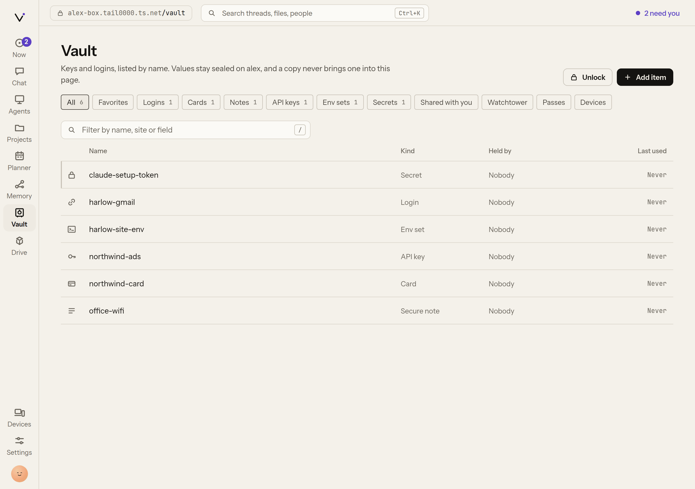
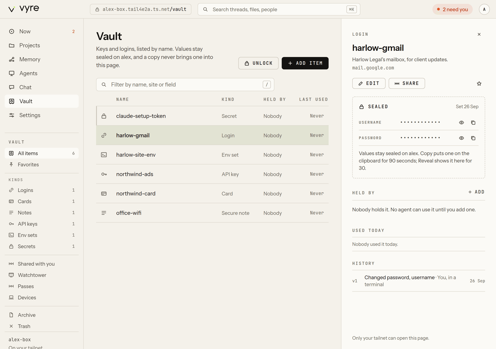

# Vault

The Vault keeps your credentials sealed at rest and releases them one item at a time, only to a
module, watcher or agent you granted that item to. Agents use items by name and never see them.
People share items by **pass**, and when someone leaves, one command revokes everything they
hold and lists what to rotate. It is also a password manager for you: logins with one-time codes,
cards, notes, API keys, env sets and SSH keys, with a generator, import, and autofill in the
browser.

## The floor rule

No value from the Vault appears on any screen, log or event, except to a person who has just
proved presence on their own device, for that one value. Never to a model, an agent, a log or an
event. This is floor rule 8 in the [security floor](../concepts/floor.md), and it cannot be
switched off.

In practice:

- `vault.list`, `vault.item`, `vault.search`, `vault.audit`, `vault.history`, events, logs, errors
  and the MCP listing carry names, kinds, field names and hosts. Never a value.
- `vault.put` refuses Claude. Values come from `vyre vault put`'s hidden prompt, from a file vyred
  reads itself (`vault.import`), or from a module. Claude is never the channel a value travels
  through.
- Showing, copying or filling a value needs you to prove you are present, with Touch ID, a
  passkey or a code typed in your terminal. See [presence](../concepts/presence.md). A call from
  Claude alone cannot pass it.

## Store an item

1. Run `put` with the item's name, kind and the origins it may be sent to:

   ```
   vyre vault put stripe-live --kind api-key --description "Harlow Legal Stripe" --host https://api.stripe.com
   ```

2. Type the value at the hidden prompt, or pipe it on stdin. Never put a value on the command
   line: shell history and Claude's transcript would see it, and `put` refuses it.

   ```output
     stored stripe-live · api-key · sent only to https://api.stripe.com
   ```

Kinds are `secret` (the default), `api-key`, `login`, `card`, `note`, `env-set` and `ssh-key`.
For a login, add `--username <name>` and `--totp` to store a one-time-code seed (`--totp` needs a
terminal). For an env set, name each variable with `--field NAME`.

> [!SNAG] hosts must be origins such as https://api.example.com
> `--host` takes a whole origin, with the scheme: `--host https://api.stripe.com`, not
> `--host api.stripe.com`. With `--url` and no `--host`, the URL's origin is used.

Other ways in:

```
vyre vault import ~/Downloads/1password-export.csv   # also .env, Bitwarden, Chrome, Safari
vyre vault generate --words 5 harlow-wifi             # stored, never printed, because it is named
vyre vault ssh generate deploy-key                    # prints only the public key
```

`import` reads the file inside vyred, so the values never pass through Claude, and it leaves the
file alone. Delete the file afterwards. `generate` without a name prints a password and stores
nothing.

A project's `.env` files come in the same way, a file or a whole folder at once:

```
vyre vault import ~/code/harlow-intake --preview   # every .env under it, typed, never a value
vyre vault import ~/code/harlow-intake --rewrite   # store them, then swap the values for references
vyre run -- npm start                              # reads ./.env's references; same environment as before
```

Each file becomes one env-set named after where it lives (`harlow-intake.env`,
`harlow-intake-apps-web.env.local`). Only secrets move: API keys, tokens, passwords, database URLs
with a password, private keys. Plain settings such as `PORT` or a public URL stay in the file. The
preview names each variable's type and provider (`api-key openai`, `db-url postgres`), flags a
public name holding a secret value (`NEXT_PUBLIC_...=sk_live_...`), and says when a file is
committed to git or missing from `.gitignore`. The scan skips `node_modules`, `.git` and build
folders, lists `.env.example` files without importing them, and follows no symlinks.
`--rewrite` changes a file only after every value in it is stored, writes no backup of the old
file, and leaves a file alone when its values differ from the vault's (a conflict).

## See what you have

```
vyre vault                    # every item: name, kind, grants; never a value
vyre vault get stripe-live    # one item's metadata
vyre vault audit stripe-live  # who used it, when, and whether it was allowed
```

In the Deck, **Vault** (`/vault`) lists items by kind, with **Watchtower** (weak, reused, old or
missing two-factor), **Passes**, **Shared with you** and **Devices**. Every field shows as twelve
dots whatever its length.



## Show, copy or fill a value yourself



Each of these is for one value, and asks you to prove presence first:

```
vyre vault get stripe-live --copy       # to the clipboard, cleared after 90 seconds
vyre vault get harlow-portal --otp      # the current one-time code
vyre vault totp harlow-portal           # the same
vyre vault read vault://stripe-live/value   # one field alone on stdout, for $(...) and pipes
```

::: tabs
::: tab On this Mac
The terminal asks for Touch ID (or your Mac password). After you cancel, the next request waits
30 seconds.
::: tab On a server
A terminal on the box cannot prove presence: the box has no Touch ID, and it does not accept a
terminal code. There, only a passkey from the Deck proves you are there. Use the Deck, or your
Mac.
:::

- **Deck**: Copy asks vyred to write the clipboard; the value never comes back to the page.
  Reveal shows one field in the item pane and hides it again after 30 seconds, when the window
  loses focus, or when you leave the item.
- **Capsule**: press Control twice, type the item's name, and choose **Fill in the front app**,
  **Copy the password or key**, **Copy username**, **Copy one-time code** or **Show the one-time
  code**. Fill types the login into the app in front through a helper; the value never returns
  to the Capsule (`vault.fill.native`).

The Deck, the Capsule and the browser extension open a short **session** with one proof. While
it lasts, reveal, copy and one-time codes do not ask again, except for cards, which ask every
time. A session ends after 10 minutes idle or 12 hours at most, when the Mac sleeps or its screen
locks, or on `vyre vault lock`. Set other limits in `config.json` under `vault.lock`, for example
`{ "idle": "5m", "max": "8h" }`. The browser extension's fill window is fixed instead: 30 minutes
from the proof (see Autofill in the browser below).

## Let an agent, module or watcher use an item

A grant lets one module, or one watcher, fetch one item. Agents run as the `agents` module, so an
agent's setup token or API key is granted to `agents` (see [agents](agents.md)).

```
vyre vault grant stripe-live billing                      # a module
vyre vault grant billing-inbox watchers --watcher harlow-invoices
vyre vault revoke billing-inbox watchers --watcher harlow-invoices
```

When Claude asks for a grant (`vault.grant`), it only creates a pending request. You approve it:

1. List what waits: `vyre vault pending`.

   ```output
     g_4f2a  grant billing-inbox to watchers/harlow-invoices

     vyre vault approve <id>
   ```

2. Approve one: `vyre vault approve g_4f2a`. Or approve it from **Passes** in the Deck, where
   what waits for you is at the top.

Taking access away never needs presence; giving it does.

> [!WHY] What happens when a module uses its grant?
> At use time the module calls `ctx.vault.fetch("<name>")` (a watcher calls `vault.fetch`), and
> vyred checks the grant and hands that one value to that one caller. The internal tool is
> `vault.release`, which no surface or model can call. Every use is written to the audit log, by
> name.

## Use an item in a script

Scripts outside Vyre run under `vyre vault run`, which puts the values into one child process's
environment and scrubs them from its output:

```
vyre vault run STRIPE_KEY=stripe-live -- npm run charge
vyre vault run --env-file .env.vyre -- node server.js      # KEY=vault://item/field lines
vyre vault inject -i config.tpl -o config.json              # {{ vault://item/field }}; vyred writes the file, 0600
```

An item before `--` is `<name>`, `<name>.<field>`, `VAR=<name>` or `VAR=<name>.<field>`; without `VAR=`, the
variable is the name in capitals (`stripe-live` becomes `STRIPE_LIVE`). A value the child prints
shows as `<concealed by vyre>`. These need presence, so Claude's own shell cannot use them to read
a value.

## Share with another person

A pass shares items with another person's Vyre. In this example you share with Dana, who runs her
own Vyre.

1. Swap cards. Send Dana the output of `vyre vault card`, and add hers:

   ```
   vyre vault people add <her card> --name dana
   ```

2. Compare the four safety words out of band (on a call, in person). You both run
   `vyre vault fingerprint dana` and should see the same words. Then:

   ```
   vyre vault people verify dana <fingerprint>
   ```

3. Share:

   ```
   vyre vault share stripe-live --with dana --expires 30d
   ```

   It prints a ticket. The ticket carries no secret; send it to Dana.

4. Dana accepts it with `vyre vault pass accept <ticket>`.

A pass is one of two kinds:

- **Relayed** (the default): the value never leaves your box. Dana's calls go through your Vyre
  over Tailscale with `vyre vault relay` (`vault.relay`), your Vyre adds the value, and revoking
  ends her access at once. `--host`, `--method` and `--path` on `vyre vault pass create` narrow
  what her calls may reach.
- **Sealed** (`--sealed`): Dana gets an encrypted copy, for offline use. Revoking a sealed pass
  means rotating the credential.

> [!SNAG] stripe-live has no hosts it may be sent to, so it cannot be relayed
> A relayed pass sends the value only to the item's hosts. Store the item again with
> `--host https://api.stripe.com`, or share it `--sealed`.

To end sharing:

```
vyre vault pass list
vyre vault pass revoke <id>
vyre vault offboard dana       # revoke every pass she holds and list what must be rotated
```

For a team, `vyre vault vaults create <name>` makes a shared vault and
`vyre vault members invite <vault> <person>` adds people to it. Its items appear as
`<vault>/<item>`.

## Autofill in the browser

The Chrome extension in `modules/vault-extension/` fills logins from your Vault.

1. Set `vault.fill` in `config.json`, for example `{ "host": "127.0.0.1", "port": 7788 }` (the
   extension looks at `http://127.0.0.1:7788` unless you change it), and restart vyred.
2. In `chrome://extensions` (Chrome, Arc, Edge, Brave), turn on Developer mode and **Load
   unpacked** that folder. In Firefox 121 or later, open `about:debugging`, choose **Load
   Temporary Add-on** and pick its `manifest.json`.
3. Set the passphrase the extension asks for: `vyre vault unlock-passphrase`.
4. Pair it: `vyre vault pair` prints an 8-character code that works once, for 5 minutes. Type it
   into the extension.

On a login page, unlock with the passphrase (or Touch ID through the Capsule) and choose **Fill**.
Only logins whose hosts include the page's exact origin (scheme, host and port) are offered, so a
lookalike domain gets nothing. An unlock lasts 30 minutes from the proof, and filling does not
extend it; `vault.fill.window` in `config.json` (minutes, 1 to 30) makes it shorter. The same
extension loads in Firefox; see `modules/vault-extension/README.md`.
`vyre vault devices` lists paired browsers; `vyre vault devices revoke <id>` ends one at once. The
design is in [ADR 0010](../adr/0010-vault-autofill.md).

Autofill on the phone is not built yet.

## Your personal vault, and getting it back

```
vyre vault account create         # sets the password; prints your Secret Key once
vyre vault kit                    # a recovery kit: a one-time page on this machine
vyre vault account enroll-touchid
vyre vault account lock
```

The Secret Key is printed once and not written to any file. Keep the recovery kit. Your agents
keep what is granted to them while your personal vault is locked.

`vyre vault backup <file>` writes the whole vault sealed to a passphrase of its own, and
`vyre vault restore <file>` reads one back.

> [!SNAG] The vault is locked (exit code 4)
> With the passphrase keystore, run `vyre vault unlock`. For your personal vault, run
> `vyre vault account unlock` (add `--touchid` once you enrolled it), or unlock in the Deck. Both
> commands meet the `presence_required` problem above.

## Which surface does what

| Task | Terminal | Deck | Capsule | Claude |
| --- | --- | --- | --- | --- |
| Add an item | `vyre vault put`, `import` | Add, per kind | | `vault.import` (a file path), never a value |
| List items | `vyre vault` | `/vault` | type a name | `vault.list` (names only) |
| Copy, reveal, code | `get --copy`, `--reveal`, `--otp`, `totp` | Copy, Reveal | Copy, Show the code | never |
| Fill a login | | | Fill in the front app | never |
| Grant | `vyre vault grant`, `approve` | Passes | | `vault.grant` (waits as pending) |
| Share | `vyre vault share` | share sheet | | `vault.pass.create` (waits for approval) |
| Offboard | `vyre vault offboard` | offboard sheet | | `vault.offboard` (asks you for presence) |

Inside a Claude Code session, the `use-the-vault` skill tells Claude these rules.

## What it will not do

- Show a value to Claude, an agent, a log or an event.
- Take a value from Claude. `vault.put` refuses it.
- Let Claude approve its own grant or pass.
- Fill a login on a page whose origin is not one of the item's hosts.
- Store passkeys. That is not built yet.

## Next

- [Presence](../concepts/presence.md): how you prove you are at the machine.
- [Watchers](watchers.md): the most common thing to grant an item to.
- Design: [ADR 0001](../adr/0001-vault-crypto.md), [ADR 0006](../adr/0006-vault-next.md),
  [ADR 0010](../adr/0010-vault-autofill.md).
- Every tool: [vault](../reference/tools.md#vault). Every command:
  [`vyre vault`](../reference/cli.md#vyre-vault), or `vyre vault help`.
